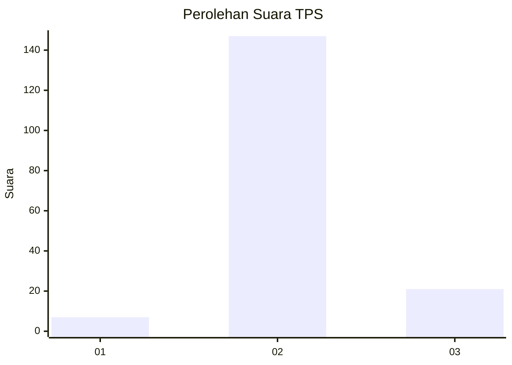
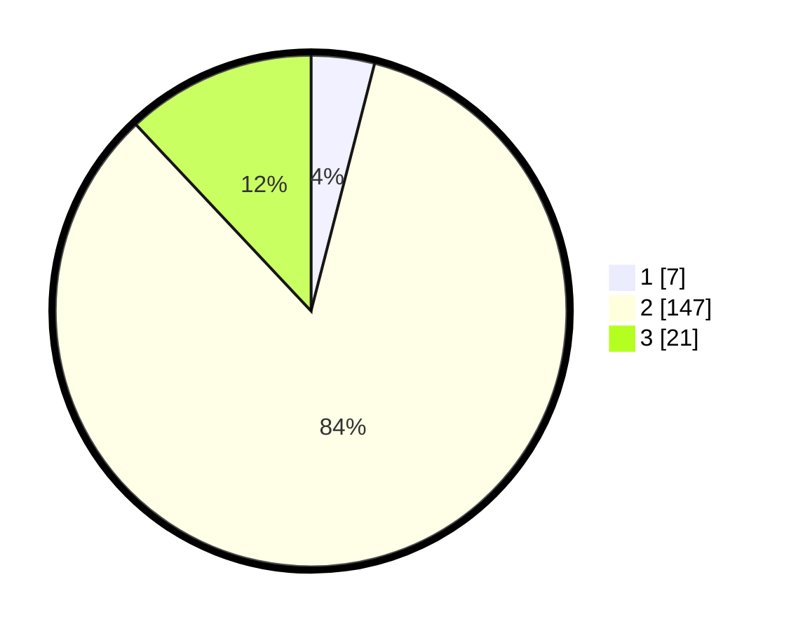

# Hasil

## Grafik

## Tabel

| No. | Nama Paslon    | Suara | Suara (raw) | Persentase |
|:--- |:-------------- | -----:| -----------:| ----------:|
| 1   | ANIES MUHAIMIN | 7     | [7][p-1]    | 4,00       |
| 2   | PRABOWO GIBRAN | 147   | [147][p-2]  | 84,00      |
| 3   | GANJAR MAHFUD  | 21    | [21][p-3]   | 12,00      |

[p-1]: https://github.com/gigit-pemilu/pemilu-2024/blob/main/pilpres/hitung-suara/sub/35-jawa-timur/sub/26-bangkalan/sub/13-tanah-merah/sub/2006-kendaban/sub/002-tps/sub/paslon-1.txt
[p-2]: https://github.com/gigit-pemilu/pemilu-2024/blob/main/pilpres/hitung-suara/sub/35-jawa-timur/sub/26-bangkalan/sub/13-tanah-merah/sub/2006-kendaban/sub/002-tps/sub/paslon-2.txt
[p-3]: https://github.com/gigit-pemilu/pemilu-2024/blob/main/pilpres/hitung-suara/sub/35-jawa-timur/sub/26-bangkalan/sub/13-tanah-merah/sub/2006-kendaban/sub/002-tps/sub/paslon-3.txt

## Foto C Plano

https://sirekap-obj-formc.kpu.go.id/202b/pemilu/ppwp/35/26/13/20/06/3526132006002-20240214-212050--f28ea8a6-7859-4db1-a08e-1db0164848c7.jpg

https://sirekap-obj-formc.kpu.go.id/202b/pemilu/ppwp/35/26/13/20/06/3526132006002-20240214-202234--7949f46e-f573-4e2e-b4ba-adce34bba21f.jpg

https://sirekap-obj-formc.kpu.go.id/202b/pemilu/ppwp/35/26/13/20/06/3526132006002-20240214-212144--51cd9c7b-d526-49e0-9ddd-43dc32ee9537.jpg

## Metadata

| Key        | Value               |
| ---------- | ------------------- |
| Time Stamp | 2024-02-24 22:31:28 |

