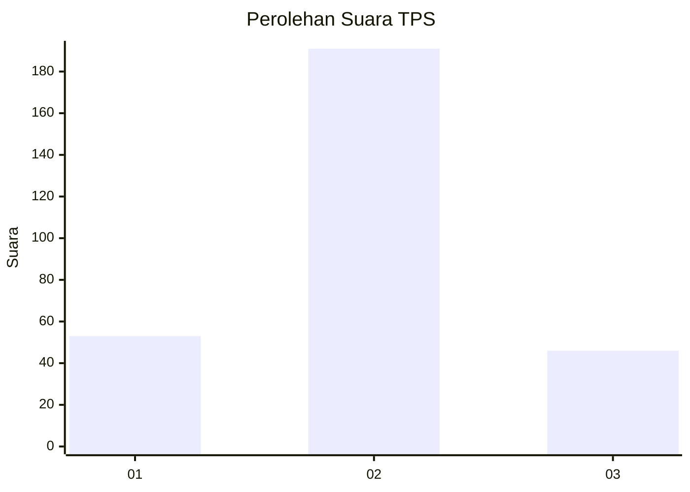
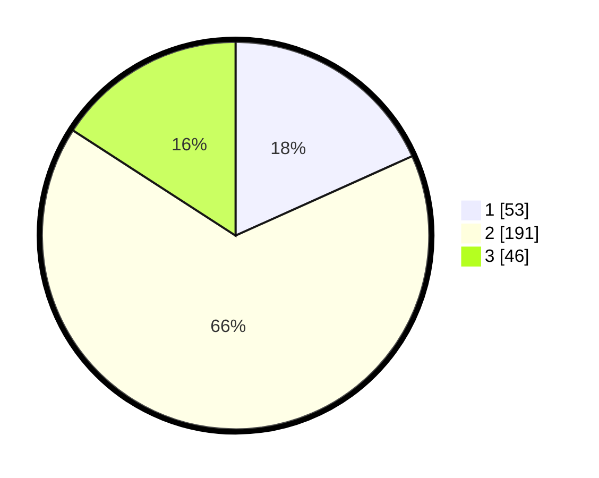

# Hasil

## Grafik

## Tabel

| No. | Nama Paslon    | Suara | Suara (raw) | Persentase |
|:--- |:-------------- | -----:| -----------:| ----------:|
| 1   | ANIES MUHAIMIN | 53    | [53][p-1]   | 18,28      |
| 2   | PRABOWO GIBRAN | 191   | [191][p-2]  | 65,86      |
| 3   | GANJAR MAHFUD  | 46    | [46][p-3]   | 15,86      |

[p-1]: https://github.com/gigit-pemilu/pemilu-2024/blob/main/pilpres/hitung-suara/sub/35-jawa-timur/sub/26-bangkalan/sub/13-tanah-merah/sub/2010-tlomar/sub/003-tps/sub/paslon-1.txt
[p-2]: https://github.com/gigit-pemilu/pemilu-2024/blob/main/pilpres/hitung-suara/sub/35-jawa-timur/sub/26-bangkalan/sub/13-tanah-merah/sub/2010-tlomar/sub/003-tps/sub/paslon-2.txt
[p-3]: https://github.com/gigit-pemilu/pemilu-2024/blob/main/pilpres/hitung-suara/sub/35-jawa-timur/sub/26-bangkalan/sub/13-tanah-merah/sub/2010-tlomar/sub/003-tps/sub/paslon-3.txt

## Foto C Plano

https://sirekap-obj-formc.kpu.go.id/e38f/pemilu/ppwp/35/26/13/20/10/3526132010003-20240214-224753--09572bf1-f177-4bdb-af57-ea36e721fb82.jpg

https://sirekap-obj-formc.kpu.go.id/e38f/pemilu/ppwp/35/26/13/20/10/3526132010003-20240214-225146--c44892e4-d23b-4338-acb9-378dcf3d7e0e.jpg

https://sirekap-obj-formc.kpu.go.id/e38f/pemilu/ppwp/35/26/13/20/10/3526132010003-20240214-225243--bec941f8-ec2d-4f58-8067-717b106754bc.jpg

## Metadata

| Key        | Value               |
| ---------- | ------------------- |
| Time Stamp | 2024-02-24 22:31:28 |

