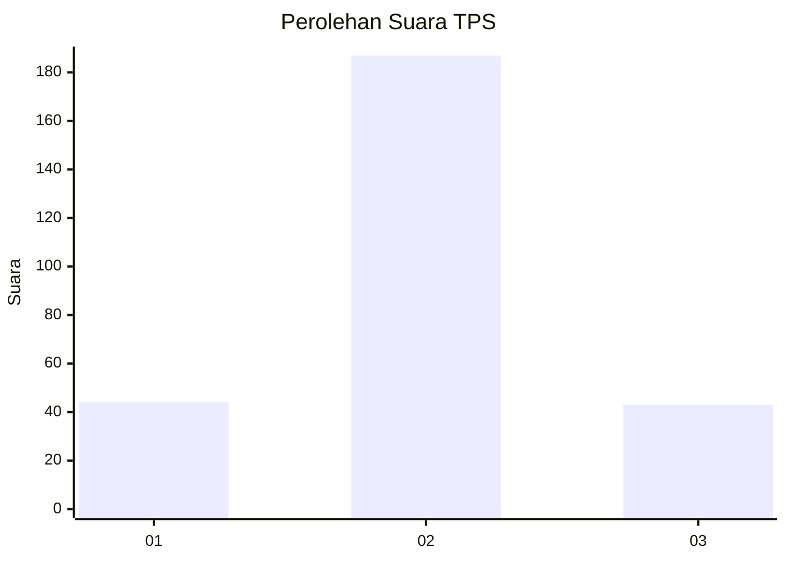
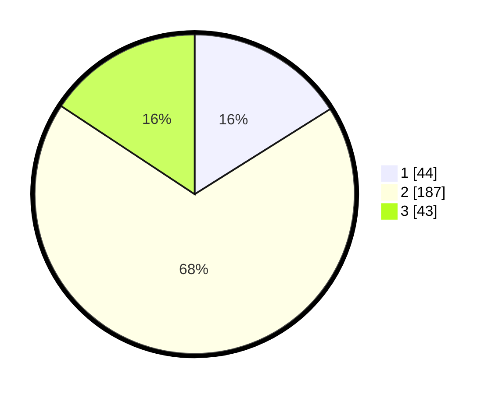

# Hasil

## Grafik

## Tabel

| No. | Nama Paslon    | Suara | Suara (raw) | Persentase |
|:--- |:-------------- | -----:| -----------:| ----------:|
| 1   | ANIES MUHAIMIN | 44    | [44][p-1]   | 16,06      |
| 2   | PRABOWO GIBRAN | 187   | [187][p-2]  | 68,25      |
| 3   | GANJAR MAHFUD  | 43    | [43][p-3]   | 15,69      |

[p-1]: https://github.com/gigit-pemilu/pemilu-2024-35-jawa-timur/blob/main/pilpres/hitung-suara/sub/35-jawa-timur/sub/26-bangkalan/sub/13-tanah-merah/sub/2010-tlomar/sub/005-tps/sub/paslon-1.txt
[p-2]: https://github.com/gigit-pemilu/pemilu-2024-35-jawa-timur/blob/main/pilpres/hitung-suara/sub/35-jawa-timur/sub/26-bangkalan/sub/13-tanah-merah/sub/2010-tlomar/sub/005-tps/sub/paslon-2.txt
[p-3]: https://github.com/gigit-pemilu/pemilu-2024-35-jawa-timur/blob/main/pilpres/hitung-suara/sub/35-jawa-timur/sub/26-bangkalan/sub/13-tanah-merah/sub/2010-tlomar/sub/005-tps/sub/paslon-3.txt

## Foto C Plano

https://sirekap-obj-formc.kpu.go.id/5b4a/pemilu/ppwp/35/26/13/20/10/3526132010005-20240215-020723--82810d97-991e-4d1c-b8ec-956e4da25aba.jpg

https://sirekap-obj-formc.kpu.go.id/5b4a/pemilu/ppwp/35/26/13/20/10/3526132010005-20240215-020611--0d808a98-1e1b-44f6-a70e-c83dd112d61c.jpg

https://sirekap-obj-formc.kpu.go.id/5b4a/pemilu/ppwp/35/26/13/20/10/3526132010005-20240215-020825--e6436b62-dc07-474c-87fb-f526333c416a.jpg

## Metadata

| Key        | Value               |
| ---------- | ------------------- |
| Time Stamp | 2024-02-19 06:16:00 |

