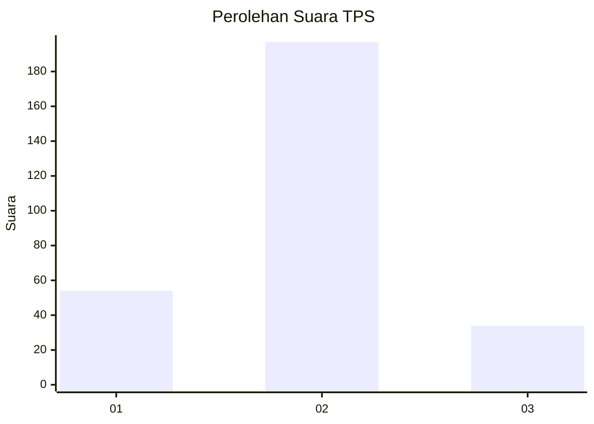
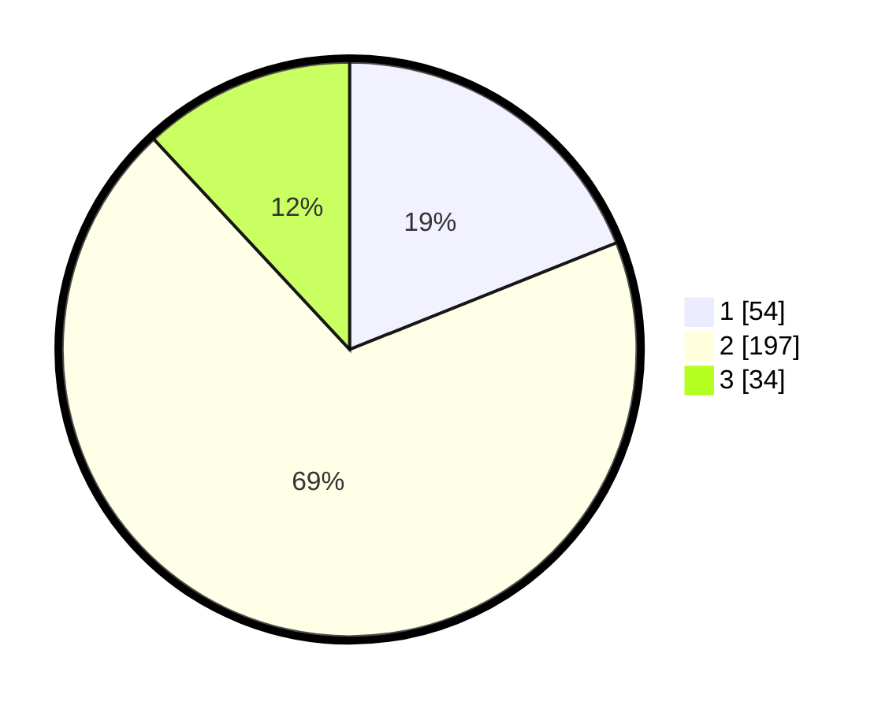

# Hasil

## Grafik

## Tabel

| No. | Nama Paslon    | Suara | Suara (raw) | Persentase |
|:--- |:-------------- | -----:| -----------:| ----------:|
| 1   | ANIES MUHAIMIN | 54    | [54][p-1]   | 18,95      |
| 2   | PRABOWO GIBRAN | 197   | [197][p-2]  | 69,12      |
| 3   | GANJAR MAHFUD  | 34    | [34][p-3]   | 11,93      |

[p-1]: https://github.com/gigit-pemilu/pemilu-2024/blob/main/pilpres/hitung-suara/sub/35-jawa-timur/sub/26-bangkalan/sub/13-tanah-merah/sub/2010-tlomar/sub/006-tps/sub/paslon-1.txt
[p-2]: https://github.com/gigit-pemilu/pemilu-2024/blob/main/pilpres/hitung-suara/sub/35-jawa-timur/sub/26-bangkalan/sub/13-tanah-merah/sub/2010-tlomar/sub/006-tps/sub/paslon-2.txt
[p-3]: https://github.com/gigit-pemilu/pemilu-2024/blob/main/pilpres/hitung-suara/sub/35-jawa-timur/sub/26-bangkalan/sub/13-tanah-merah/sub/2010-tlomar/sub/006-tps/sub/paslon-3.txt

## Foto C Plano

https://sirekap-obj-formc.kpu.go.id/6c3f/pemilu/ppwp/35/26/13/20/10/3526132010006-20240214-201818--36555480-c7b6-4d78-a8fa-ede5f8c1c1ad.jpg

https://sirekap-obj-formc.kpu.go.id/6c3f/pemilu/ppwp/35/26/13/20/10/3526132010006-20240214-202113--24bfac82-67a6-47c3-a724-81d0238d9a52.jpg

https://sirekap-obj-formc.kpu.go.id/6c3f/pemilu/ppwp/35/26/13/20/10/3526132010006-20240214-202244--84b858cb-d5b8-45ca-9d55-87561f5b3d74.jpg

## Metadata

| Key        | Value               |
| ---------- | ------------------- |
| Time Stamp | 2024-02-24 22:31:28 |

