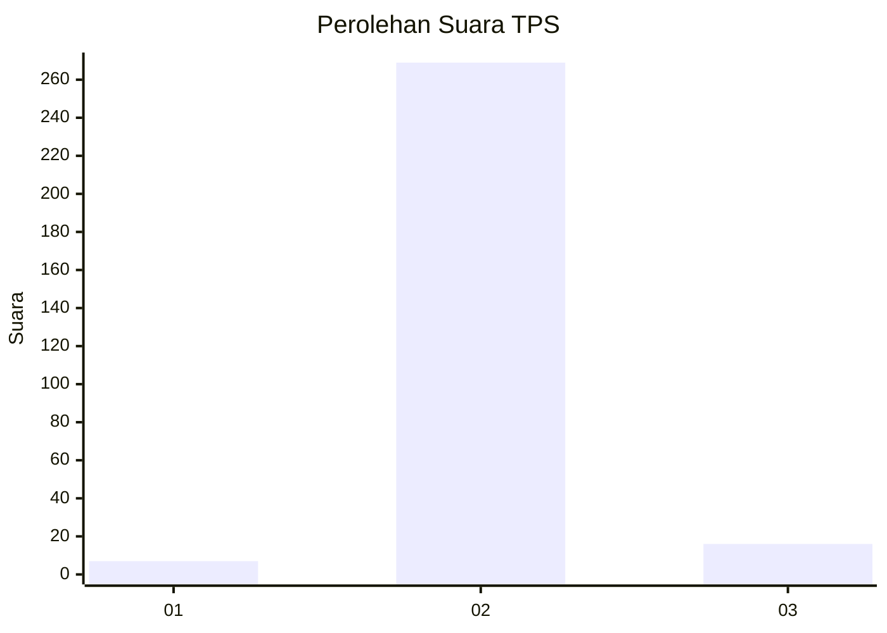
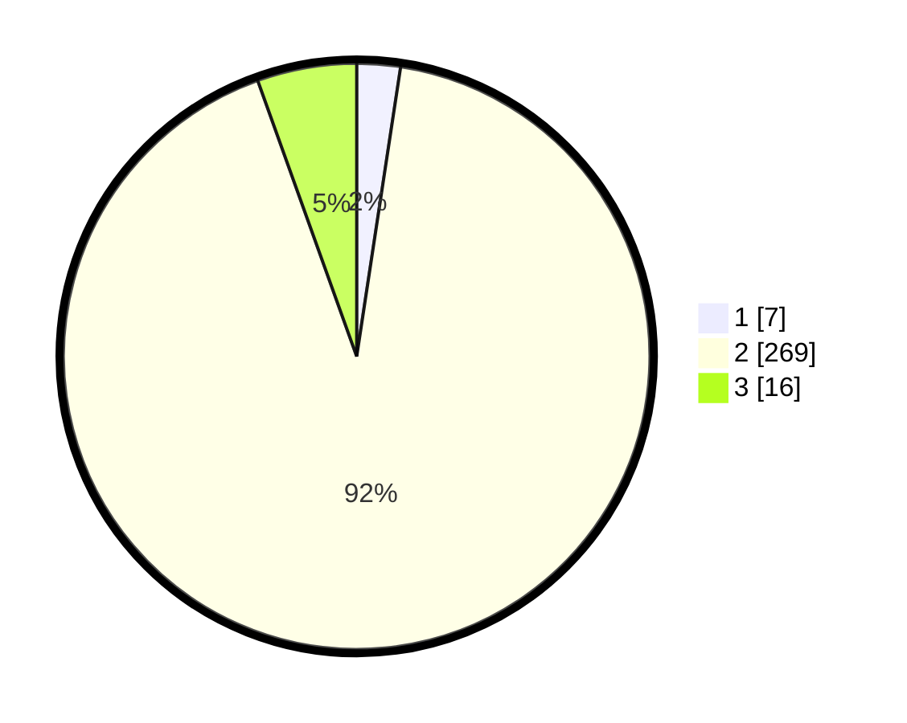

# Hasil

## Grafik

## Tabel

| No. | Nama Paslon    | Suara | Suara (raw) | Persentase |
|:--- |:-------------- | -----:| -----------:| ----------:|
| 1   | ANIES MUHAIMIN | 7     | [7][p-1]    | 2,40       |
| 2   | PRABOWO GIBRAN | 269   | [269][p-2]  | 92,12      |
| 3   | GANJAR MAHFUD  | 16    | [16][p-3]   | 5,48       |

[p-1]: https://github.com/gigit-pemilu/pemilu-2024-35-jawa-timur/blob/main/pilpres/hitung-suara/sub/35-jawa-timur/sub/26-bangkalan/sub/13-tanah-merah/sub/2014-poter/sub/001-tps/sub/paslon-1.txt
[p-2]: https://github.com/gigit-pemilu/pemilu-2024-35-jawa-timur/blob/main/pilpres/hitung-suara/sub/35-jawa-timur/sub/26-bangkalan/sub/13-tanah-merah/sub/2014-poter/sub/001-tps/sub/paslon-2.txt
[p-3]: https://github.com/gigit-pemilu/pemilu-2024-35-jawa-timur/blob/main/pilpres/hitung-suara/sub/35-jawa-timur/sub/26-bangkalan/sub/13-tanah-merah/sub/2014-poter/sub/001-tps/sub/paslon-3.txt

## Foto C Plano

https://sirekap-obj-formc.kpu.go.id/361a/pemilu/ppwp/35/26/13/20/14/3526132014001-20240214-191226--5f726945-952d-47b0-9de4-5671b21a62c1.jpg

https://sirekap-obj-formc.kpu.go.id/361a/pemilu/ppwp/35/26/13/20/14/3526132014001-20240214-191855--58d857b3-3f9d-4434-98ff-1678392afbc7.jpg

https://sirekap-obj-formc.kpu.go.id/361a/pemilu/ppwp/35/26/13/20/14/3526132014001-20240214-192049--4a8f1275-de6b-44e5-a0ce-fbbb6cb03492.jpg

## Metadata

| Key        | Value               |
| ---------- | ------------------- |
| Time Stamp | 2024-02-24 22:31:28 |

