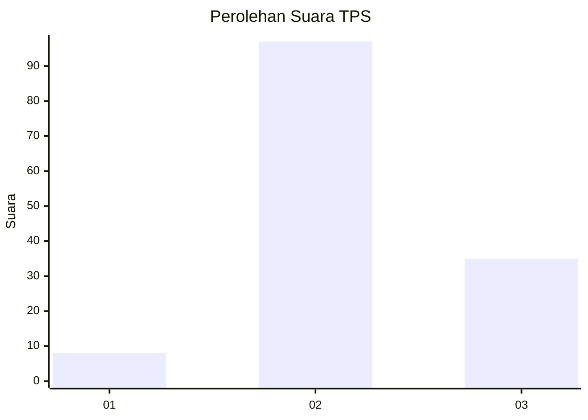
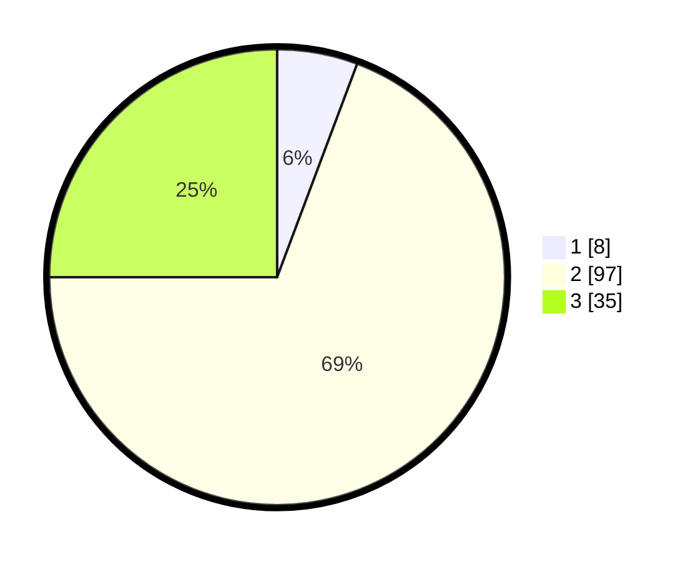

# Hasil

## Grafik

## Tabel

| No. | Nama Paslon    | Suara | Suara (raw) | Persentase |
|:--- |:-------------- | -----:| -----------:| ----------:|
| 1   | ANIES MUHAIMIN | 8     | [8][p-1]    | 5,71       |
| 2   | PRABOWO GIBRAN | 97    | [97][p-2]   | 69,29      |
| 3   | GANJAR MAHFUD  | 35    | [35][p-3]   | 25,00      |

[p-1]: https://github.com/gigit-pemilu/pemilu-2024/blob/main/pilpres/hitung-suara/sub/35-jawa-timur/sub/26-bangkalan/sub/13-tanah-merah/sub/2015-patemon/sub/002-tps/sub/paslon-1.txt
[p-2]: https://github.com/gigit-pemilu/pemilu-2024/blob/main/pilpres/hitung-suara/sub/35-jawa-timur/sub/26-bangkalan/sub/13-tanah-merah/sub/2015-patemon/sub/002-tps/sub/paslon-2.txt
[p-3]: https://github.com/gigit-pemilu/pemilu-2024/blob/main/pilpres/hitung-suara/sub/35-jawa-timur/sub/26-bangkalan/sub/13-tanah-merah/sub/2015-patemon/sub/002-tps/sub/paslon-3.txt

## Foto C Plano

https://sirekap-obj-formc.kpu.go.id/5436/pemilu/ppwp/35/26/13/20/15/3526132015002-20240214-202839--f3d1d697-9014-4e58-bb54-3767b04a9eee.jpg

https://sirekap-obj-formc.kpu.go.id/5436/pemilu/ppwp/35/26/13/20/15/3526132015002-20240214-205548--b6ee7b5d-84b8-4068-898c-f6c2eb5e69c7.jpg

https://sirekap-obj-formc.kpu.go.id/5436/pemilu/ppwp/35/26/13/20/15/3526132015002-20240214-202546--72ac3bc9-5b94-4130-977c-90c689f61359.jpg

## Metadata

| Key        | Value               |
| ---------- | ------------------- |
| Time Stamp | 2024-02-19 06:16:00 |

