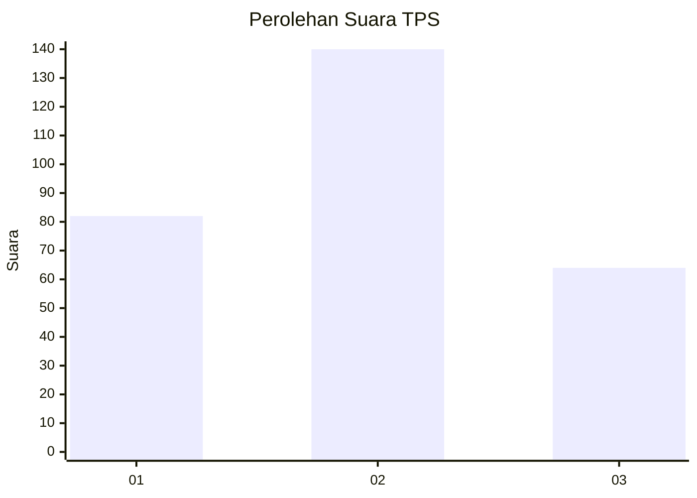
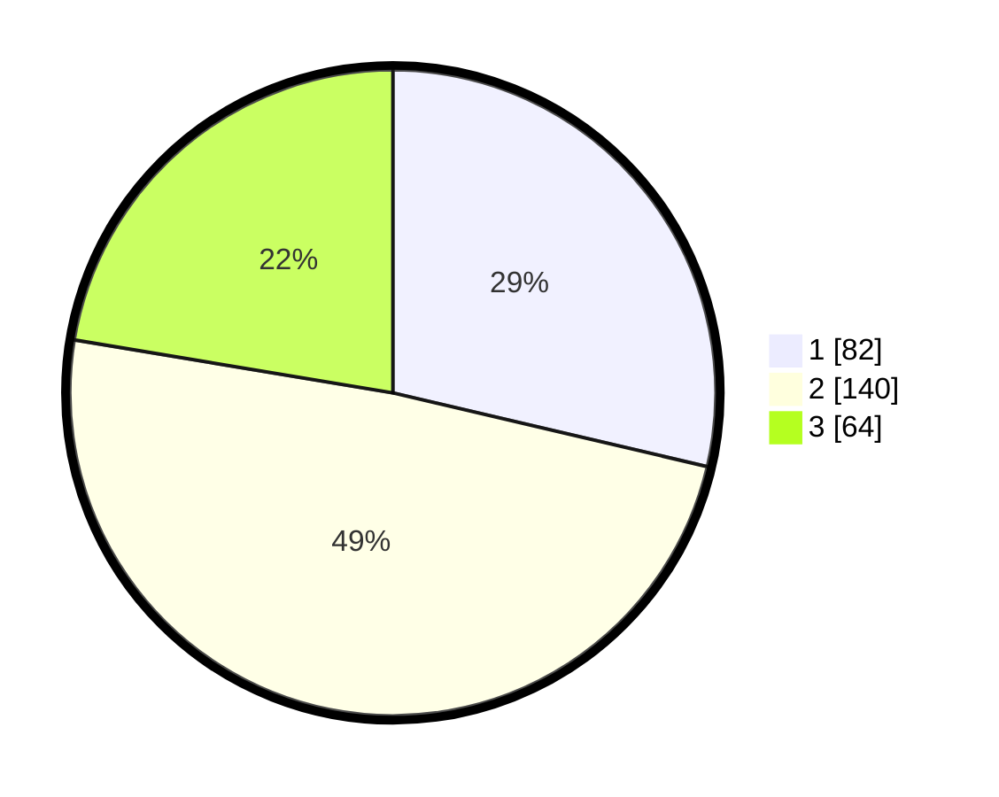

# Hasil

## Grafik

## Tabel

| No. | Nama Paslon    | Suara | Suara (raw) | Persentase |
|:--- |:-------------- | -----:| -----------:| ----------:|
| 1   | ANIES MUHAIMIN | 82    | [82][p-1]   | 28,67      |
| 2   | PRABOWO GIBRAN | 140   | [140][p-2]  | 48,95      |
| 3   | GANJAR MAHFUD  | 64    | [64][p-3]   | 22,38      |

[p-1]: https://github.com/gigit-pemilu/pemilu-2024/blob/main/pilpres/hitung-suara/sub/35-jawa-timur/sub/26-bangkalan/sub/13-tanah-merah/sub/2016-dlambah-dajah/sub/008-tps/sub/paslon-1.txt
[p-2]: https://github.com/gigit-pemilu/pemilu-2024/blob/main/pilpres/hitung-suara/sub/35-jawa-timur/sub/26-bangkalan/sub/13-tanah-merah/sub/2016-dlambah-dajah/sub/008-tps/sub/paslon-2.txt
[p-3]: https://github.com/gigit-pemilu/pemilu-2024/blob/main/pilpres/hitung-suara/sub/35-jawa-timur/sub/26-bangkalan/sub/13-tanah-merah/sub/2016-dlambah-dajah/sub/008-tps/sub/paslon-3.txt

## Foto C Plano

https://sirekap-obj-formc.kpu.go.id/e6c6/pemilu/ppwp/35/26/13/20/16/3526132016008-20240214-221805--1d6fa517-7af1-4ff3-b4c3-ac35ebc5115a.jpg

https://sirekap-obj-formc.kpu.go.id/e6c6/pemilu/ppwp/35/26/13/20/16/3526132016008-20240214-221955--aa683da1-0907-4207-8aef-7e3e9d4bd2bb.jpg

https://sirekap-obj-formc.kpu.go.id/e6c6/pemilu/ppwp/35/26/13/20/16/3526132016008-20240214-222334--a86ce3a7-6abf-462a-b413-c781cc6586f1.jpg

## Metadata

| Key        | Value               |
| ---------- | ------------------- |
| Time Stamp | 2024-02-24 22:31:28 |

