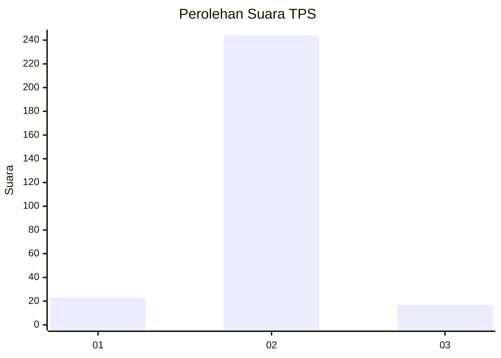
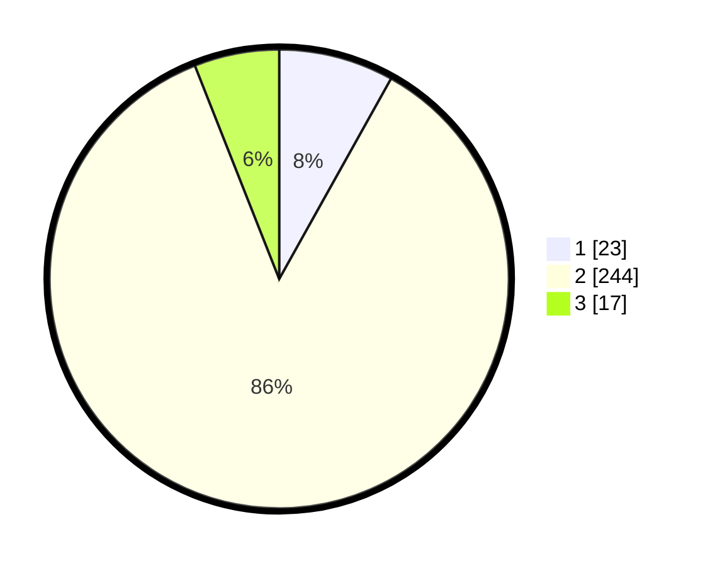

# Hasil

## Grafik

## Tabel

| No. | Nama Paslon    | Suara | Suara (raw) | Persentase |
|:--- |:-------------- | -----:| -----------:| ----------:|
| 1   | ANIES MUHAIMIN | 23    | [23][p-1]   | 8,10       |
| 2   | PRABOWO GIBRAN | 244   | [244][p-2]  | 85,92      |
| 3   | GANJAR MAHFUD  | 17    | [17][p-3]   | 5,99       |

[p-1]: https://github.com/gigit-pemilu/pemilu-2024-35-jawa-timur/blob/main/pilpres/hitung-suara/sub/35-jawa-timur/sub/26-bangkalan/sub/13-tanah-merah/sub/2019-buddan/sub/003-tps/sub/paslon-1.txt
[p-2]: https://github.com/gigit-pemilu/pemilu-2024-35-jawa-timur/blob/main/pilpres/hitung-suara/sub/35-jawa-timur/sub/26-bangkalan/sub/13-tanah-merah/sub/2019-buddan/sub/003-tps/sub/paslon-2.txt
[p-3]: https://github.com/gigit-pemilu/pemilu-2024-35-jawa-timur/blob/main/pilpres/hitung-suara/sub/35-jawa-timur/sub/26-bangkalan/sub/13-tanah-merah/sub/2019-buddan/sub/003-tps/sub/paslon-3.txt

## Foto C Plano

https://sirekap-obj-formc.kpu.go.id/cc62/pemilu/ppwp/35/26/13/20/19/3526132019003-20240214-224056--ef71151c-a583-4d9a-af15-0986e25816b8.jpg

https://sirekap-obj-formc.kpu.go.id/cc62/pemilu/ppwp/35/26/13/20/19/3526132019003-20240214-203735--d1bc4ba4-315e-4a6b-8649-647d3f850730.jpg

https://sirekap-obj-formc.kpu.go.id/cc62/pemilu/ppwp/35/26/13/20/19/3526132019003-20240214-204048--06283f70-5ada-48e7-855c-a0ff2c6ed372.jpg

## Metadata

| Key        | Value               |
| ---------- | ------------------- |
| Time Stamp | 2024-02-17 16:00:02 |

