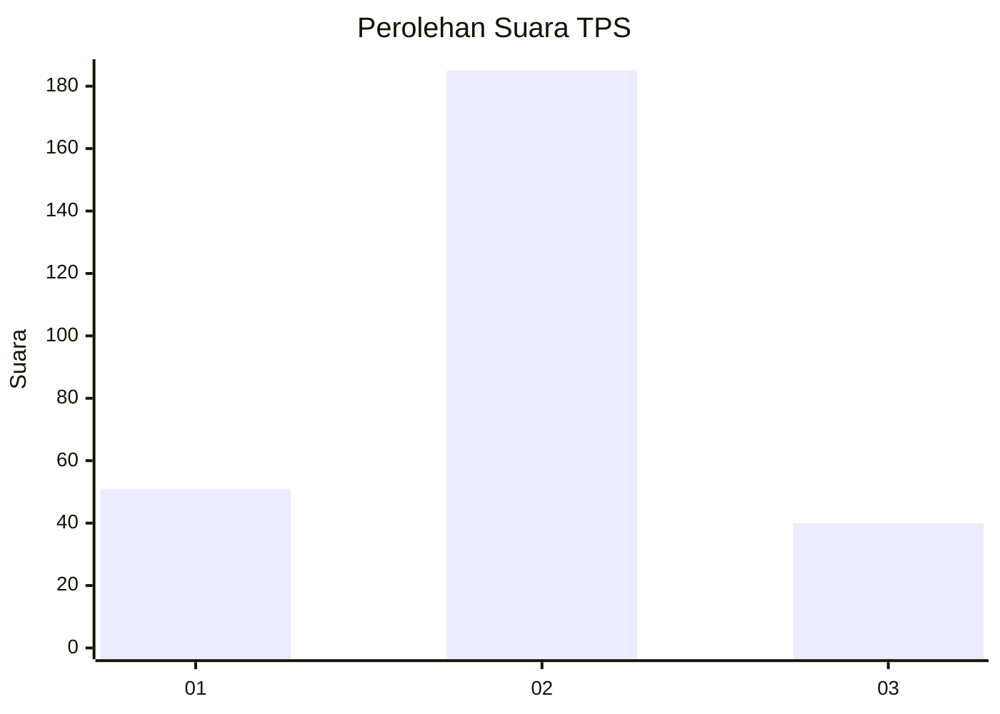
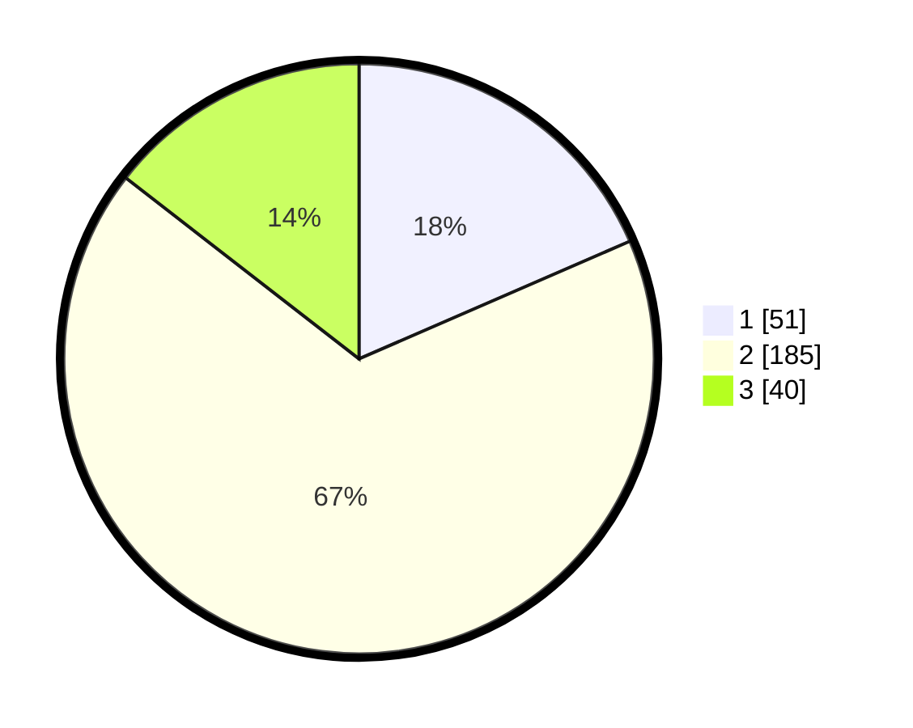

# Hasil

## Grafik

## Tabel

| No. | Nama Paslon    | Suara | Suara (raw) | Persentase |
|:--- |:-------------- | -----:| -----------:| ----------:|
| 1   | ANIES MUHAIMIN | 51    | [51][p-1]   | 18,48      |
| 2   | PRABOWO GIBRAN | 185   | [185][p-2]  | 67,03      |
| 3   | GANJAR MAHFUD  | 40    | [40][p-3]   | 14,49      |

[p-1]: https://github.com/gigit-pemilu/pemilu-2024/blob/main/pilpres/hitung-suara/sub/35-jawa-timur/sub/26-bangkalan/sub/14-tragah/sub/2001-soket-laok/sub/002-tps/sub/paslon-1.txt
[p-2]: https://github.com/gigit-pemilu/pemilu-2024/blob/main/pilpres/hitung-suara/sub/35-jawa-timur/sub/26-bangkalan/sub/14-tragah/sub/2001-soket-laok/sub/002-tps/sub/paslon-2.txt
[p-3]: https://github.com/gigit-pemilu/pemilu-2024/blob/main/pilpres/hitung-suara/sub/35-jawa-timur/sub/26-bangkalan/sub/14-tragah/sub/2001-soket-laok/sub/002-tps/sub/paslon-3.txt

## Foto C Plano

https://sirekap-obj-formc.kpu.go.id/9fa7/pemilu/ppwp/35/26/14/20/01/3526142001002-20240214-193626--cde19d12-8604-4465-9819-9537a2dc216e.jpg

https://sirekap-obj-formc.kpu.go.id/9fa7/pemilu/ppwp/35/26/14/20/01/3526142001002-20240214-193944--567c0600-1b7f-4f67-b545-95e223b1e627.jpg

https://sirekap-obj-formc.kpu.go.id/9fa7/pemilu/ppwp/35/26/14/20/01/3526142001002-20240214-194213--6a3c8625-80c2-4fba-bdd7-de93d02d0719.jpg

## Metadata

| Key        | Value               |
| ---------- | ------------------- |
| Time Stamp | 2024-02-19 06:16:00 |

