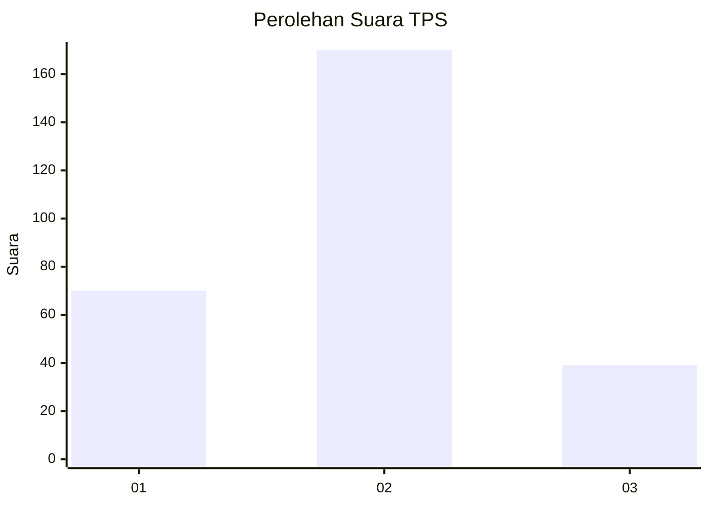
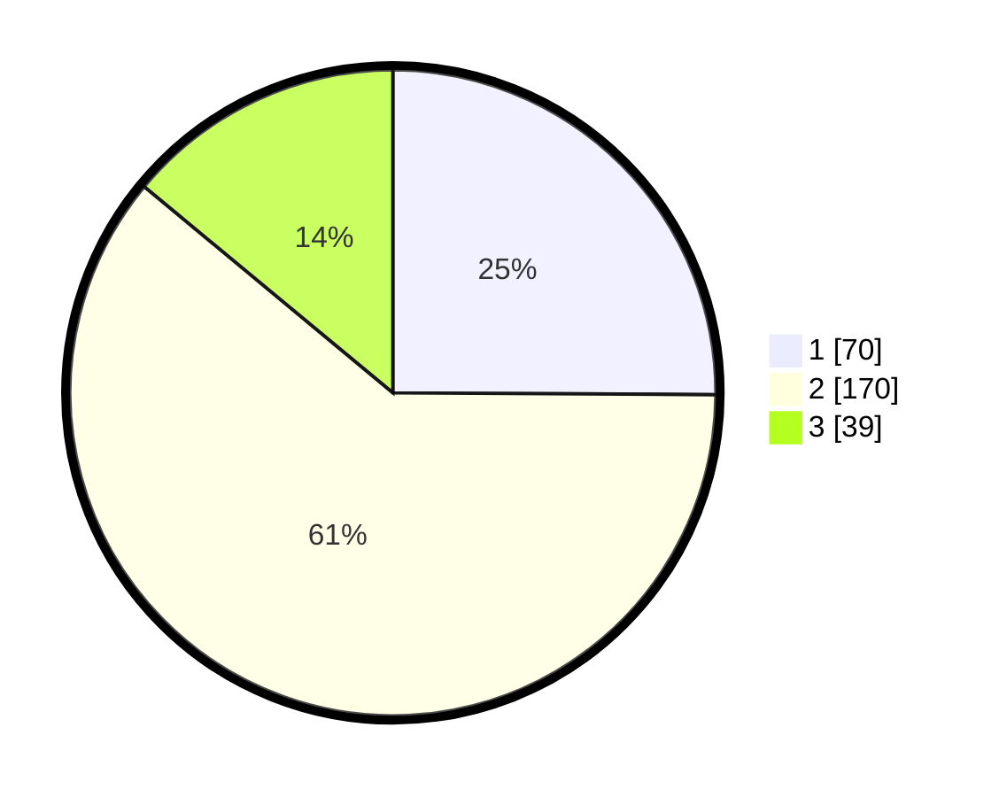

# Hasil

## Grafik

## Tabel

| No. | Nama Paslon    | Suara | Suara (raw) | Persentase |
|:--- |:-------------- | -----:| -----------:| ----------:|
| 1   | ANIES MUHAIMIN | 70    | [70][p-1]   | 25,09      |
| 2   | PRABOWO GIBRAN | 170   | [170][p-2]  | 60,93      |
| 3   | GANJAR MAHFUD  | 39    | [39][p-3]   | 13,98      |

[p-1]: https://github.com/gigit-pemilu/pemilu-2024-35-jawa-timur/blob/main/pilpres/hitung-suara/sub/35-jawa-timur/sub/26-bangkalan/sub/14-tragah/sub/2001-soket-laok/sub/003-tps/sub/paslon-1.txt
[p-2]: https://github.com/gigit-pemilu/pemilu-2024-35-jawa-timur/blob/main/pilpres/hitung-suara/sub/35-jawa-timur/sub/26-bangkalan/sub/14-tragah/sub/2001-soket-laok/sub/003-tps/sub/paslon-2.txt
[p-3]: https://github.com/gigit-pemilu/pemilu-2024-35-jawa-timur/blob/main/pilpres/hitung-suara/sub/35-jawa-timur/sub/26-bangkalan/sub/14-tragah/sub/2001-soket-laok/sub/003-tps/sub/paslon-3.txt

## Foto C Plano

https://sirekap-obj-formc.kpu.go.id/fb07/pemilu/ppwp/35/26/14/20/01/3526142001003-20240214-200915--6b818843-fec0-4c9f-88c9-0acc647d6192.jpg

https://sirekap-obj-formc.kpu.go.id/fb07/pemilu/ppwp/35/26/14/20/01/3526142001003-20240214-201030--ed7a968a-acae-41d5-a016-6e388b2034f6.jpg

https://sirekap-obj-formc.kpu.go.id/fb07/pemilu/ppwp/35/26/14/20/01/3526142001003-20240214-201130--2843e7da-2a96-4e48-8e56-9ae476203d12.jpg

## Metadata

| Key        | Value               |
| ---------- | ------------------- |
| Time Stamp | 2024-02-19 06:16:00 |

