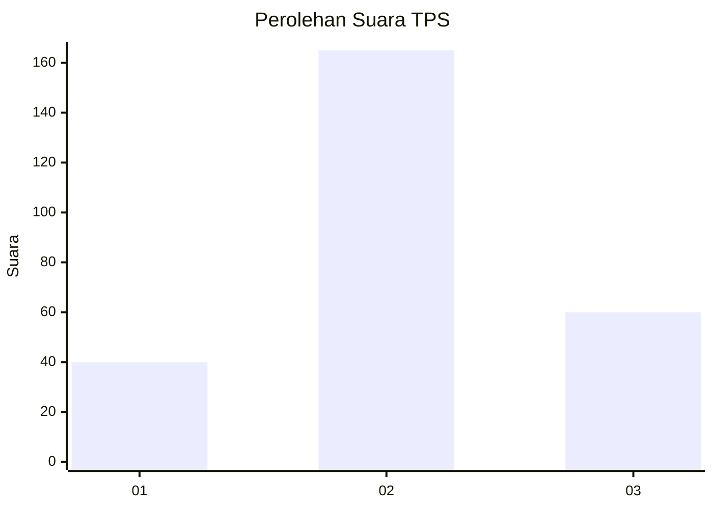
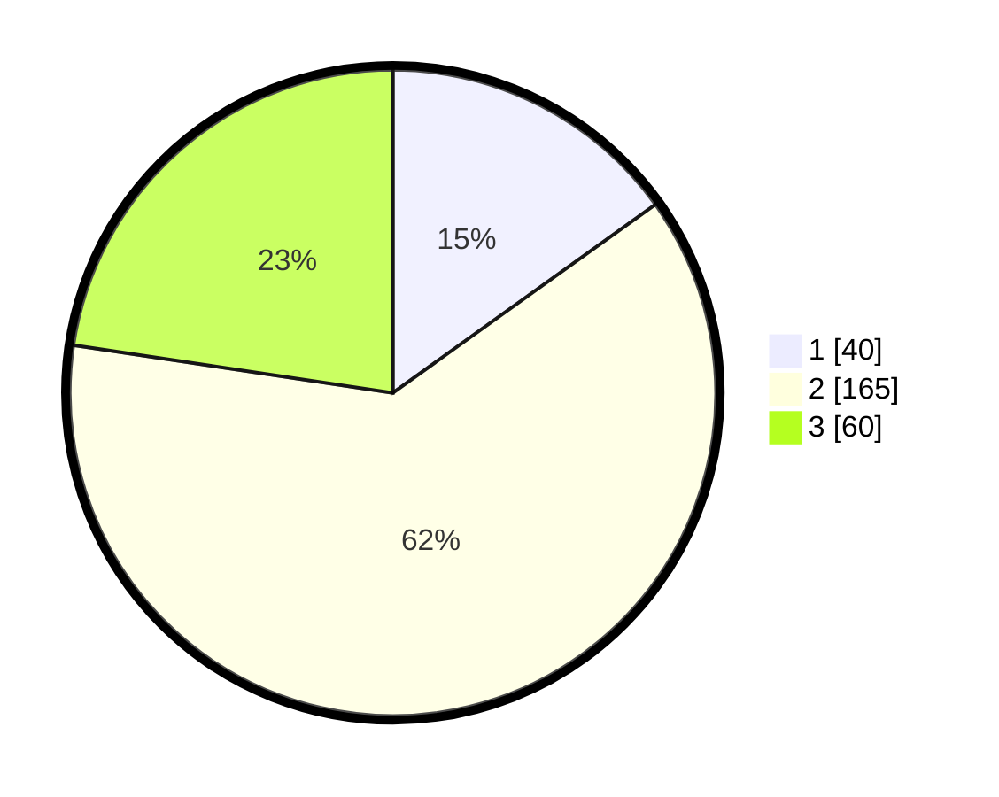

# Hasil

## Grafik

## Tabel

| No. | Nama Paslon    | Suara | Suara (raw) | Persentase |
|:--- |:-------------- | -----:| -----------:| ----------:|
| 1   | ANIES MUHAIMIN | 40    | [40][p-1]   | 15,09      |
| 2   | PRABOWO GIBRAN | 165   | [165][p-2]  | 62,26      |
| 3   | GANJAR MAHFUD  | 60    | [60][p-3]   | 22,64      |

[p-1]: https://github.com/gigit-pemilu/pemilu-2024/blob/main/pilpres/hitung-suara/sub/35-jawa-timur/sub/26-bangkalan/sub/14-tragah/sub/2001-soket-laok/sub/004-tps/sub/paslon-1.txt
[p-2]: https://github.com/gigit-pemilu/pemilu-2024/blob/main/pilpres/hitung-suara/sub/35-jawa-timur/sub/26-bangkalan/sub/14-tragah/sub/2001-soket-laok/sub/004-tps/sub/paslon-2.txt
[p-3]: https://github.com/gigit-pemilu/pemilu-2024/blob/main/pilpres/hitung-suara/sub/35-jawa-timur/sub/26-bangkalan/sub/14-tragah/sub/2001-soket-laok/sub/004-tps/sub/paslon-3.txt

## Foto C Plano

https://sirekap-obj-formc.kpu.go.id/ac30/pemilu/ppwp/35/26/14/20/01/3526142001004-20240214-211003--2b2a80fb-509b-40a8-b307-705d358ed6cd.jpg

https://sirekap-obj-formc.kpu.go.id/ac30/pemilu/ppwp/35/26/14/20/01/3526142001004-20240214-211008--9d756ec9-fbb4-4906-bcea-dc568fd2ccc6.jpg

https://sirekap-obj-formc.kpu.go.id/ac30/pemilu/ppwp/35/26/14/20/01/3526142001004-20240214-211010--1284cee2-fbf2-45aa-9ae7-bd877cb4496a.jpg

## Metadata

| Key        | Value               |
| ---------- | ------------------- |
| Time Stamp | 2024-02-19 06:16:00 |

