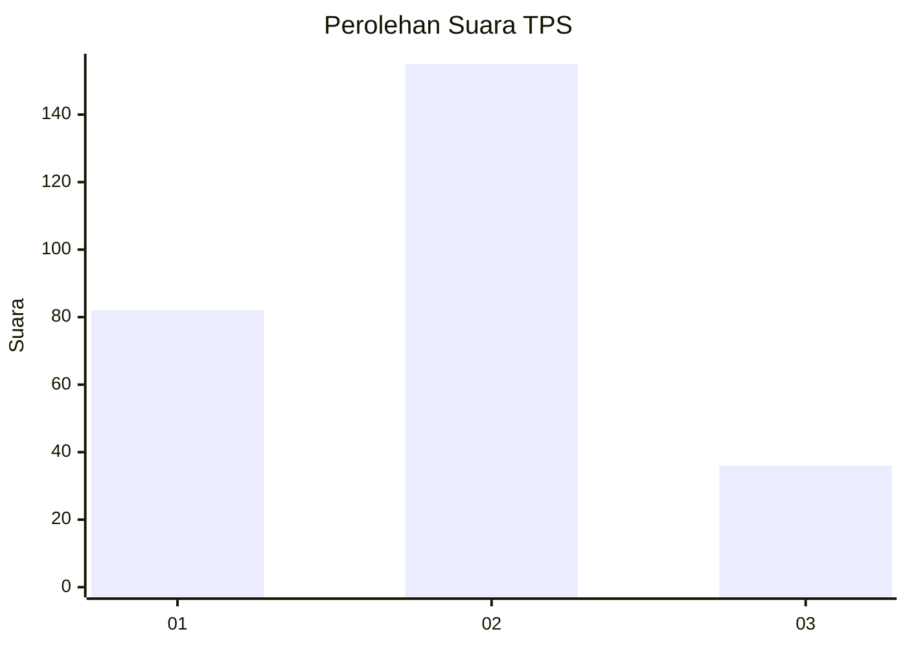
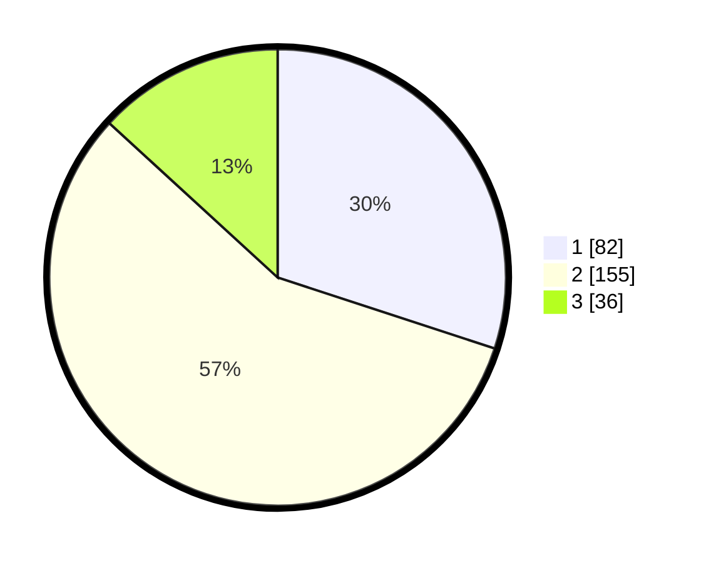

# Hasil

## Grafik

## Tabel

| No. | Nama Paslon    | Suara | Suara (raw) | Persentase |
|:--- |:-------------- | -----:| -----------:| ----------:|
| 1   | ANIES MUHAIMIN | 82    | [82][p-1]   | 30,04      |
| 2   | PRABOWO GIBRAN | 155   | [155][p-2]  | 56,78      |
| 3   | GANJAR MAHFUD  | 36    | [36][p-3]   | 13,19      |

[p-1]: https://github.com/gigit-pemilu/pemilu-2024/blob/main/pilpres/hitung-suara/sub/35-jawa-timur/sub/26-bangkalan/sub/14-tragah/sub/2001-soket-laok/sub/010-tps/sub/paslon-1.txt
[p-2]: https://github.com/gigit-pemilu/pemilu-2024/blob/main/pilpres/hitung-suara/sub/35-jawa-timur/sub/26-bangkalan/sub/14-tragah/sub/2001-soket-laok/sub/010-tps/sub/paslon-2.txt
[p-3]: https://github.com/gigit-pemilu/pemilu-2024/blob/main/pilpres/hitung-suara/sub/35-jawa-timur/sub/26-bangkalan/sub/14-tragah/sub/2001-soket-laok/sub/010-tps/sub/paslon-3.txt

## Foto C Plano

https://sirekap-obj-formc.kpu.go.id/131e/pemilu/ppwp/35/26/14/20/01/3526142001010-20240214-195724--5b62b114-ef7f-413f-bb3b-99ccc02d350d.jpg

https://sirekap-obj-formc.kpu.go.id/131e/pemilu/ppwp/35/26/14/20/01/3526142001010-20240214-193155--d6a9677e-5bcb-4d3c-ad88-0cc328fdcb7d.jpg

https://sirekap-obj-formc.kpu.go.id/131e/pemilu/ppwp/35/26/14/20/01/3526142001010-20240214-193420--42df61c1-5673-4ceb-8edc-617b69501b8f.jpg

## Metadata

| Key        | Value               |
| ---------- | ------------------- |
| Time Stamp | 2024-02-19 06:16:00 |

