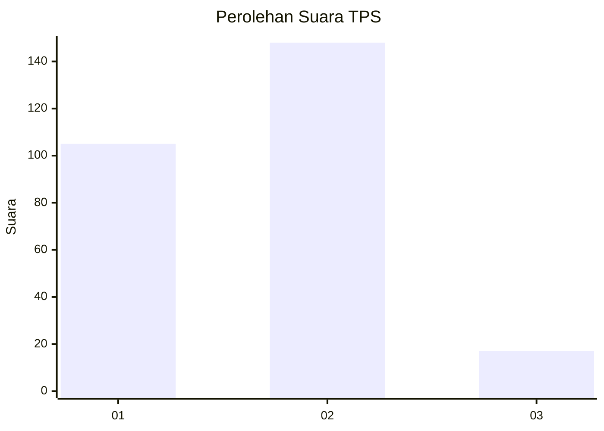

# Hasil

## Grafik

## Tabel

| No. | Nama Paslon    | Suara | Suara (raw) | Persentase |
|:--- |:-------------- | -----:| -----------:| ----------:|
| 1   | ANIES MUHAIMIN | 105   | [105][p-1]  | 38,89      |
| 2   | PRABOWO GIBRAN | 148   | [148][p-2]  | 54,81      |
| 3   | GANJAR MAHFUD  | 17    | [17][p-3]   | 6,30       |

[p-1]: https://github.com/gigit-pemilu/pemilu-2024-35-jawa-timur/blob/main/pilpres/hitung-suara/sub/35-jawa-timur/sub/26-bangkalan/sub/15-blega/sub/2001-blega/sub/003-tps/sub/paslon-1.txt
[p-2]: https://github.com/gigit-pemilu/pemilu-2024-35-jawa-timur/blob/main/pilpres/hitung-suara/sub/35-jawa-timur/sub/26-bangkalan/sub/15-blega/sub/2001-blega/sub/003-tps/sub/paslon-2.txt
[p-3]: https://github.com/gigit-pemilu/pemilu-2024-35-jawa-timur/blob/main/pilpres/hitung-suara/sub/35-jawa-timur/sub/26-bangkalan/sub/15-blega/sub/2001-blega/sub/003-tps/sub/paslon-3.txt

## Foto C Plano

https://sirekap-obj-formc.kpu.go.id/707d/pemilu/ppwp/35/26/15/20/01/3526152001003-20240214-190111--122527de-64ab-48d0-9bb0-e8bce52d33c2.jpg

https://sirekap-obj-formc.kpu.go.id/707d/pemilu/ppwp/35/26/15/20/01/3526152001003-20240214-190114--555bab27-cb45-401c-a9ee-b3bf27c4cb6f.jpg

https://sirekap-obj-formc.kpu.go.id/707d/pemilu/ppwp/35/26/15/20/01/3526152001003-20240214-221857--798ade65-0747-4bde-b7e8-aab07b891b93.jpg

## Metadata

| Key        | Value               |
| ---------- | ------------------- |
| Time Stamp | 2024-02-15 09:00:24 |

