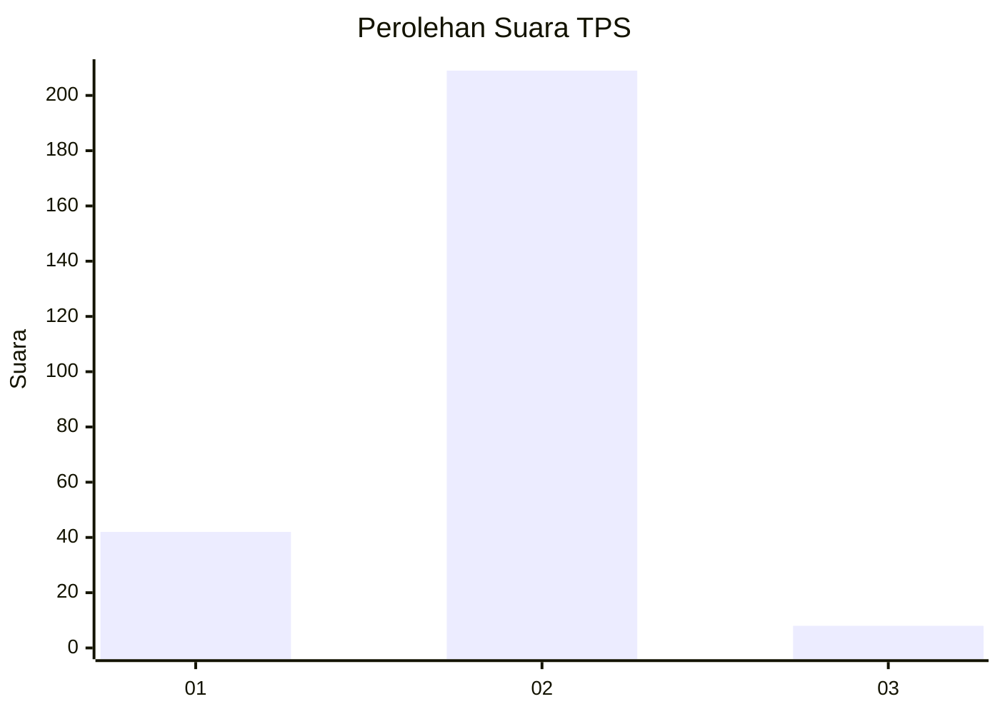
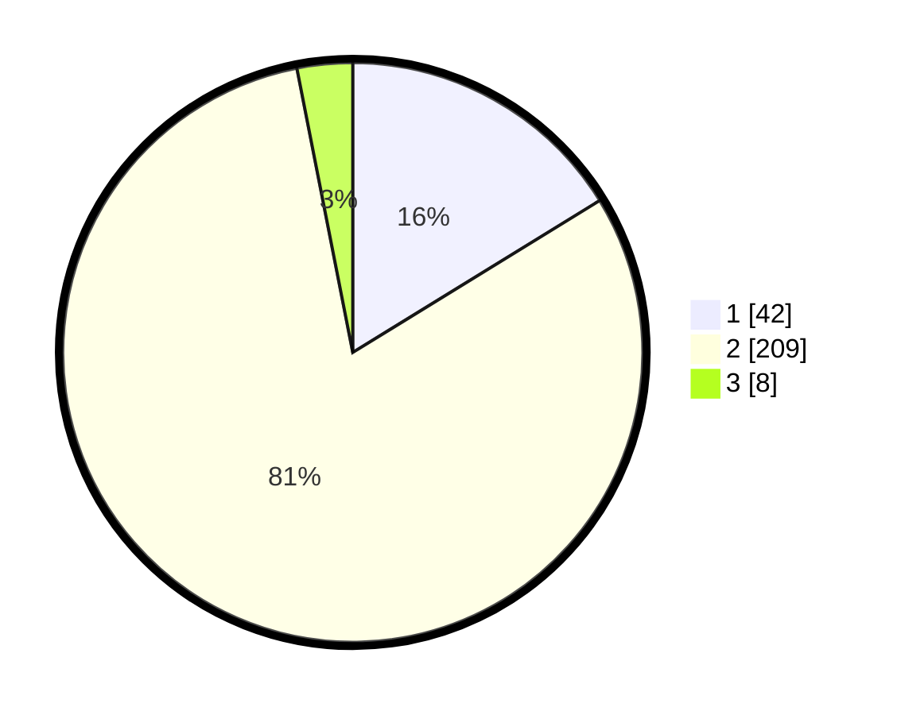

# Hasil

## Grafik

## Tabel

| No. | Nama Paslon    | Suara | Suara (raw) | Persentase |
|:--- |:-------------- | -----:| -----------:| ----------:|
| 1   | ANIES MUHAIMIN | 42    | [42][p-1]   | 16,22      |
| 2   | PRABOWO GIBRAN | 209   | [209][p-2]  | 80,69      |
| 3   | GANJAR MAHFUD  | 8     | [8][p-3]    | 3,09       |

[p-1]: https://github.com/gigit-pemilu/pemilu-2024/blob/main/pilpres/hitung-suara/sub/35-jawa-timur/sub/26-bangkalan/sub/15-blega/sub/2001-blega/sub/005-tps/sub/paslon-1.txt
[p-2]: https://github.com/gigit-pemilu/pemilu-2024/blob/main/pilpres/hitung-suara/sub/35-jawa-timur/sub/26-bangkalan/sub/15-blega/sub/2001-blega/sub/005-tps/sub/paslon-2.txt
[p-3]: https://github.com/gigit-pemilu/pemilu-2024/blob/main/pilpres/hitung-suara/sub/35-jawa-timur/sub/26-bangkalan/sub/15-blega/sub/2001-blega/sub/005-tps/sub/paslon-3.txt

## Foto C Plano

https://sirekap-obj-formc.kpu.go.id/5d6b/pemilu/ppwp/35/26/15/20/01/3526152001005-20240214-141446--34e62fb9-15d5-4d47-819c-42084703195f.jpg

https://sirekap-obj-formc.kpu.go.id/5d6b/pemilu/ppwp/35/26/15/20/01/3526152001005-20240214-141639--8622608c-9f10-4c08-b41c-34102e5dcde4.jpg

## Metadata

| Key        | Value               |
| ---------- | ------------------- |
| Time Stamp | 2024-02-24 22:31:28 |

