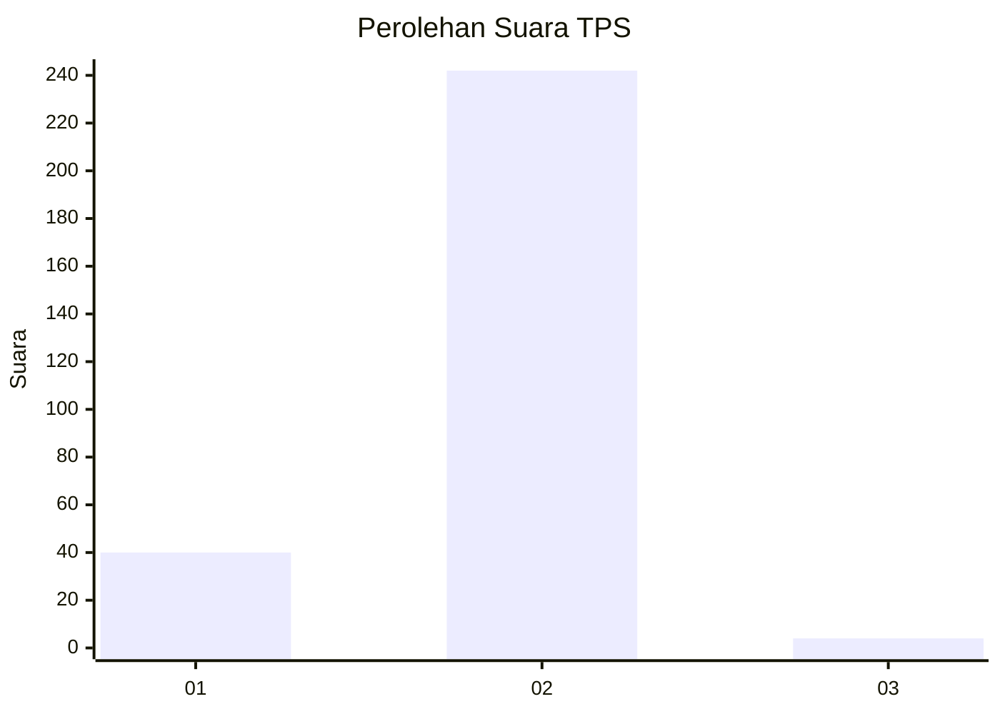
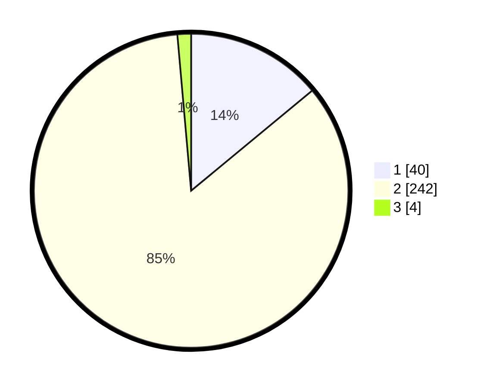

# Hasil

## Grafik

## Tabel

| No. | Nama Paslon    | Suara | Suara (raw) | Persentase |
|:--- |:-------------- | -----:| -----------:| ----------:|
| 1   | ANIES MUHAIMIN | 40    | [40][p-1]   | 13,99      |
| 2   | PRABOWO GIBRAN | 242   | [242][p-2]  | 84,62      |
| 3   | GANJAR MAHFUD  | 4     | [4][p-3]    | 1,40       |

[p-1]: https://github.com/gigit-pemilu/pemilu-2024/blob/main/pilpres/hitung-suara/sub/35-jawa-timur/sub/26-bangkalan/sub/15-blega/sub/2001-blega/sub/006-tps/sub/paslon-1.txt
[p-2]: https://github.com/gigit-pemilu/pemilu-2024/blob/main/pilpres/hitung-suara/sub/35-jawa-timur/sub/26-bangkalan/sub/15-blega/sub/2001-blega/sub/006-tps/sub/paslon-2.txt
[p-3]: https://github.com/gigit-pemilu/pemilu-2024/blob/main/pilpres/hitung-suara/sub/35-jawa-timur/sub/26-bangkalan/sub/15-blega/sub/2001-blega/sub/006-tps/sub/paslon-3.txt

## Foto C Plano

https://sirekap-obj-formc.kpu.go.id/e37d/pemilu/ppwp/35/26/15/20/01/3526152001006-20240214-185043--227b7e6f-19a3-4749-8338-29af8de7d510.jpg

https://sirekap-obj-formc.kpu.go.id/e37d/pemilu/ppwp/35/26/15/20/01/3526152001006-20240214-185049--998718e3-1afd-4d81-a1e2-460801e42798.jpg

https://sirekap-obj-formc.kpu.go.id/e37d/pemilu/ppwp/35/26/15/20/01/3526152001006-20240214-185056--560fa226-57c3-498a-b4b5-16ef0adc25fd.jpg

## Metadata

| Key        | Value               |
| ---------- | ------------------- |
| Time Stamp | 2024-02-19 06:16:00 |

