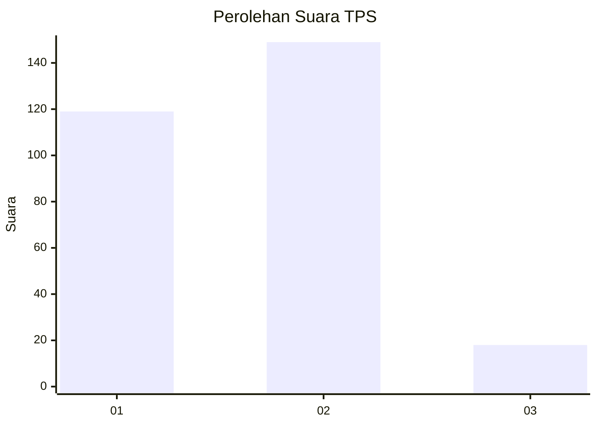

# Hasil

## Grafik

## Tabel

| No. | Nama Paslon    | Suara | Suara (raw) | Persentase |
|:--- |:-------------- | -----:| -----------:| ----------:|
| 1   | ANIES MUHAIMIN | 119   | [119][p-1]  | 41,61      |
| 2   | PRABOWO GIBRAN | 149   | [149][p-2]  | 52,10      |
| 3   | GANJAR MAHFUD  | 18    | [18][p-3]   | 6,29       |

[p-1]: https://github.com/gigit-pemilu/pemilu-2024/blob/main/pilpres/hitung-suara/sub/35-jawa-timur/sub/26-bangkalan/sub/15-blega/sub/2001-blega/sub/010-tps/sub/paslon-1.txt
[p-2]: https://github.com/gigit-pemilu/pemilu-2024/blob/main/pilpres/hitung-suara/sub/35-jawa-timur/sub/26-bangkalan/sub/15-blega/sub/2001-blega/sub/010-tps/sub/paslon-2.txt
[p-3]: https://github.com/gigit-pemilu/pemilu-2024/blob/main/pilpres/hitung-suara/sub/35-jawa-timur/sub/26-bangkalan/sub/15-blega/sub/2001-blega/sub/010-tps/sub/paslon-3.txt

## Foto C Plano

https://sirekap-obj-formc.kpu.go.id/d657/pemilu/ppwp/35/26/15/20/01/3526152001010-20240214-210646--2c964592-ef7b-40d6-b101-eeb55d4d23de.jpg

https://sirekap-obj-formc.kpu.go.id/d657/pemilu/ppwp/35/26/15/20/01/3526152001010-20240214-210829--28eba348-e677-4985-a050-714374639035.jpg

https://sirekap-obj-formc.kpu.go.id/d657/pemilu/ppwp/35/26/15/20/01/3526152001010-20240214-211118--5ad216f4-61a9-4726-a1e3-4d80b9d8b242.jpg

## Metadata

| Key        | Value               |
| ---------- | ------------------- |
| Time Stamp | 2024-02-19 06:16:00 |

