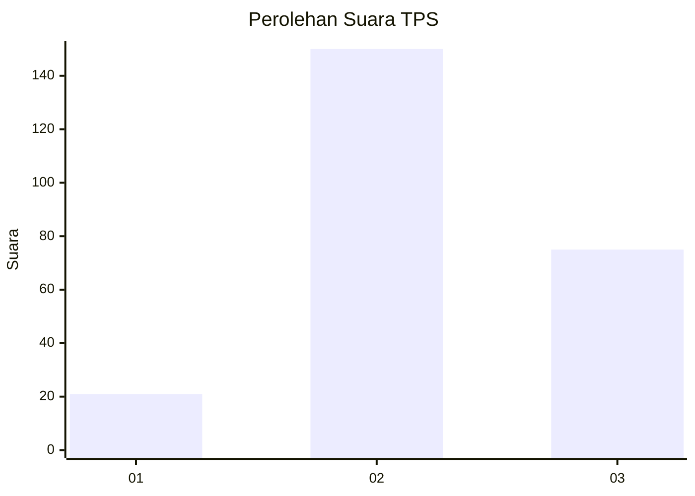
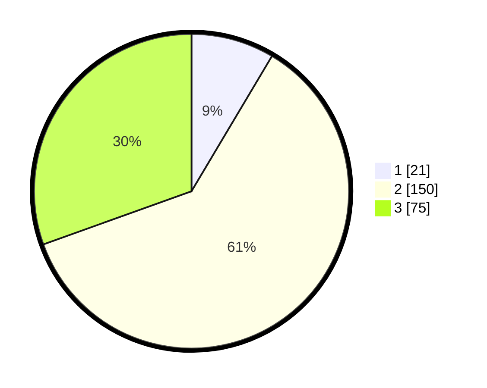

# Hasil

## Grafik

## Tabel

| No. | Nama Paslon    | Suara | Suara (raw) | Persentase |
|:--- |:-------------- | -----:| -----------:| ----------:|
| 1   | ANIES MUHAIMIN | 21    | [21][p-1]   | 8,54       |
| 2   | PRABOWO GIBRAN | 150   | [150][p-2]  | 60,98      |
| 3   | GANJAR MAHFUD  | 75    | [75][p-3]   | 30,49      |

[p-1]: https://github.com/gigit-pemilu/pemilu-2024-35-jawa-timur/blob/main/pilpres/hitung-suara/sub/35-jawa-timur/sub/26-bangkalan/sub/15-blega/sub/2002-rosep/sub/003-tps/sub/paslon-1.txt
[p-2]: https://github.com/gigit-pemilu/pemilu-2024-35-jawa-timur/blob/main/pilpres/hitung-suara/sub/35-jawa-timur/sub/26-bangkalan/sub/15-blega/sub/2002-rosep/sub/003-tps/sub/paslon-2.txt
[p-3]: https://github.com/gigit-pemilu/pemilu-2024-35-jawa-timur/blob/main/pilpres/hitung-suara/sub/35-jawa-timur/sub/26-bangkalan/sub/15-blega/sub/2002-rosep/sub/003-tps/sub/paslon-3.txt

## Foto C Plano

https://sirekap-obj-formc.kpu.go.id/2ae9/pemilu/ppwp/35/26/15/20/02/3526152002003-20240215-225046--5387a12e-4587-4a2c-8f5d-1d3ee23d9169.jpg

https://sirekap-obj-formc.kpu.go.id/2ae9/pemilu/ppwp/35/26/15/20/02/3526152002003-20240215-225056--58ed5508-476e-41f8-b56c-e620d0465a7f.jpg

https://sirekap-obj-formc.kpu.go.id/2ae9/pemilu/ppwp/35/26/15/20/02/3526152002003-20240215-225104--adcbe2f2-44cc-4ed2-ab2d-6553837c0351.jpg

## Metadata

| Key        | Value               |
| ---------- | ------------------- |
| Time Stamp | 2024-02-24 22:31:28 |

