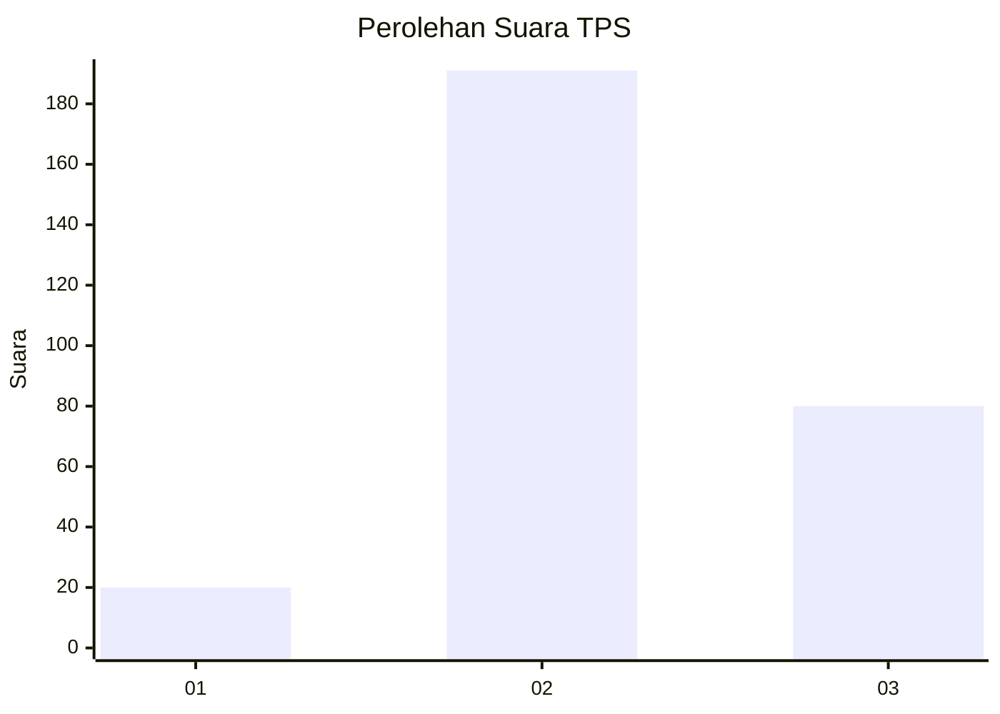

# Hasil

## Grafik

## Tabel

| No. | Nama Paslon    | Suara | Suara (raw) | Persentase |
|:--- |:-------------- | -----:| -----------:| ----------:|
| 1   | ANIES MUHAIMIN | 20    | [20][p-1]   | 6,87       |
| 2   | PRABOWO GIBRAN | 191   | [191][p-2]  | 65,64      |
| 3   | GANJAR MAHFUD  | 80    | [80][p-3]   | 27,49      |

[p-1]: https://github.com/gigit-pemilu/pemilu-2024/blob/main/pilpres/hitung-suara/sub/35-jawa-timur/sub/26-bangkalan/sub/15-blega/sub/2002-rosep/sub/006-tps/sub/paslon-1.txt
[p-2]: https://github.com/gigit-pemilu/pemilu-2024/blob/main/pilpres/hitung-suara/sub/35-jawa-timur/sub/26-bangkalan/sub/15-blega/sub/2002-rosep/sub/006-tps/sub/paslon-2.txt
[p-3]: https://github.com/gigit-pemilu/pemilu-2024/blob/main/pilpres/hitung-suara/sub/35-jawa-timur/sub/26-bangkalan/sub/15-blega/sub/2002-rosep/sub/006-tps/sub/paslon-3.txt

## Foto C Plano

https://sirekap-obj-formc.kpu.go.id/c80a/pemilu/ppwp/35/26/15/20/02/3526152002006-20240214-210149--61645a15-9823-4b0b-b3bb-caaa4a1e6308.jpg

https://sirekap-obj-formc.kpu.go.id/c80a/pemilu/ppwp/35/26/15/20/02/3526152002006-20240217-102745--29b732e0-d32c-4e5a-8b4f-cd1870f4b95b.jpg

https://sirekap-obj-formc.kpu.go.id/c80a/pemilu/ppwp/35/26/15/20/02/3526152002006-20240214-210748--07b2240e-0b20-4bf9-bf5c-4edf7702345a.jpg

## Metadata

| Key        | Value               |
| ---------- | ------------------- |
| Time Stamp | 2024-02-19 06:16:00 |

