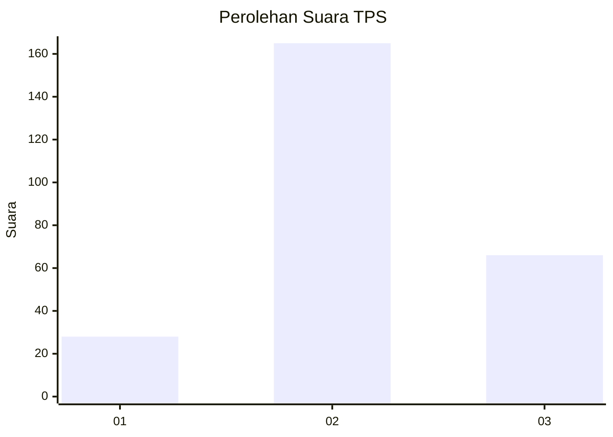
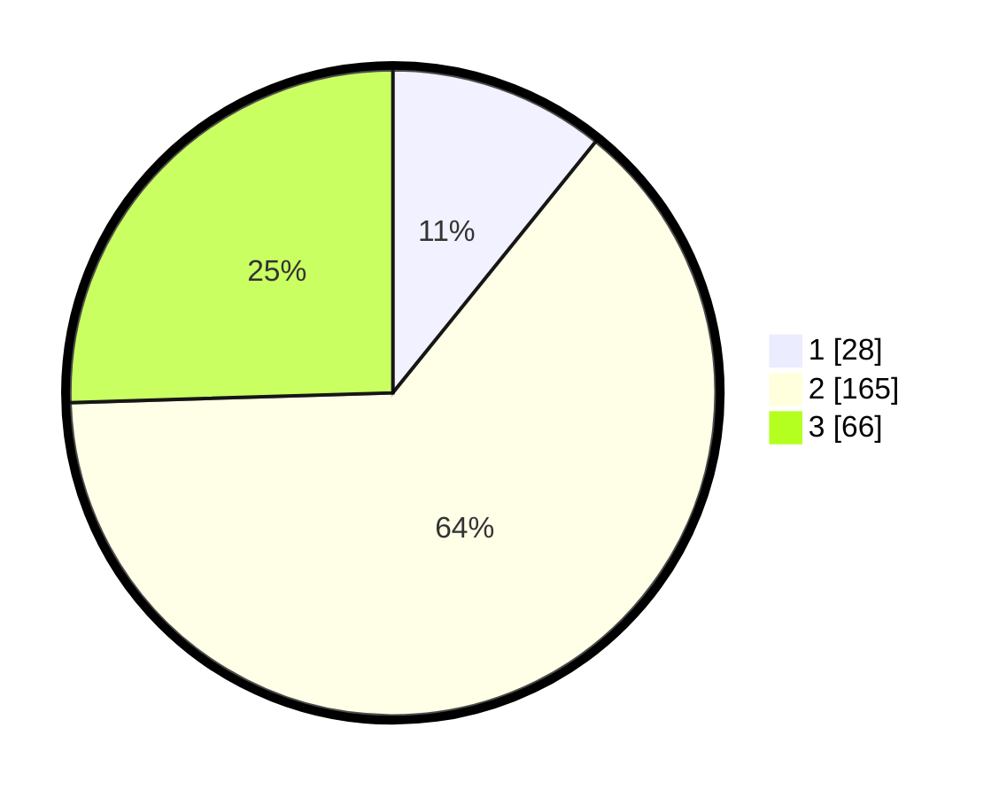

# Hasil

## Grafik

## Tabel

| No. | Nama Paslon    | Suara | Suara (raw) | Persentase |
|:--- |:-------------- | -----:| -----------:| ----------:|
| 1   | ANIES MUHAIMIN | 28    | [28][p-1]   | 10,81      |
| 2   | PRABOWO GIBRAN | 165   | [165][p-2]  | 63,71      |
| 3   | GANJAR MAHFUD  | 66    | [66][p-3]   | 25,48      |

[p-1]: https://github.com/gigit-pemilu/pemilu-2024/blob/main/pilpres/hitung-suara/sub/35-jawa-timur/sub/26-bangkalan/sub/15-blega/sub/2011-lombang-laok/sub/001-tps/sub/paslon-1.txt
[p-2]: https://github.com/gigit-pemilu/pemilu-2024/blob/main/pilpres/hitung-suara/sub/35-jawa-timur/sub/26-bangkalan/sub/15-blega/sub/2011-lombang-laok/sub/001-tps/sub/paslon-2.txt
[p-3]: https://github.com/gigit-pemilu/pemilu-2024/blob/main/pilpres/hitung-suara/sub/35-jawa-timur/sub/26-bangkalan/sub/15-blega/sub/2011-lombang-laok/sub/001-tps/sub/paslon-3.txt

## Foto C Plano

https://sirekap-obj-formc.kpu.go.id/6dac/pemilu/ppwp/35/26/15/20/11/3526152011001-20240215-003956--12b2bcf2-8506-4aa4-85e1-a11003c46aa4.jpg

https://sirekap-obj-formc.kpu.go.id/6dac/pemilu/ppwp/35/26/15/20/11/3526152011001-20240215-004008--31aefb13-e7a5-41d1-9f4f-bc20d2b2ed60.jpg

https://sirekap-obj-formc.kpu.go.id/6dac/pemilu/ppwp/35/26/15/20/11/3526152011001-20240215-004016--91118950-51c6-481e-b2d3-e6db1d47f07c.jpg

## Metadata

| Key        | Value               |
| ---------- | ------------------- |
| Time Stamp | 2024-02-24 22:31:28 |

