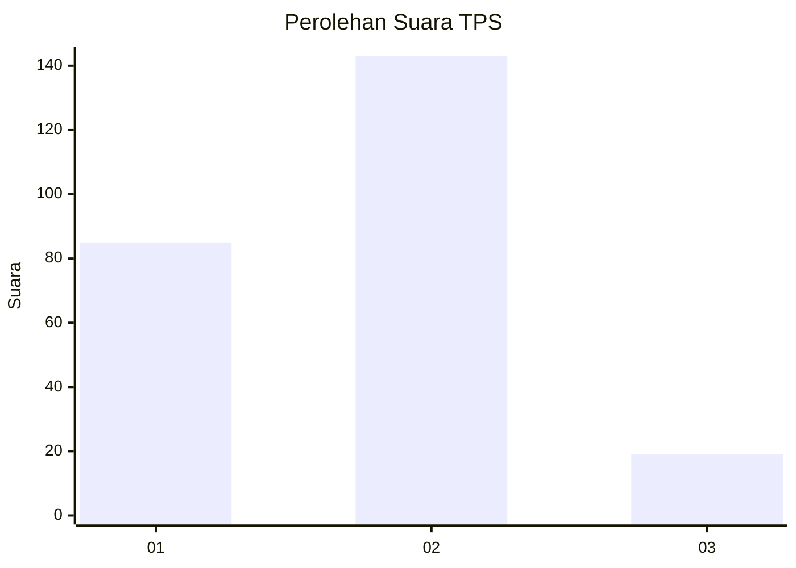
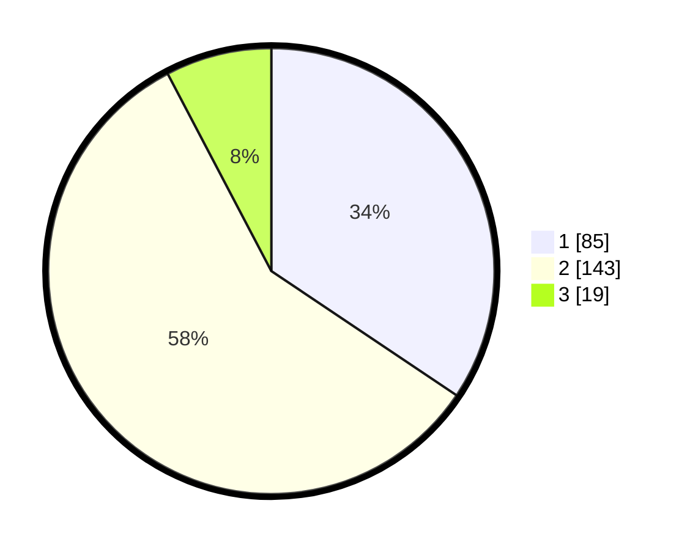

# Hasil

## Grafik

## Tabel

| No. | Nama Paslon    | Suara | Suara (raw) | Persentase |
|:--- |:-------------- | -----:| -----------:| ----------:|
| 1   | ANIES MUHAIMIN | 85    | [85][p-1]   | 34,41      |
| 2   | PRABOWO GIBRAN | 143   | [143][p-2]  | 57,89      |
| 3   | GANJAR MAHFUD  | 19    | [19][p-3]   | 7,69       |

[p-1]: https://github.com/gigit-pemilu/pemilu-2024/blob/main/pilpres/hitung-suara/sub/35-jawa-timur/sub/26-bangkalan/sub/15-blega/sub/2011-lombang-laok/sub/005-tps/sub/paslon-1.txt
[p-2]: https://github.com/gigit-pemilu/pemilu-2024/blob/main/pilpres/hitung-suara/sub/35-jawa-timur/sub/26-bangkalan/sub/15-blega/sub/2011-lombang-laok/sub/005-tps/sub/paslon-2.txt
[p-3]: https://github.com/gigit-pemilu/pemilu-2024/blob/main/pilpres/hitung-suara/sub/35-jawa-timur/sub/26-bangkalan/sub/15-blega/sub/2011-lombang-laok/sub/005-tps/sub/paslon-3.txt

## Foto C Plano

https://sirekap-obj-formc.kpu.go.id/b619/pemilu/ppwp/35/26/15/20/11/3526152011005-20240215-084845--2cff0167-042c-4085-8aac-bb65f4af99b6.jpg

https://sirekap-obj-formc.kpu.go.id/b619/pemilu/ppwp/35/26/15/20/11/3526152011005-20240215-084856--efae2676-0dbb-421c-8570-9852a9cede0f.jpg

https://sirekap-obj-formc.kpu.go.id/b619/pemilu/ppwp/35/26/15/20/11/3526152011005-20240215-084908--afb9e2f3-671a-4d2e-998a-4bc693bd92f3.jpg

## Metadata

| Key        | Value               |
| ---------- | ------------------- |
| Time Stamp | 2024-02-24 22:31:28 |

