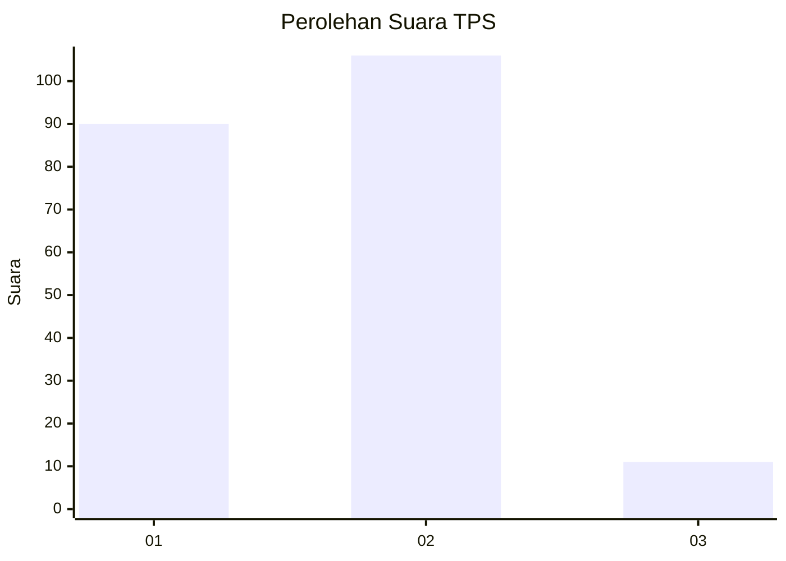
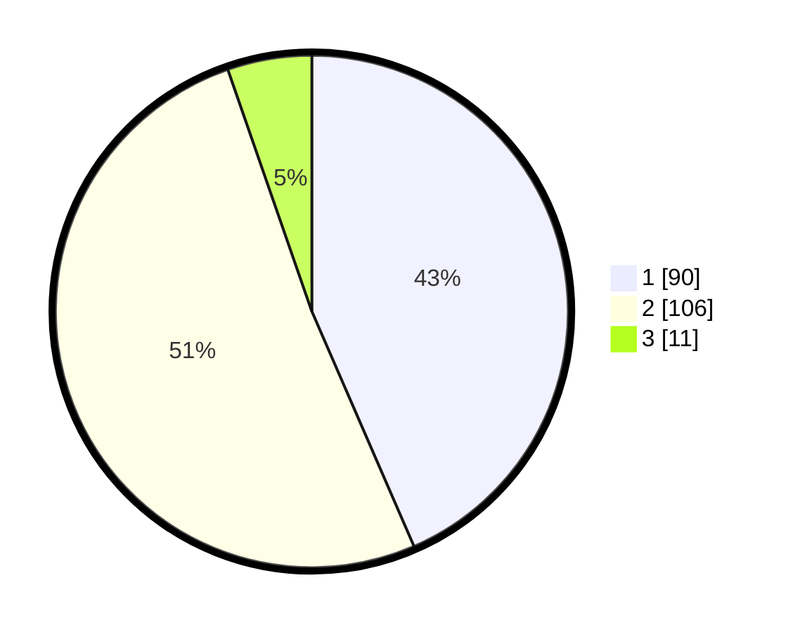

# Hasil

## Grafik

## Tabel

| No. | Nama Paslon    | Suara | Suara (raw) | Persentase |
|:--- |:-------------- | -----:| -----------:| ----------:|
| 1   | ANIES MUHAIMIN | 90    | [90][p-1]   | 43,48      |
| 2   | PRABOWO GIBRAN | 106   | [106][p-2]  | 51,21      |
| 3   | GANJAR MAHFUD  | 11    | [11][p-3]   | 5,31       |

[p-1]: https://github.com/gigit-pemilu/pemilu-2024-35-jawa-timur/blob/main/pilpres/hitung-suara/sub/35-jawa-timur/sub/26-bangkalan/sub/15-blega/sub/2011-lombang-laok/sub/006-tps/sub/paslon-1.txt
[p-2]: https://github.com/gigit-pemilu/pemilu-2024-35-jawa-timur/blob/main/pilpres/hitung-suara/sub/35-jawa-timur/sub/26-bangkalan/sub/15-blega/sub/2011-lombang-laok/sub/006-tps/sub/paslon-2.txt
[p-3]: https://github.com/gigit-pemilu/pemilu-2024-35-jawa-timur/blob/main/pilpres/hitung-suara/sub/35-jawa-timur/sub/26-bangkalan/sub/15-blega/sub/2011-lombang-laok/sub/006-tps/sub/paslon-3.txt

## Foto C Plano

https://sirekap-obj-formc.kpu.go.id/801d/pemilu/ppwp/35/26/15/20/11/3526152011006-20240214-184127--21106c1b-7367-4604-bdd9-9f1a1702ee01.jpg

https://sirekap-obj-formc.kpu.go.id/801d/pemilu/ppwp/35/26/15/20/11/3526152011006-20240214-232619--cfad8b7f-8bd5-45d9-83c4-de8ebb4c6b2d.jpg

https://sirekap-obj-formc.kpu.go.id/801d/pemilu/ppwp/35/26/15/20/11/3526152011006-20240214-184137--307d74bd-417a-417b-8042-4d552af89f29.jpg

## Metadata

| Key        | Value               |
| ---------- | ------------------- |
| Time Stamp | 2024-02-24 22:31:28 |

