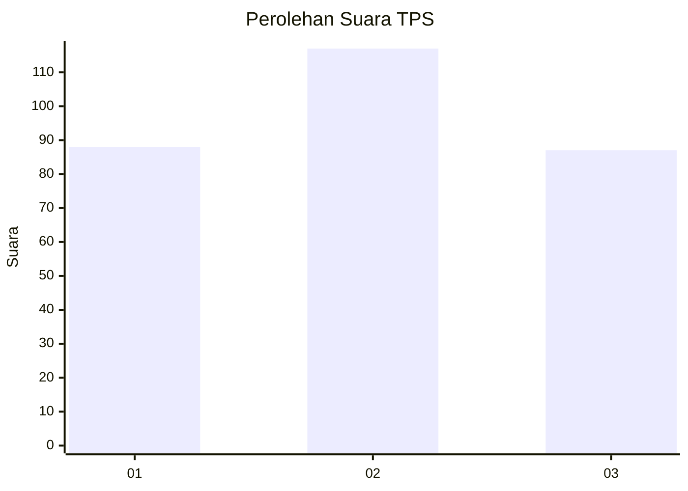
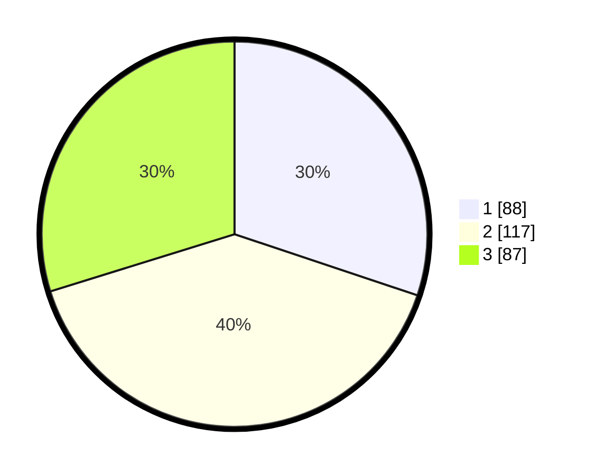

# Hasil

## Grafik

## Tabel

| No. | Nama Paslon    | Suara | Suara (raw) | Persentase |
|:--- |:-------------- | -----:| -----------:| ----------:|
| 1   | ANIES MUHAIMIN | 88    | [88][p-1]   | 30,14      |
| 2   | PRABOWO GIBRAN | 117   | [117][p-2]  | 40,07      |
| 3   | GANJAR MAHFUD  | 87    | [87][p-3]   | 29,79      |

[p-1]: https://github.com/gigit-pemilu/pemilu-2024-35-jawa-timur/blob/main/pilpres/hitung-suara/sub/35-jawa-timur/sub/26-bangkalan/sub/15-blega/sub/2012-lombang-dajah/sub/003-tps/sub/paslon-1.txt
[p-2]: https://github.com/gigit-pemilu/pemilu-2024-35-jawa-timur/blob/main/pilpres/hitung-suara/sub/35-jawa-timur/sub/26-bangkalan/sub/15-blega/sub/2012-lombang-dajah/sub/003-tps/sub/paslon-2.txt
[p-3]: https://github.com/gigit-pemilu/pemilu-2024-35-jawa-timur/blob/main/pilpres/hitung-suara/sub/35-jawa-timur/sub/26-bangkalan/sub/15-blega/sub/2012-lombang-dajah/sub/003-tps/sub/paslon-3.txt

## Foto C Plano

https://sirekap-obj-formc.kpu.go.id/2472/pemilu/ppwp/35/26/15/20/12/3526152012003-20240214-200729--62a032f8-7540-4560-92d5-517de72381b6.jpg

https://sirekap-obj-formc.kpu.go.id/2472/pemilu/ppwp/35/26/15/20/12/3526152012003-20240214-200629--202b13ae-cbce-4f78-9685-e9773ab8f622.jpg

https://sirekap-obj-formc.kpu.go.id/2472/pemilu/ppwp/35/26/15/20/12/3526152012003-20240214-200701--3fc54c9b-fae0-4b1e-a552-7cd34838e952.jpg

## Metadata

| Key        | Value               |
| ---------- | ------------------- |
| Time Stamp | 2024-02-24 22:31:28 |

