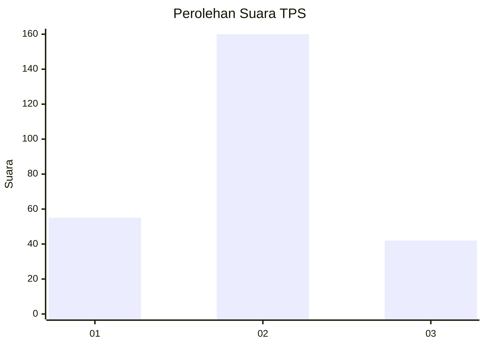

# Hasil

## Grafik

## Tabel

| No. | Nama Paslon    | Suara | Suara (raw) | Persentase |
|:--- |:-------------- | -----:| -----------:| ----------:|
| 1   | ANIES MUHAIMIN | 55    | [55][p-1]   | 21,40      |
| 2   | PRABOWO GIBRAN | 160   | [160][p-2]  | 62,26      |
| 3   | GANJAR MAHFUD  | 42    | [42][p-3]   | 16,34      |

[p-1]: https://github.com/gigit-pemilu/pemilu-2024/blob/main/pilpres/hitung-suara/sub/35-jawa-timur/sub/26-bangkalan/sub/15-blega/sub/2012-lombang-dajah/sub/004-tps/sub/paslon-1.txt
[p-2]: https://github.com/gigit-pemilu/pemilu-2024/blob/main/pilpres/hitung-suara/sub/35-jawa-timur/sub/26-bangkalan/sub/15-blega/sub/2012-lombang-dajah/sub/004-tps/sub/paslon-2.txt
[p-3]: https://github.com/gigit-pemilu/pemilu-2024/blob/main/pilpres/hitung-suara/sub/35-jawa-timur/sub/26-bangkalan/sub/15-blega/sub/2012-lombang-dajah/sub/004-tps/sub/paslon-3.txt

## Foto C Plano

https://sirekap-obj-formc.kpu.go.id/9ad5/pemilu/ppwp/35/26/15/20/12/3526152012004-20240214-220933--aa7e05aa-2803-4a14-8985-2ae4f3f02c40.jpg

https://sirekap-obj-formc.kpu.go.id/9ad5/pemilu/ppwp/35/26/15/20/12/3526152012004-20240214-221637--3e564e13-b45f-4bfb-8ee1-0a512b0fa25d.jpg

https://sirekap-obj-formc.kpu.go.id/9ad5/pemilu/ppwp/35/26/15/20/12/3526152012004-20240214-221947--527ad5e9-195f-4639-ab14-e7a33334dace.jpg

## Metadata

| Key        | Value               |
| ---------- | ------------------- |
| Time Stamp | 2024-02-19 06:16:00 |

