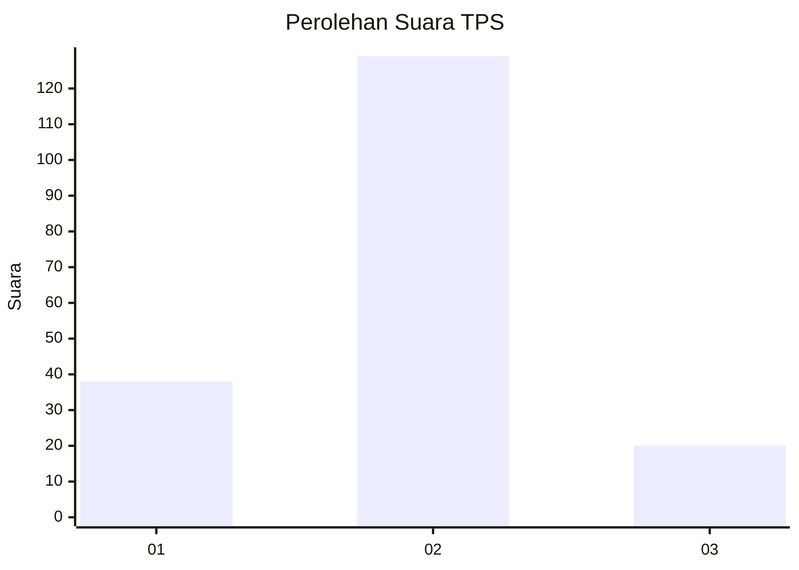
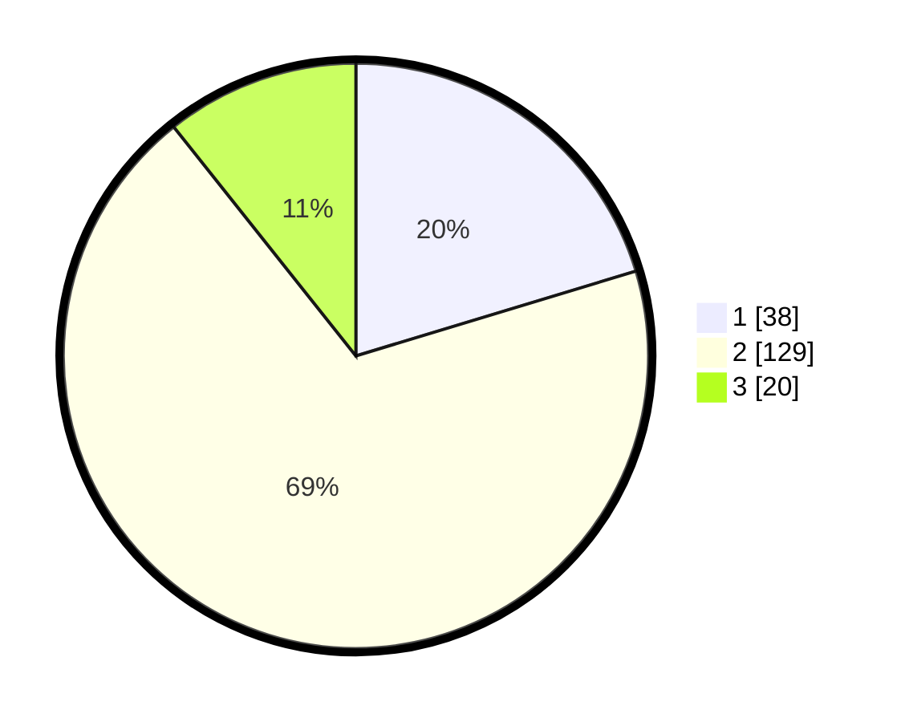

# Hasil

## Grafik

## Tabel

| No. | Nama Paslon    | Suara | Suara (raw) | Persentase |
|:--- |:-------------- | -----:| -----------:| ----------:|
| 1   | ANIES MUHAIMIN | 38    | [38][p-1]   | 20,32      |
| 2   | PRABOWO GIBRAN | 129   | [129][p-2]  | 68,98      |
| 3   | GANJAR MAHFUD  | 20    | [20][p-3]   | 10,70      |

[p-1]: https://github.com/gigit-pemilu/pemilu-2024/blob/main/pilpres/hitung-suara/sub/35-jawa-timur/sub/26-bangkalan/sub/15-blega/sub/2012-lombang-dajah/sub/005-tps/sub/paslon-1.txt
[p-2]: https://github.com/gigit-pemilu/pemilu-2024/blob/main/pilpres/hitung-suara/sub/35-jawa-timur/sub/26-bangkalan/sub/15-blega/sub/2012-lombang-dajah/sub/005-tps/sub/paslon-2.txt
[p-3]: https://github.com/gigit-pemilu/pemilu-2024/blob/main/pilpres/hitung-suara/sub/35-jawa-timur/sub/26-bangkalan/sub/15-blega/sub/2012-lombang-dajah/sub/005-tps/sub/paslon-3.txt

## Foto C Plano

https://sirekap-obj-formc.kpu.go.id/b7bd/pemilu/ppwp/35/26/15/20/12/3526152012005-20240217-095534--3a3a8ff6-d2f8-4a34-8048-27a30e3de741.jpg

https://sirekap-obj-formc.kpu.go.id/b7bd/pemilu/ppwp/35/26/15/20/12/3526152012005-20240217-105245--c10b9867-edeb-4c82-a240-59c16f373e21.jpg

https://sirekap-obj-formc.kpu.go.id/b7bd/pemilu/ppwp/35/26/15/20/12/3526152012005-20240218-125310--bc889dec-dff6-4129-8c81-0d30dec60d91.jpg

## Metadata

| Key        | Value               |
| ---------- | ------------------- |
| Time Stamp | 2024-02-19 06:16:00 |

