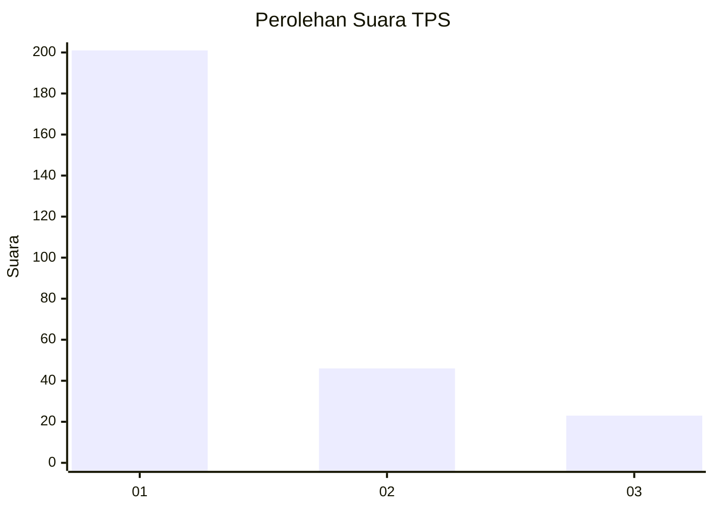
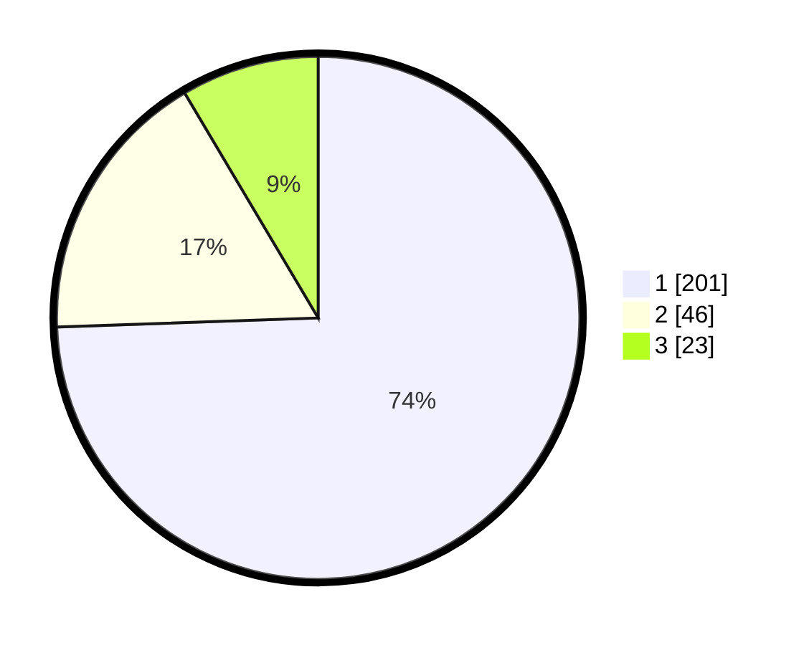

# Hasil

## Grafik

## Tabel

| No. | Nama Paslon    | Suara | Suara (raw) | Persentase |
|:--- |:-------------- | -----:| -----------:| ----------:|
| 1   | ANIES MUHAIMIN | 201   | [201][p-1]  | 74,44      |
| 2   | PRABOWO GIBRAN | 46    | [46][p-2]   | 17,04      |
| 3   | GANJAR MAHFUD  | 23    | [23][p-3]   | 8,52       |

[p-1]: https://github.com/gigit-pemilu/pemilu-2024/blob/main/pilpres/hitung-suara/sub/35-jawa-timur/sub/26-bangkalan/sub/15-blega/sub/2012-lombang-dajah/sub/010-tps/sub/paslon-1.txt
[p-2]: https://github.com/gigit-pemilu/pemilu-2024/blob/main/pilpres/hitung-suara/sub/35-jawa-timur/sub/26-bangkalan/sub/15-blega/sub/2012-lombang-dajah/sub/010-tps/sub/paslon-2.txt
[p-3]: https://github.com/gigit-pemilu/pemilu-2024/blob/main/pilpres/hitung-suara/sub/35-jawa-timur/sub/26-bangkalan/sub/15-blega/sub/2012-lombang-dajah/sub/010-tps/sub/paslon-3.txt

## Foto C Plano

https://sirekap-obj-formc.kpu.go.id/1caa/pemilu/ppwp/35/26/15/20/12/3526152012010-20240214-201225--73ec0a21-3700-4864-bb6c-fd96e03d5fda.jpg

https://sirekap-obj-formc.kpu.go.id/1caa/pemilu/ppwp/35/26/15/20/12/3526152012010-20240214-203310--2c46699c-9815-470e-aac0-001e228f87d4.jpg

https://sirekap-obj-formc.kpu.go.id/1caa/pemilu/ppwp/35/26/15/20/12/3526152012010-20240214-203409--6c8f3aba-40e3-44b8-b7aa-38fd321230de.jpg

## Metadata

| Key        | Value               |
| ---------- | ------------------- |
| Time Stamp | 2024-02-15 12:00:28 |

