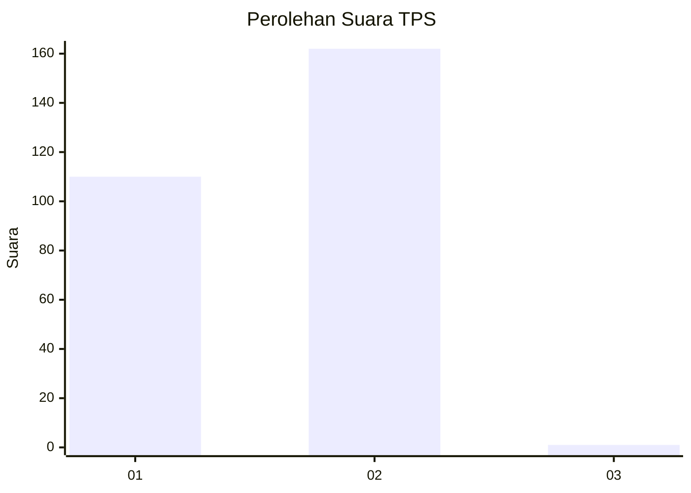
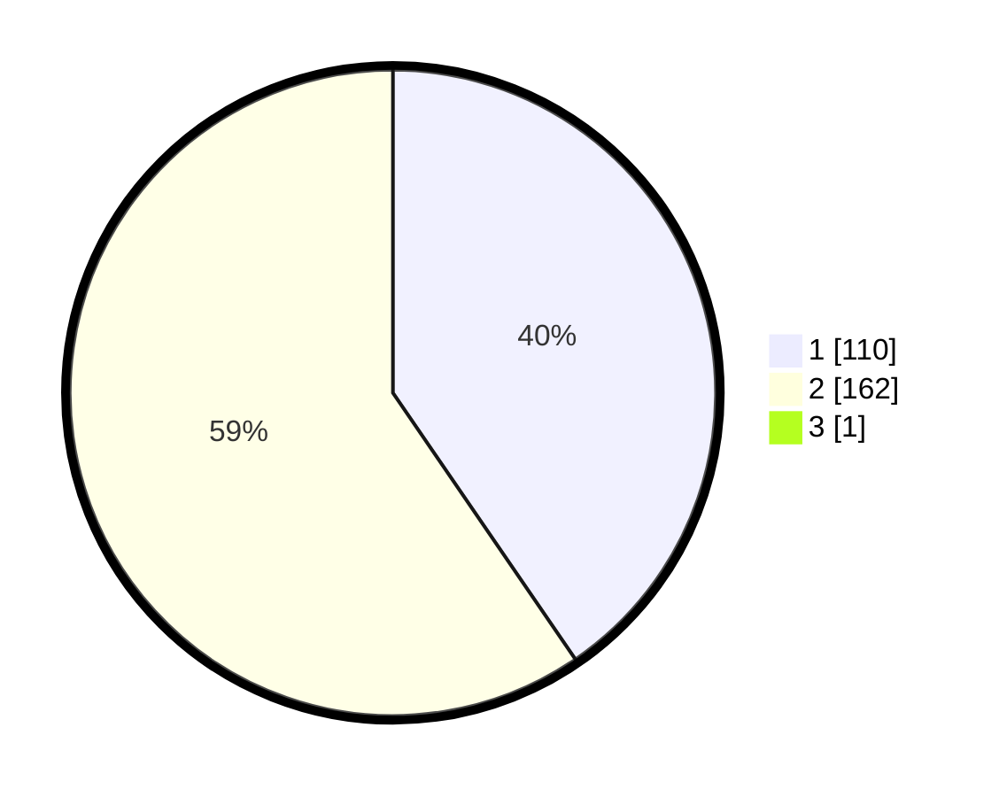

# Hasil

## Grafik

## Tabel

| No. | Nama Paslon    | Suara | Suara (raw) | Persentase |
|:--- |:-------------- | -----:| -----------:| ----------:|
| 1   | ANIES MUHAIMIN | 110   | [110][p-1]  | 40,29      |
| 2   | PRABOWO GIBRAN | 162   | [162][p-2]  | 59,34      |
| 3   | GANJAR MAHFUD  | 1     | [1][p-3]    | 0,37       |

[p-1]: https://github.com/gigit-pemilu/pemilu-2024/blob/main/pilpres/hitung-suara/sub/35-jawa-timur/sub/26-bangkalan/sub/15-blega/sub/2013-karpote/sub/002-tps/sub/paslon-1.txt
[p-2]: https://github.com/gigit-pemilu/pemilu-2024/blob/main/pilpres/hitung-suara/sub/35-jawa-timur/sub/26-bangkalan/sub/15-blega/sub/2013-karpote/sub/002-tps/sub/paslon-2.txt
[p-3]: https://github.com/gigit-pemilu/pemilu-2024/blob/main/pilpres/hitung-suara/sub/35-jawa-timur/sub/26-bangkalan/sub/15-blega/sub/2013-karpote/sub/002-tps/sub/paslon-3.txt

## Foto C Plano

https://sirekap-obj-formc.kpu.go.id/eb22/pemilu/ppwp/35/26/15/20/13/3526152013002-20240214-225856--fa9a6308-01a9-49ae-a011-2f28ccdb2c65.jpg

https://sirekap-obj-formc.kpu.go.id/eb22/pemilu/ppwp/35/26/15/20/13/3526152013002-20240214-224334--a1e4ad58-3c05-4e6e-8bf5-b6fe102f5c2a.jpg

https://sirekap-obj-formc.kpu.go.id/eb22/pemilu/ppwp/35/26/15/20/13/3526152013002-20240214-224921--a3e91960-8ca4-4074-86d8-0c2c32c24c4f.jpg

## Metadata

| Key        | Value               |
| ---------- | ------------------- |
| Time Stamp | 2024-02-24 22:31:28 |

