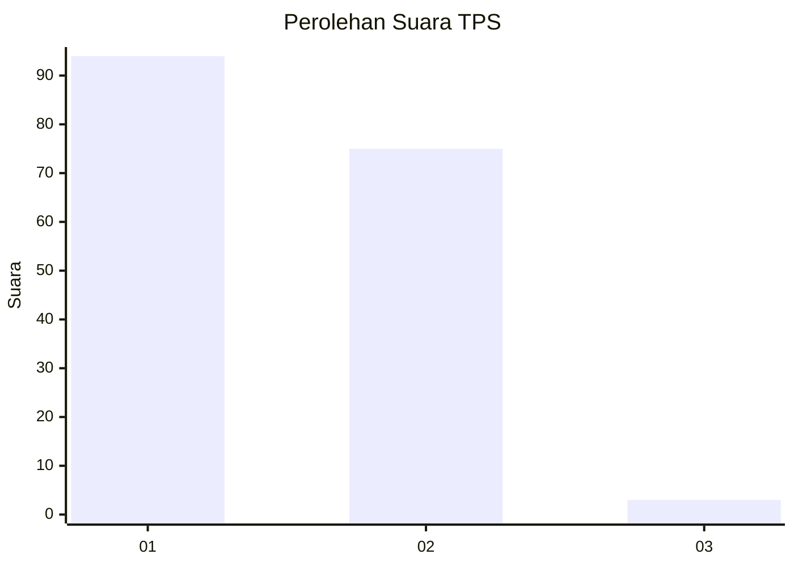
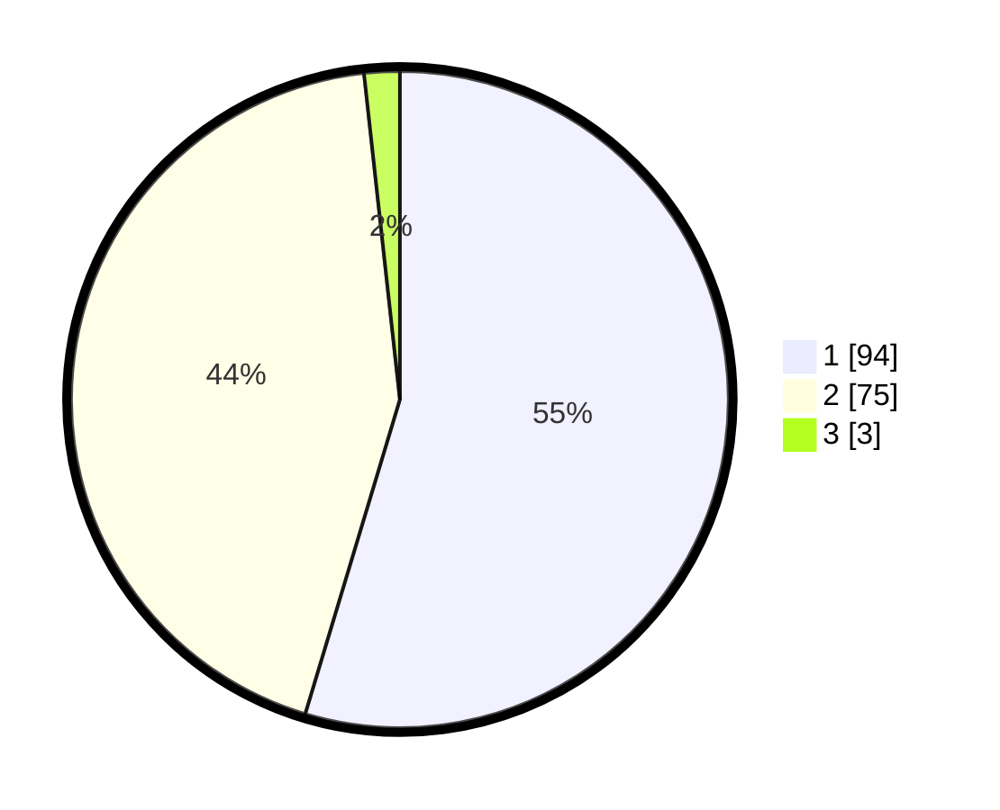

# Hasil

## Grafik

## Tabel

| No. | Nama Paslon    | Suara | Suara (raw) | Persentase |
|:--- |:-------------- | -----:| -----------:| ----------:|
| 1   | ANIES MUHAIMIN | 94    | [94][p-1]   | 54,65      |
| 2   | PRABOWO GIBRAN | 75    | [75][p-2]   | 43,60      |
| 3   | GANJAR MAHFUD  | 3     | [3][p-3]    | 1,74       |

[p-1]: https://github.com/gigit-pemilu/pemilu-2024/blob/main/pilpres/hitung-suara/sub/35-jawa-timur/sub/26-bangkalan/sub/15-blega/sub/2013-karpote/sub/005-tps/sub/paslon-1.txt
[p-2]: https://github.com/gigit-pemilu/pemilu-2024/blob/main/pilpres/hitung-suara/sub/35-jawa-timur/sub/26-bangkalan/sub/15-blega/sub/2013-karpote/sub/005-tps/sub/paslon-2.txt
[p-3]: https://github.com/gigit-pemilu/pemilu-2024/blob/main/pilpres/hitung-suara/sub/35-jawa-timur/sub/26-bangkalan/sub/15-blega/sub/2013-karpote/sub/005-tps/sub/paslon-3.txt

## Foto C Plano

https://sirekap-obj-formc.kpu.go.id/13d4/pemilu/ppwp/35/26/15/20/13/3526152013005-20240214-212229--0062af03-1fde-409f-a7dd-0d8c23a4b385.jpg

https://sirekap-obj-formc.kpu.go.id/13d4/pemilu/ppwp/35/26/15/20/13/3526152013005-20240214-212327--f9493221-ae6f-47ce-85bb-e2231dc52924.jpg

https://sirekap-obj-formc.kpu.go.id/13d4/pemilu/ppwp/35/26/15/20/13/3526152013005-20240214-195147--04fd5e96-4c9d-4394-b481-e6ec7a8de61b.jpg

## Metadata

| Key        | Value               |
| ---------- | ------------------- |
| Time Stamp | 2024-02-24 22:31:28 |

