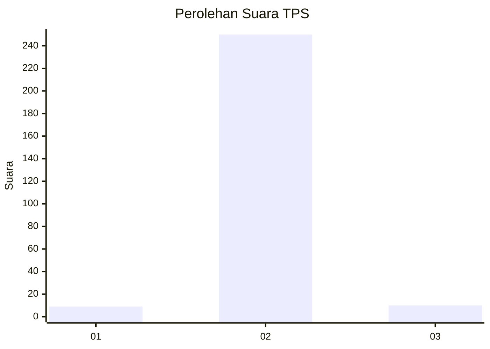
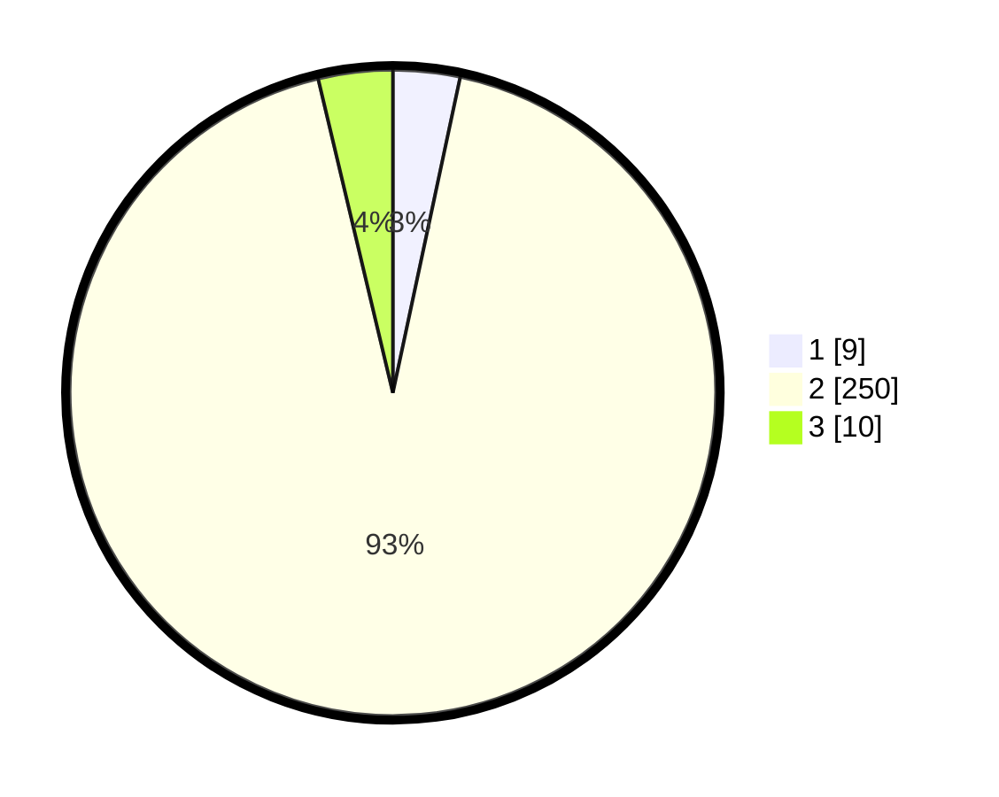

# Hasil

## Grafik

## Tabel

| No. | Nama Paslon    | Suara | Suara (raw) | Persentase |
|:--- |:-------------- | -----:| -----------:| ----------:|
| 1   | ANIES MUHAIMIN | 9     | [9][p-1]    | 3,35       |
| 2   | PRABOWO GIBRAN | 250   | [250][p-2]  | 92,94      |
| 3   | GANJAR MAHFUD  | 10    | [10][p-3]   | 3,72       |

[p-1]: https://github.com/gigit-pemilu/pemilu-2024/blob/main/pilpres/hitung-suara/sub/35-jawa-timur/sub/26-bangkalan/sub/15-blega/sub/2015-panjalinan/sub/002-tps/sub/paslon-1.txt
[p-2]: https://github.com/gigit-pemilu/pemilu-2024/blob/main/pilpres/hitung-suara/sub/35-jawa-timur/sub/26-bangkalan/sub/15-blega/sub/2015-panjalinan/sub/002-tps/sub/paslon-2.txt
[p-3]: https://github.com/gigit-pemilu/pemilu-2024/blob/main/pilpres/hitung-suara/sub/35-jawa-timur/sub/26-bangkalan/sub/15-blega/sub/2015-panjalinan/sub/002-tps/sub/paslon-3.txt

## Foto C Plano

https://sirekap-obj-formc.kpu.go.id/b4b1/pemilu/ppwp/35/26/15/20/15/3526152015002-20240216-074641--795f87ce-b45a-4613-b271-74f66e0f21e1.jpg

https://sirekap-obj-formc.kpu.go.id/b4b1/pemilu/ppwp/35/26/15/20/15/3526152015002-20240216-075544--e8b17955-d318-4126-a559-500b89263a76.jpg

https://sirekap-obj-formc.kpu.go.id/b4b1/pemilu/ppwp/35/26/15/20/15/3526152015002-20240216-122530--9621bd41-f5ad-4b7a-905f-e6efcab35475.jpg

## Metadata

| Key        | Value               |
| ---------- | ------------------- |
| Time Stamp | 2024-02-25 18:00:00 |

## DATA PEMILIH TETAP

Jumlah pemilih dalam DPT: **272**.
 * L: **141**.
 * P: **131**.

## DATA PENGGUNA HAK PILIH

Jumlah pengguna hak pilih dalam DPT: **269**.
 * L: **141**.
 * P: **128**.

Jumlah pengguna hak pilih dalam DPTb: **0**.
 * L: **0**.
 * P: **0**.

Jumlah pengguna hak pilih dalam DPK: **5**.
 * L: **2**.
 * P: **3**.

Jumlah pengguna hak pilih: **274**.
 * L: **143**.
 * P: **131**.

## JUMLAH SUARA SAH DAN TIDAK SAH

JUMLAH SELURUH SUARA SAH: **269**.

JUMLAH SUARA TIDAK SAH: **250**.

JUMLAH SELURUH SUARA SAH DAN SUARA TIDAK SAH: **10**.

