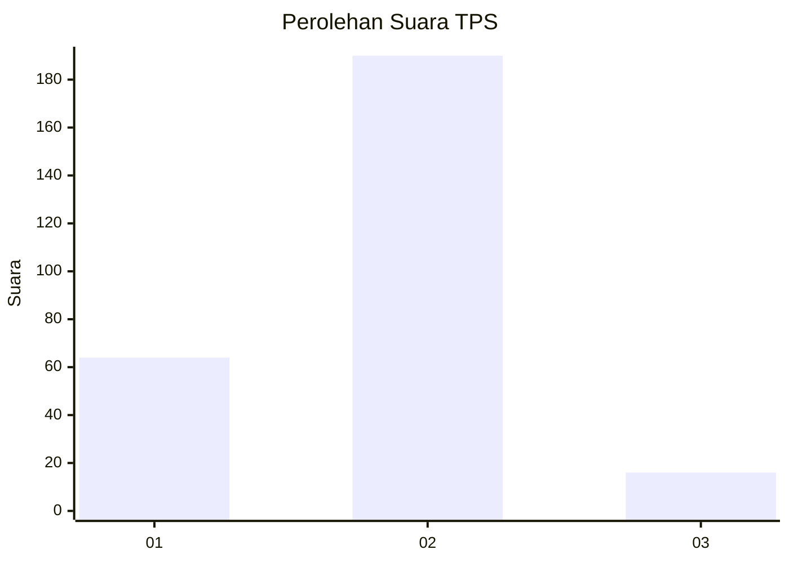

# Hasil

## Grafik

## Tabel

| No. | Nama Paslon    | Suara | Suara (raw) | Persentase |
|:--- |:-------------- | -----:| -----------:| ----------:|
| 1   | ANIES MUHAIMIN | 64    | [64][p-1]   | 23,70      |
| 2   | PRABOWO GIBRAN | 190   | [190][p-2]  | 70,37      |
| 3   | GANJAR MAHFUD  | 16    | [16][p-3]   | 5,93       |

[p-1]: https://github.com/gigit-pemilu/pemilu-2024-35-jawa-timur/blob/main/pilpres/hitung-suara/sub/35-jawa-timur/sub/26-bangkalan/sub/15-blega/sub/2015-panjalinan/sub/004-tps/sub/paslon-1.txt
[p-2]: https://github.com/gigit-pemilu/pemilu-2024-35-jawa-timur/blob/main/pilpres/hitung-suara/sub/35-jawa-timur/sub/26-bangkalan/sub/15-blega/sub/2015-panjalinan/sub/004-tps/sub/paslon-2.txt
[p-3]: https://github.com/gigit-pemilu/pemilu-2024-35-jawa-timur/blob/main/pilpres/hitung-suara/sub/35-jawa-timur/sub/26-bangkalan/sub/15-blega/sub/2015-panjalinan/sub/004-tps/sub/paslon-3.txt

## Foto C Plano

https://sirekap-obj-formc.kpu.go.id/42e0/pemilu/ppwp/35/26/15/20/15/3526152015004-20240215-194534--ee4e690f-d777-489e-9471-72b3909705b6.jpg

https://sirekap-obj-formc.kpu.go.id/42e0/pemilu/ppwp/35/26/15/20/15/3526152015004-20240215-194540--465ec167-5d25-4ad8-afa3-16621b8af112.jpg

https://sirekap-obj-formc.kpu.go.id/42e0/pemilu/ppwp/35/26/15/20/15/3526152015004-20240215-194545--6002c5b9-56db-46a6-9816-d0a9fdcf87c5.jpg

## Metadata

| Key        | Value               |
| ---------- | ------------------- |
| Time Stamp | 2024-02-24 22:31:28 |

