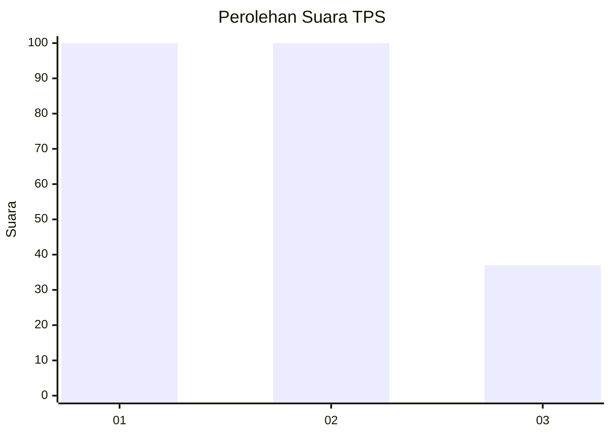
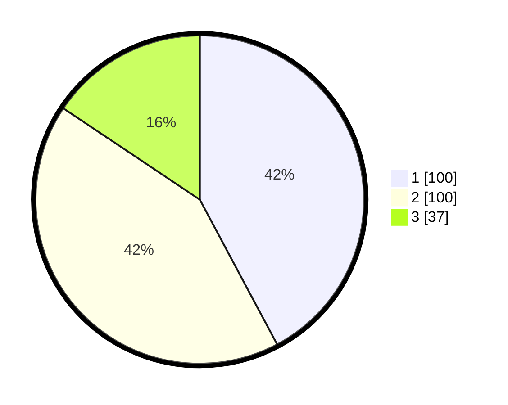

# Hasil

## Grafik

## Tabel

| No. | Nama Paslon    | Suara | Suara (raw) | Persentase |
|:--- |:-------------- | -----:| -----------:| ----------:|
| 1   | ANIES MUHAIMIN | 100   | [100][p-1]  | 42,19      |
| 2   | PRABOWO GIBRAN | 100   | [100][p-2]  | 42,19      |
| 3   | GANJAR MAHFUD  | 37    | [37][p-3]   | 15,61      |

[p-1]: https://github.com/gigit-pemilu/pemilu-2024/blob/main/pilpres/hitung-suara/sub/35-jawa-timur/sub/26-bangkalan/sub/15-blega/sub/2017-kampao/sub/001-tps/sub/paslon-1.txt
[p-2]: https://github.com/gigit-pemilu/pemilu-2024/blob/main/pilpres/hitung-suara/sub/35-jawa-timur/sub/26-bangkalan/sub/15-blega/sub/2017-kampao/sub/001-tps/sub/paslon-2.txt
[p-3]: https://github.com/gigit-pemilu/pemilu-2024/blob/main/pilpres/hitung-suara/sub/35-jawa-timur/sub/26-bangkalan/sub/15-blega/sub/2017-kampao/sub/001-tps/sub/paslon-3.txt

## Foto C Plano

https://sirekap-obj-formc.kpu.go.id/a8a6/pemilu/ppwp/35/26/15/20/17/3526152017001-20240214-195331--3d366255-8862-4e7d-864f-9eb3cd51f3bf.jpg

https://sirekap-obj-formc.kpu.go.id/a8a6/pemilu/ppwp/35/26/15/20/17/3526152017001-20240214-195859--f3f2d715-7d0e-4a66-9940-d1dc98b9b710.jpg

https://sirekap-obj-formc.kpu.go.id/a8a6/pemilu/ppwp/35/26/15/20/17/3526152017001-20240214-200018--98ee2011-3bb0-4d97-8b56-95b54e49c79c.jpg

## Metadata

| Key        | Value               |
| ---------- | ------------------- |
| Time Stamp | 2024-02-19 06:16:00 |

