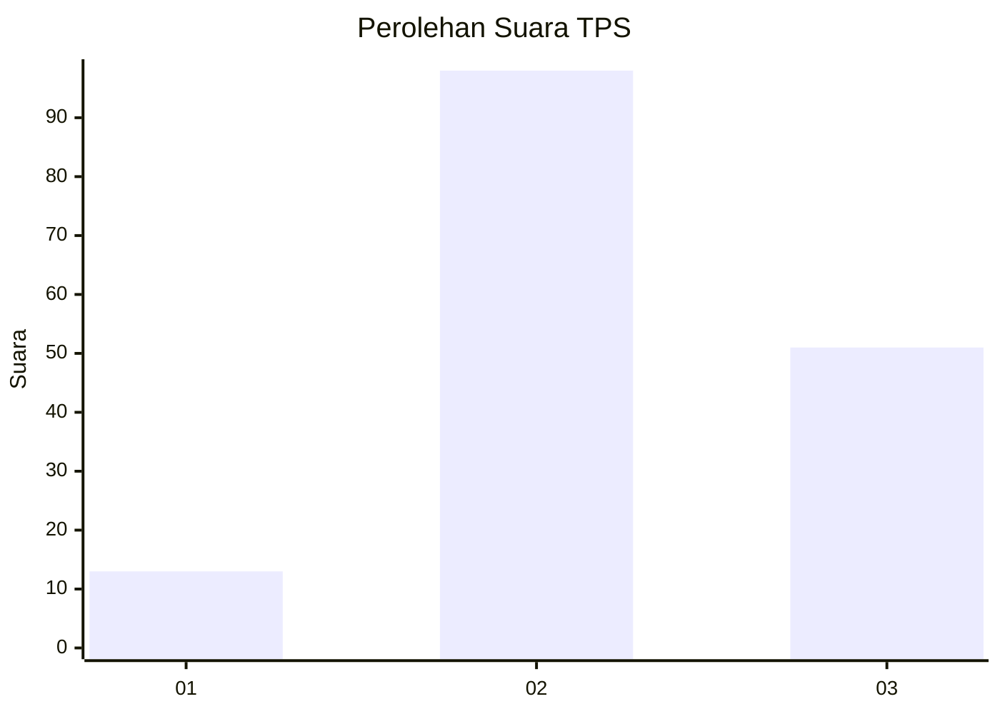
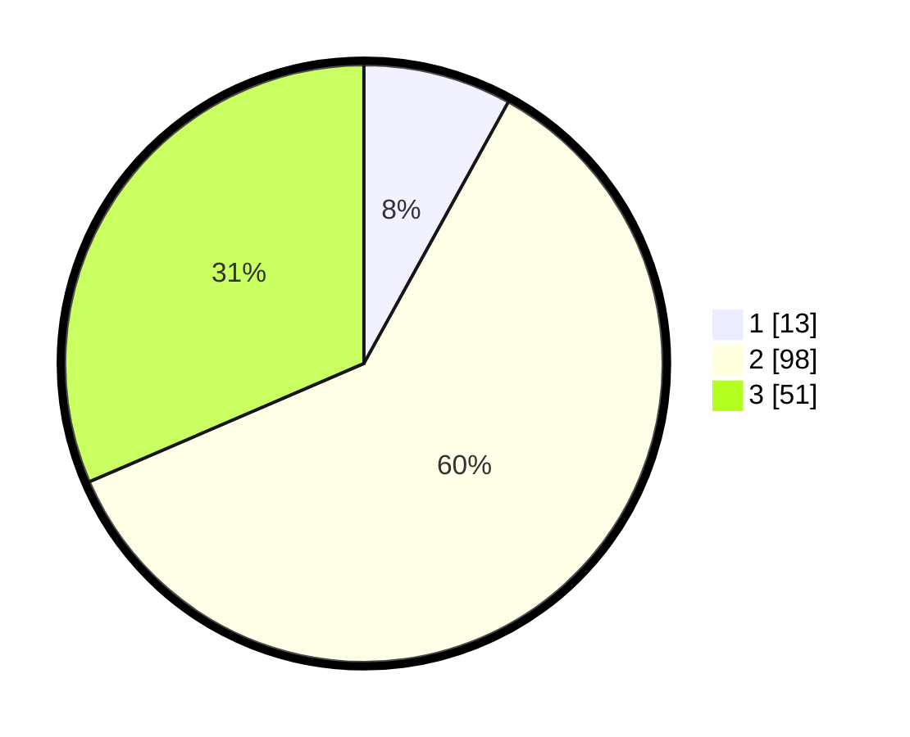

# Hasil

## Grafik

## Tabel

| No. | Nama Paslon    | Suara | Suara (raw) | Persentase |
|:--- |:-------------- | -----:| -----------:| ----------:|
| 1   | ANIES MUHAIMIN | 13    | [13][p-1]   | 8,02       |
| 2   | PRABOWO GIBRAN | 98    | [98][p-2]   | 60,49      |
| 3   | GANJAR MAHFUD  | 51    | [51][p-3]   | 31,48      |

[p-1]: https://github.com/gigit-pemilu/pemilu-2024-35-jawa-timur/blob/main/pilpres/hitung-suara/sub/35-jawa-timur/sub/26-bangkalan/sub/15-blega/sub/2018-ko'olan/sub/003-tps/sub/paslon-1.txt
[p-2]: https://github.com/gigit-pemilu/pemilu-2024-35-jawa-timur/blob/main/pilpres/hitung-suara/sub/35-jawa-timur/sub/26-bangkalan/sub/15-blega/sub/2018-ko'olan/sub/003-tps/sub/paslon-2.txt
[p-3]: https://github.com/gigit-pemilu/pemilu-2024-35-jawa-timur/blob/main/pilpres/hitung-suara/sub/35-jawa-timur/sub/26-bangkalan/sub/15-blega/sub/2018-ko'olan/sub/003-tps/sub/paslon-3.txt

## Foto C Plano

https://sirekap-obj-formc.kpu.go.id/8ee3/pemilu/ppwp/35/26/15/20/18/3526152018003-20240214-191635--c7243398-5695-4e92-99bc-82fc4d9e12dc.jpg

https://sirekap-obj-formc.kpu.go.id/8ee3/pemilu/ppwp/35/26/15/20/18/3526152018003-20240214-193011--89352c57-24dd-4648-955c-dc84587f7043.jpg

https://sirekap-obj-formc.kpu.go.id/8ee3/pemilu/ppwp/35/26/15/20/18/3526152018003-20240214-193138--aef904af-9f39-46c5-9d18-73ea8f7510a5.jpg

## Metadata

| Key        | Value               |
| ---------- | ------------------- |
| Time Stamp | 2024-02-22 09:00:00 |

