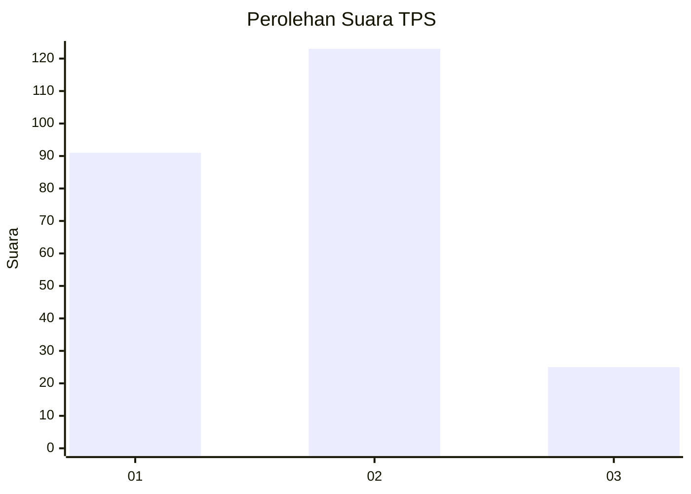
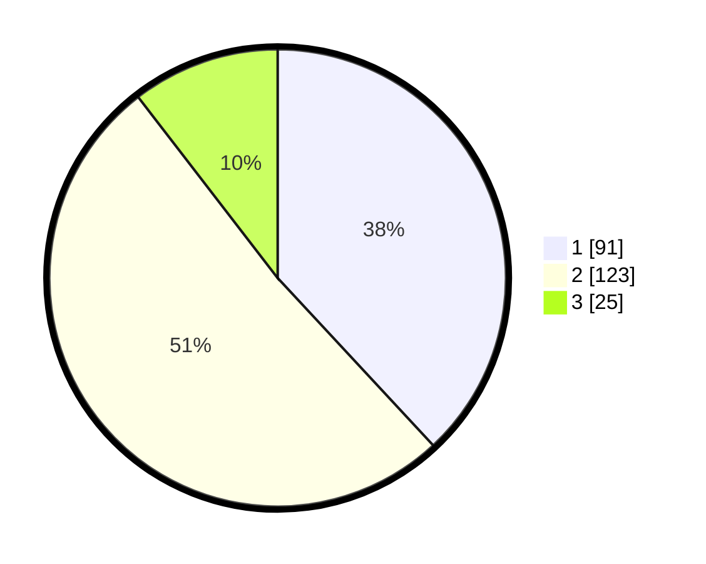

# Hasil

## Grafik

## Tabel

| No. | Nama Paslon    | Suara | Suara (raw) | Persentase |
|:--- |:-------------- | -----:| -----------:| ----------:|
| 1   | ANIES MUHAIMIN | 91    | [91][p-1]   | 38,08      |
| 2   | PRABOWO GIBRAN | 123   | [123][p-2]  | 51,46      |
| 3   | GANJAR MAHFUD  | 25    | [25][p-3]   | 10,46      |

[p-1]: https://github.com/gigit-pemilu/pemilu-2024/blob/main/pilpres/hitung-suara/sub/35-jawa-timur/sub/26-bangkalan/sub/16-modung/sub/2001-patereman/sub/006-tps/sub/paslon-1.txt
[p-2]: https://github.com/gigit-pemilu/pemilu-2024/blob/main/pilpres/hitung-suara/sub/35-jawa-timur/sub/26-bangkalan/sub/16-modung/sub/2001-patereman/sub/006-tps/sub/paslon-2.txt
[p-3]: https://github.com/gigit-pemilu/pemilu-2024/blob/main/pilpres/hitung-suara/sub/35-jawa-timur/sub/26-bangkalan/sub/16-modung/sub/2001-patereman/sub/006-tps/sub/paslon-3.txt

## Foto C Plano

https://sirekap-obj-formc.kpu.go.id/015c/pemilu/ppwp/35/26/16/20/01/3526162001006-20240214-225128--ffc5fee1-b368-49e1-90cd-a07eab5826be.jpg

https://sirekap-obj-formc.kpu.go.id/015c/pemilu/ppwp/35/26/16/20/01/3526162001006-20240214-225327--80c9c22c-2d96-4f9e-917e-f949c60a13ad.jpg

https://sirekap-obj-formc.kpu.go.id/015c/pemilu/ppwp/35/26/16/20/01/3526162001006-20240214-225503--3d54fea3-8851-42ef-9d54-05c482ab3f89.jpg

## Metadata

| Key        | Value               |
| ---------- | ------------------- |
| Time Stamp | 2024-02-24 22:31:28 |

