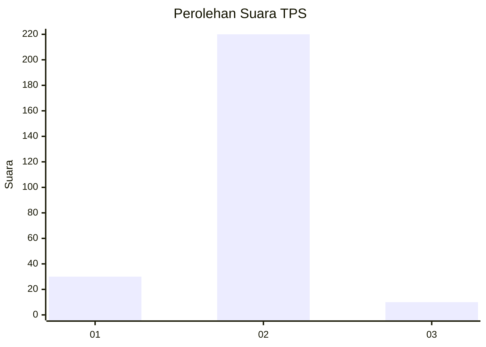
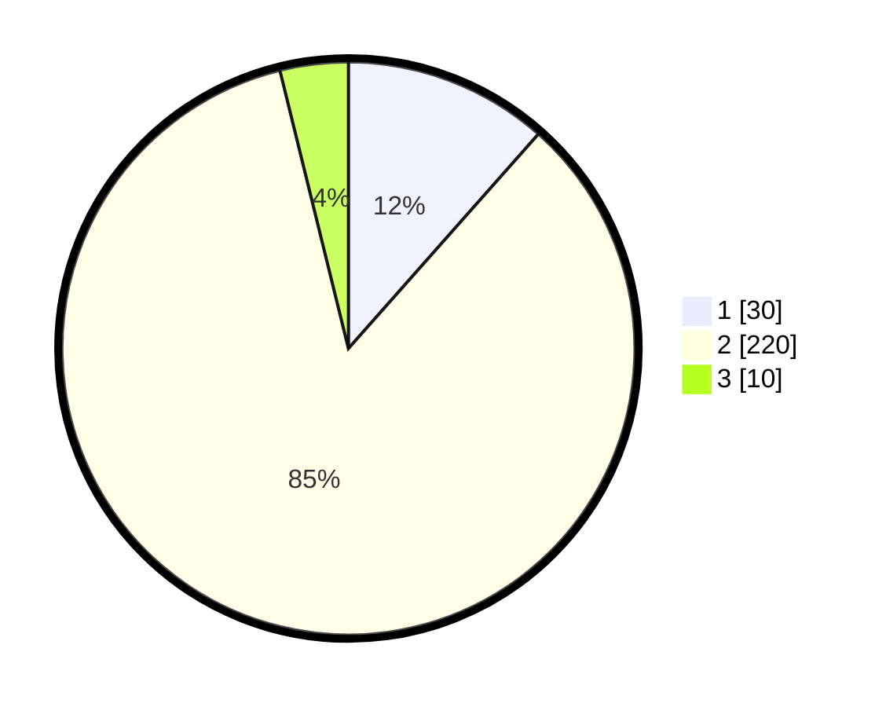

# Hasil

## Grafik

## Tabel

| No. | Nama Paslon    | Suara | Suara (raw) | Persentase |
|:--- |:-------------- | -----:| -----------:| ----------:|
| 1   | ANIES MUHAIMIN | 30    | [30][p-1]   | 11,54      |
| 2   | PRABOWO GIBRAN | 220   | [220][p-2]  | 84,62      |
| 3   | GANJAR MAHFUD  | 10    | [10][p-3]   | 3,85       |

[p-1]: https://github.com/gigit-pemilu/pemilu-2024-35-jawa-timur/blob/main/pilpres/hitung-suara/sub/35-jawa-timur/sub/26-bangkalan/sub/16-modung/sub/2005-langpanggang/sub/001-tps/sub/paslon-1.txt
[p-2]: https://github.com/gigit-pemilu/pemilu-2024-35-jawa-timur/blob/main/pilpres/hitung-suara/sub/35-jawa-timur/sub/26-bangkalan/sub/16-modung/sub/2005-langpanggang/sub/001-tps/sub/paslon-2.txt
[p-3]: https://github.com/gigit-pemilu/pemilu-2024-35-jawa-timur/blob/main/pilpres/hitung-suara/sub/35-jawa-timur/sub/26-bangkalan/sub/16-modung/sub/2005-langpanggang/sub/001-tps/sub/paslon-3.txt

## Foto C Plano

https://sirekap-obj-formc.kpu.go.id/7385/pemilu/ppwp/35/26/16/20/05/3526162005001-20240215-112005--8bd63033-1a2d-40cd-bdd5-a8e32c16aa4f.jpg

https://sirekap-obj-formc.kpu.go.id/7385/pemilu/ppwp/35/26/16/20/05/3526162005001-20240215-112142--10a24ab9-df22-4dc5-ae7c-c42b9f665723.jpg

## Metadata

| Key        | Value               |
| ---------- | ------------------- |
| Time Stamp | 2024-02-24 22:31:28 |

