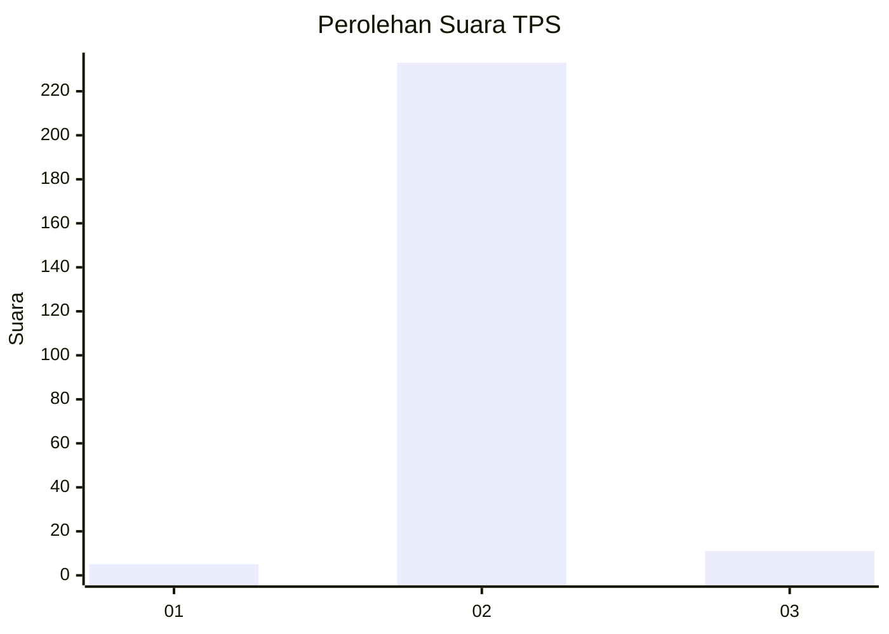
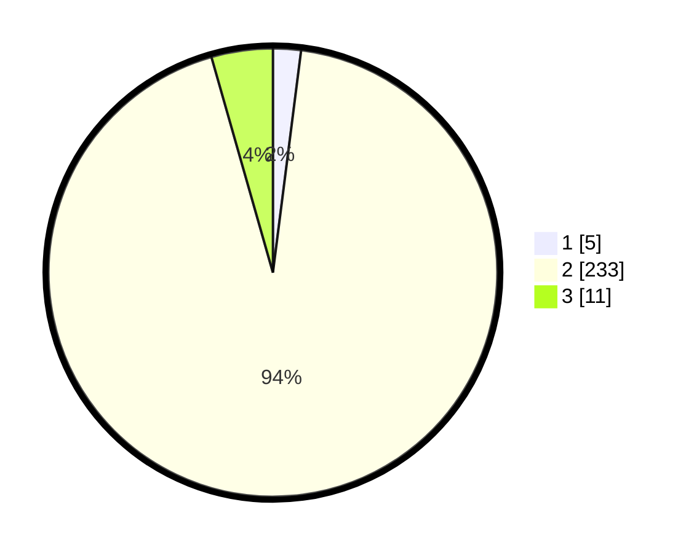

# Hasil

## Grafik

## Tabel

| No. | Nama Paslon    | Suara | Suara (raw) | Persentase |
|:--- |:-------------- | -----:| -----------:| ----------:|
| 1   | ANIES MUHAIMIN | 5     | [5][p-1]    | 2,01       |
| 2   | PRABOWO GIBRAN | 233   | [233][p-2]  | 93,57      |
| 3   | GANJAR MAHFUD  | 11    | [11][p-3]   | 4,42       |

[p-1]: https://github.com/gigit-pemilu/pemilu-2024/blob/main/pilpres/hitung-suara/sub/35-jawa-timur/sub/26-bangkalan/sub/16-modung/sub/2005-langpanggang/sub/004-tps/sub/paslon-1.txt
[p-2]: https://github.com/gigit-pemilu/pemilu-2024/blob/main/pilpres/hitung-suara/sub/35-jawa-timur/sub/26-bangkalan/sub/16-modung/sub/2005-langpanggang/sub/004-tps/sub/paslon-2.txt
[p-3]: https://github.com/gigit-pemilu/pemilu-2024/blob/main/pilpres/hitung-suara/sub/35-jawa-timur/sub/26-bangkalan/sub/16-modung/sub/2005-langpanggang/sub/004-tps/sub/paslon-3.txt

## Foto C Plano

https://sirekap-obj-formc.kpu.go.id/9cce/pemilu/ppwp/35/26/16/20/05/3526162005004-20240215-083138--32f79b6b-fc53-4b74-86eb-b5832c356d99.jpg

https://sirekap-obj-formc.kpu.go.id/9cce/pemilu/ppwp/35/26/16/20/05/3526162005004-20240215-083305--c1a1f052-aabb-403c-8614-4917f64e17bc.jpg

https://sirekap-obj-formc.kpu.go.id/9cce/pemilu/ppwp/35/26/16/20/05/3526162005004-20240215-083525--24b0b05e-1988-4dc2-932c-663bb5052dbe.jpg

## Metadata

| Key        | Value               |
| ---------- | ------------------- |
| Time Stamp | 2024-02-19 06:16:00 |

