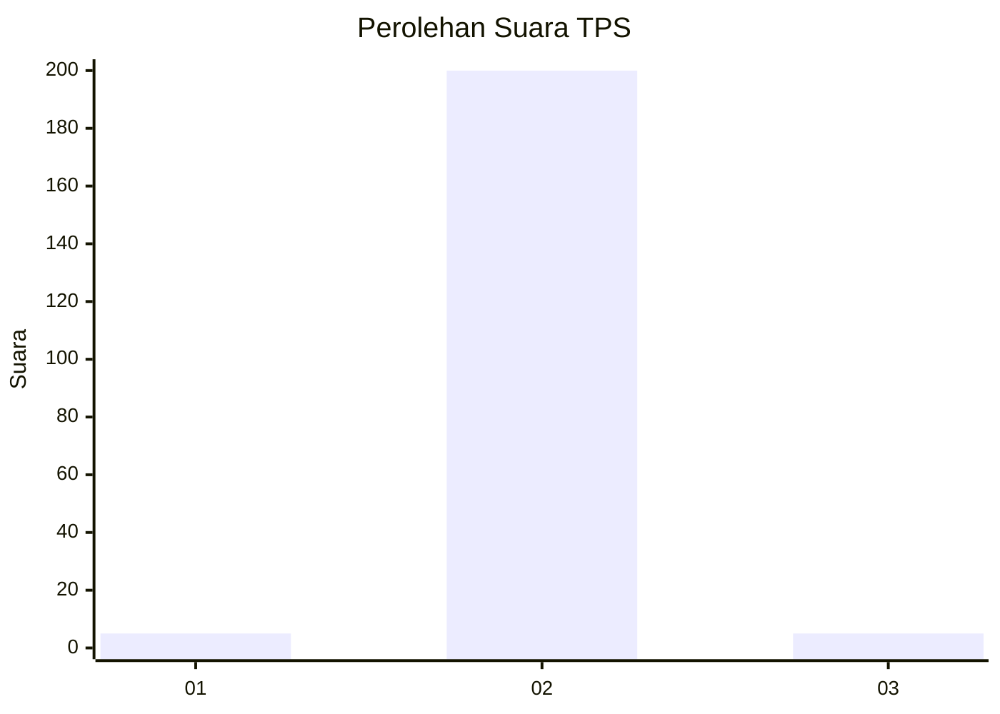
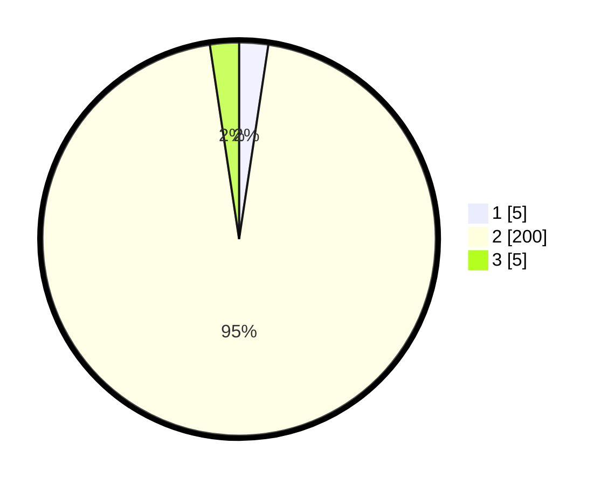

# Hasil

## Grafik

## Tabel

| No. | Nama Paslon    | Suara | Suara (raw) | Persentase |
|:--- |:-------------- | -----:| -----------:| ----------:|
| 1   | ANIES MUHAIMIN | 5     | [5][p-1]    | 2,38       |
| 2   | PRABOWO GIBRAN | 200   | [200][p-2]  | 95,24      |
| 3   | GANJAR MAHFUD  | 5     | [5][p-3]    | 2,38       |

[p-1]: https://github.com/gigit-pemilu/pemilu-2024/blob/main/pilpres/hitung-suara/sub/35-jawa-timur/sub/26-bangkalan/sub/16-modung/sub/2005-langpanggang/sub/005-tps/sub/paslon-1.txt
[p-2]: https://github.com/gigit-pemilu/pemilu-2024/blob/main/pilpres/hitung-suara/sub/35-jawa-timur/sub/26-bangkalan/sub/16-modung/sub/2005-langpanggang/sub/005-tps/sub/paslon-2.txt
[p-3]: https://github.com/gigit-pemilu/pemilu-2024/blob/main/pilpres/hitung-suara/sub/35-jawa-timur/sub/26-bangkalan/sub/16-modung/sub/2005-langpanggang/sub/005-tps/sub/paslon-3.txt

## Foto C Plano

https://sirekap-obj-formc.kpu.go.id/5305/pemilu/ppwp/35/26/16/20/05/3526162005005-20240215-091104--6477915e-dab0-4d44-abd1-ac63354e1738.jpg

https://sirekap-obj-formc.kpu.go.id/5305/pemilu/ppwp/35/26/16/20/05/3526162005005-20240215-091122--f565933a-aa34-449e-9955-13461860ac05.jpg

https://sirekap-obj-formc.kpu.go.id/5305/pemilu/ppwp/35/26/16/20/05/3526162005005-20240215-091134--666f4e72-bf6d-493f-9934-3cd6611fe0b6.jpg

## Metadata

| Key        | Value               |
| ---------- | ------------------- |
| Time Stamp | 2024-02-24 22:31:28 |

