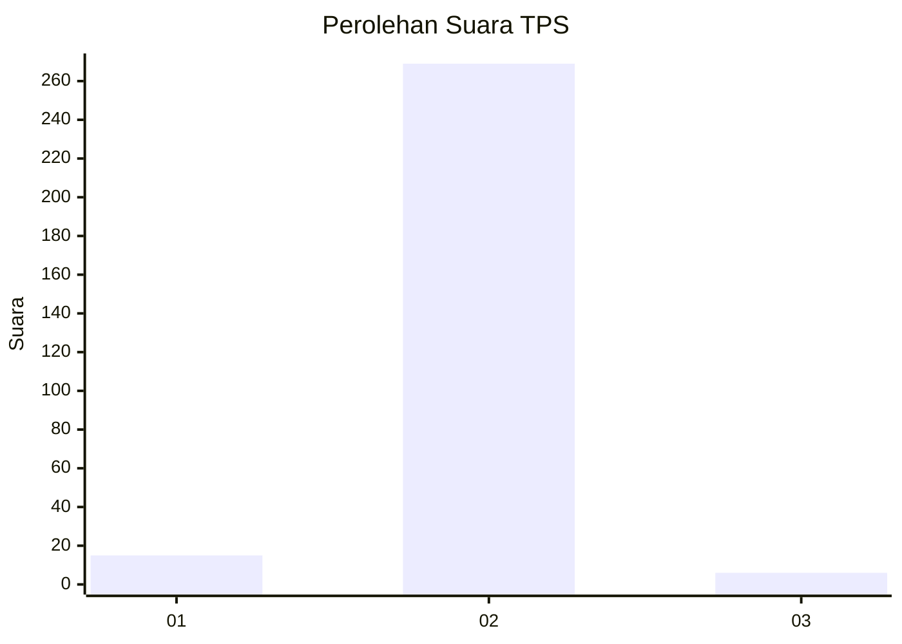
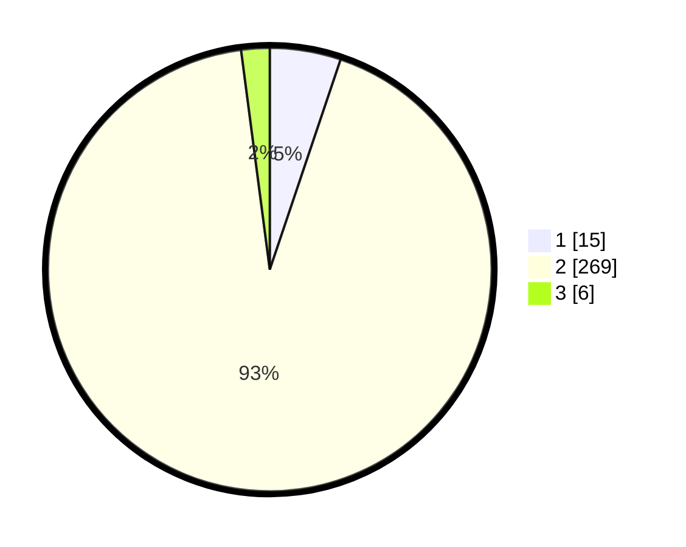

# Hasil

## Grafik

## Tabel

| No. | Nama Paslon    | Suara | Suara (raw) | Persentase |
|:--- |:-------------- | -----:| -----------:| ----------:|
| 1   | ANIES MUHAIMIN | 15    | [15][p-1]   | 5,17       |
| 2   | PRABOWO GIBRAN | 269   | [269][p-2]  | 92,76      |
| 3   | GANJAR MAHFUD  | 6     | [6][p-3]    | 2,07       |

[p-1]: https://github.com/gigit-pemilu/pemilu-2024-35-jawa-timur/blob/main/pilpres/hitung-suara/sub/35-jawa-timur/sub/26-bangkalan/sub/16-modung/sub/2016-suwa'an/sub/002-tps/sub/paslon-1.txt
[p-2]: https://github.com/gigit-pemilu/pemilu-2024-35-jawa-timur/blob/main/pilpres/hitung-suara/sub/35-jawa-timur/sub/26-bangkalan/sub/16-modung/sub/2016-suwa'an/sub/002-tps/sub/paslon-2.txt
[p-3]: https://github.com/gigit-pemilu/pemilu-2024-35-jawa-timur/blob/main/pilpres/hitung-suara/sub/35-jawa-timur/sub/26-bangkalan/sub/16-modung/sub/2016-suwa'an/sub/002-tps/sub/paslon-3.txt

## Foto C Plano

https://sirekap-obj-formc.kpu.go.id/051c/pemilu/ppwp/35/26/16/20/16/3526162016002-20240214-210134--8ccfd070-e609-4ce1-ba3d-a94ed640bdfb.jpg

https://sirekap-obj-formc.kpu.go.id/051c/pemilu/ppwp/35/26/16/20/16/3526162016002-20240214-210212--7f36c6d1-abb6-4116-8ca3-c0a91be1df67.jpg

https://sirekap-obj-formc.kpu.go.id/051c/pemilu/ppwp/35/26/16/20/16/3526162016002-20240215-194916--c8109c38-7f12-4b3b-a537-299ce55988c7.jpg

## Metadata

| Key        | Value               |
| ---------- | ------------------- |
| Time Stamp | 2024-02-19 06:16:00 |

