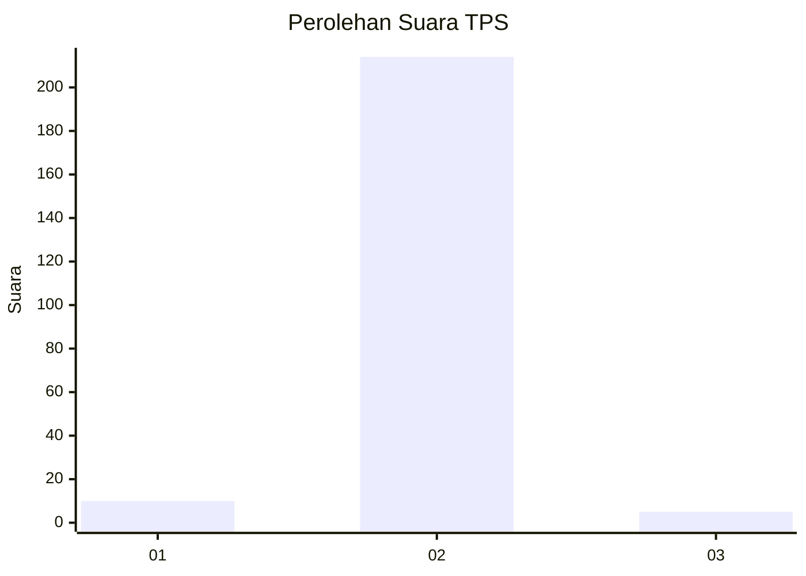
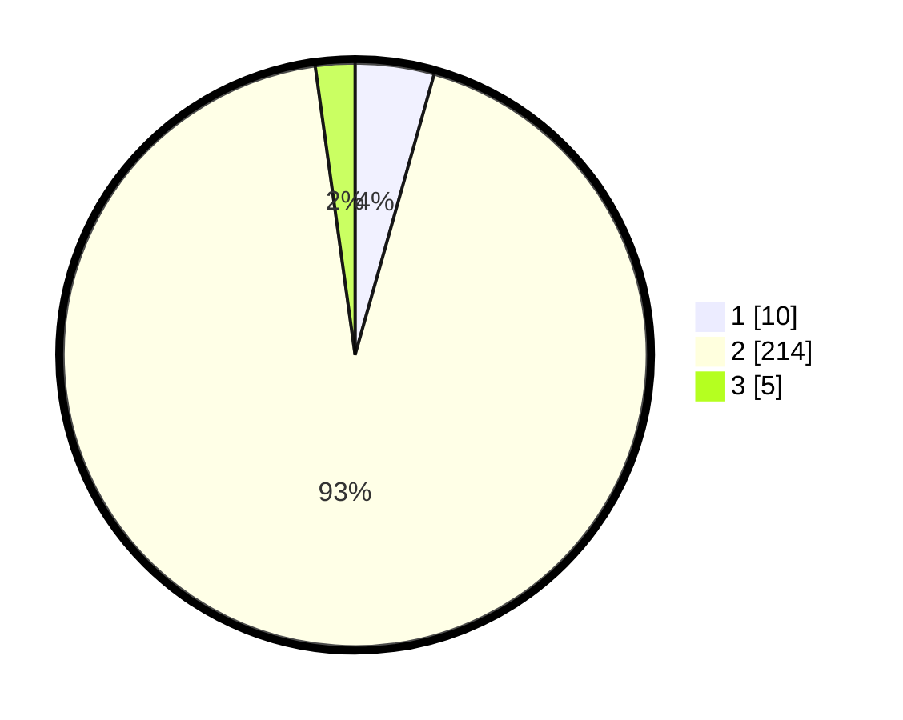

# Hasil

## Grafik

## Tabel

| No. | Nama Paslon    | Suara | Suara (raw) | Persentase |
|:--- |:-------------- | -----:| -----------:| ----------:|
| 1   | ANIES MUHAIMIN | 10    | [10][p-1]   | 4,37       |
| 2   | PRABOWO GIBRAN | 214   | [214][p-2]  | 93,45      |
| 3   | GANJAR MAHFUD  | 5     | [5][p-3]    | 2,18       |

[p-1]: https://github.com/gigit-pemilu/pemilu-2024-35-jawa-timur/blob/main/pilpres/hitung-suara/sub/35-jawa-timur/sub/26-bangkalan/sub/16-modung/sub/2016-suwa'an/sub/003-tps/sub/paslon-1.txt
[p-2]: https://github.com/gigit-pemilu/pemilu-2024-35-jawa-timur/blob/main/pilpres/hitung-suara/sub/35-jawa-timur/sub/26-bangkalan/sub/16-modung/sub/2016-suwa'an/sub/003-tps/sub/paslon-2.txt
[p-3]: https://github.com/gigit-pemilu/pemilu-2024-35-jawa-timur/blob/main/pilpres/hitung-suara/sub/35-jawa-timur/sub/26-bangkalan/sub/16-modung/sub/2016-suwa'an/sub/003-tps/sub/paslon-3.txt

## Foto C Plano

https://sirekap-obj-formc.kpu.go.id/de64/pemilu/ppwp/35/26/16/20/16/3526162016003-20240214-204629--9ec3cb5c-bb24-4265-be61-19262d2e79d9.jpg

https://sirekap-obj-formc.kpu.go.id/de64/pemilu/ppwp/35/26/16/20/16/3526162016003-20240214-212720--3be8428b-bc45-4ca2-abaa-f64da024c7da.jpg

https://sirekap-obj-formc.kpu.go.id/de64/pemilu/ppwp/35/26/16/20/16/3526162016003-20240214-212807--73045db1-4efe-4885-a174-07b5307f003a.jpg

## Metadata

| Key        | Value               |
| ---------- | ------------------- |
| Time Stamp | 2024-02-15 15:00:29 |

