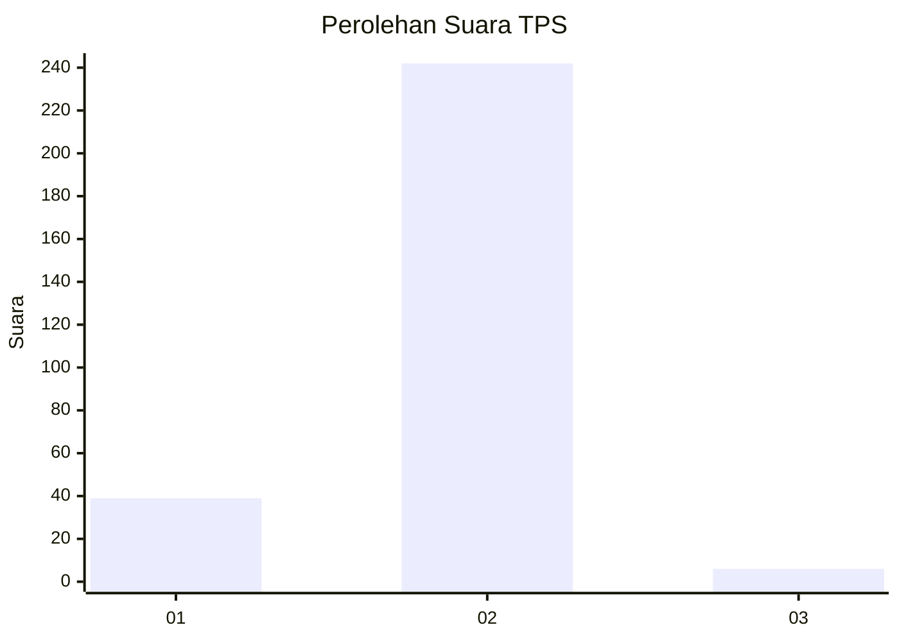
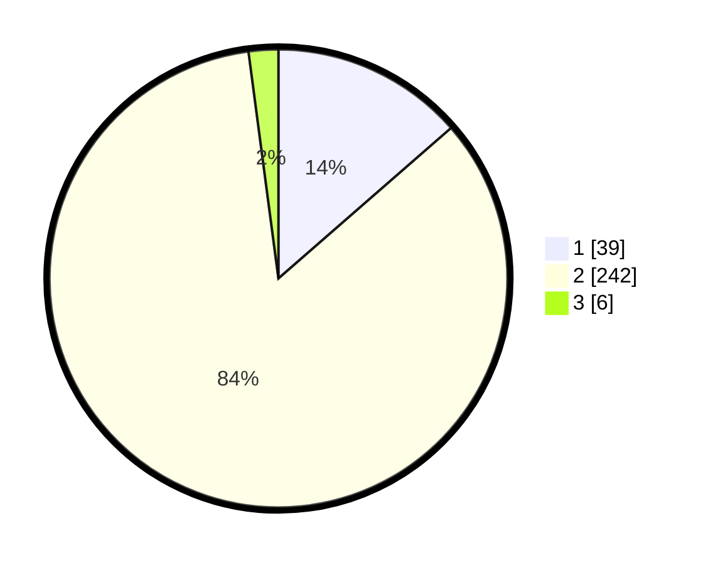

# Hasil

## Grafik

## Tabel

| No. | Nama Paslon    | Suara | Suara (raw) | Persentase |
|:--- |:-------------- | -----:| -----------:| ----------:|
| 1   | ANIES MUHAIMIN | 39    | [39][p-1]   | 13,59      |
| 2   | PRABOWO GIBRAN | 242   | [242][p-2]  | 84,32      |
| 3   | GANJAR MAHFUD  | 6     | [6][p-3]    | 2,09       |

[p-1]: https://github.com/gigit-pemilu/pemilu-2024-35-jawa-timur/blob/main/pilpres/hitung-suara/sub/35-jawa-timur/sub/26-bangkalan/sub/16-modung/sub/2016-suwa'an/sub/004-tps/sub/paslon-1.txt
[p-2]: https://github.com/gigit-pemilu/pemilu-2024-35-jawa-timur/blob/main/pilpres/hitung-suara/sub/35-jawa-timur/sub/26-bangkalan/sub/16-modung/sub/2016-suwa'an/sub/004-tps/sub/paslon-2.txt
[p-3]: https://github.com/gigit-pemilu/pemilu-2024-35-jawa-timur/blob/main/pilpres/hitung-suara/sub/35-jawa-timur/sub/26-bangkalan/sub/16-modung/sub/2016-suwa'an/sub/004-tps/sub/paslon-3.txt

## Foto C Plano

https://sirekap-obj-formc.kpu.go.id/6612/pemilu/ppwp/35/26/16/20/16/3526162016004-20240214-204052--af0166ee-de9b-4e29-91b0-b5d014596b54.jpg

https://sirekap-obj-formc.kpu.go.id/6612/pemilu/ppwp/35/26/16/20/16/3526162016004-20240214-204058--55d37bb7-33dd-487d-abe3-c25fbe7227ca.jpg

https://sirekap-obj-formc.kpu.go.id/6612/pemilu/ppwp/35/26/16/20/16/3526162016004-20240214-204104--4f9b3281-94e9-49b0-915a-0732d9a6a747.jpg

## Metadata

| Key        | Value               |
| ---------- | ------------------- |
| Time Stamp | 2024-02-25 12:00:00 |

