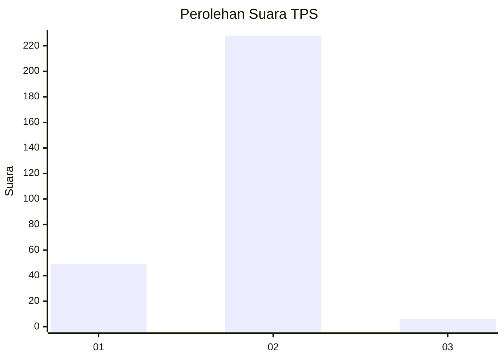
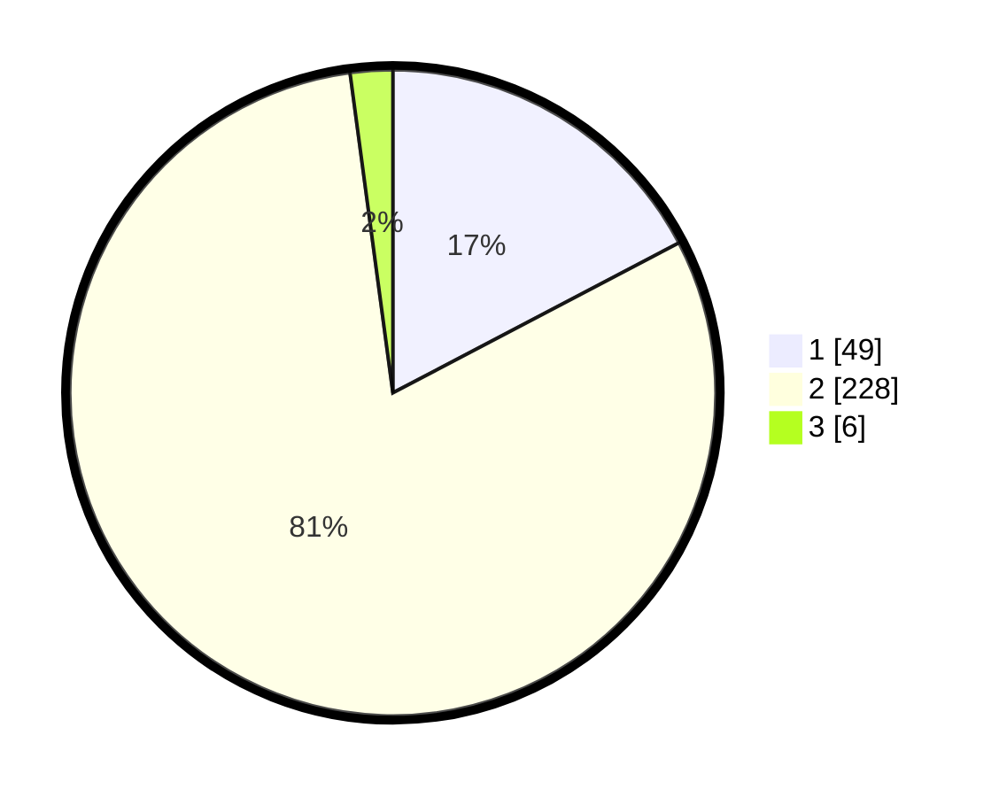

# Hasil

## Grafik

## Tabel

| No. | Nama Paslon    | Suara | Suara (raw) | Persentase |
|:--- |:-------------- | -----:| -----------:| ----------:|
| 1   | ANIES MUHAIMIN | 49    | [49][p-1]   | 17,31      |
| 2   | PRABOWO GIBRAN | 228   | [228][p-2]  | 80,57      |
| 3   | GANJAR MAHFUD  | 6     | [6][p-3]    | 2,12       |

[p-1]: https://github.com/gigit-pemilu/pemilu-2024-35-jawa-timur/blob/main/pilpres/hitung-suara/sub/35-jawa-timur/sub/26-bangkalan/sub/16-modung/sub/2016-suwa'an/sub/005-tps/sub/paslon-1.txt
[p-2]: https://github.com/gigit-pemilu/pemilu-2024-35-jawa-timur/blob/main/pilpres/hitung-suara/sub/35-jawa-timur/sub/26-bangkalan/sub/16-modung/sub/2016-suwa'an/sub/005-tps/sub/paslon-2.txt
[p-3]: https://github.com/gigit-pemilu/pemilu-2024-35-jawa-timur/blob/main/pilpres/hitung-suara/sub/35-jawa-timur/sub/26-bangkalan/sub/16-modung/sub/2016-suwa'an/sub/005-tps/sub/paslon-3.txt

## Foto C Plano

https://sirekap-obj-formc.kpu.go.id/b930/pemilu/ppwp/35/26/16/20/16/3526162016005-20240214-204633--aff65916-a591-497d-b3af-967a60e7607d.jpg

https://sirekap-obj-formc.kpu.go.id/b930/pemilu/ppwp/35/26/16/20/16/3526162016005-20240214-205117--fc7d18cf-f9bf-4c3b-b23a-ef9d9bb265e4.jpg

https://sirekap-obj-formc.kpu.go.id/b930/pemilu/ppwp/35/26/16/20/16/3526162016005-20240214-205336--bad270b6-f0be-47eb-8024-50db6a2566ee.jpg

## Metadata

| Key        | Value               |
| ---------- | ------------------- |
| Time Stamp | 2024-02-19 06:16:00 |

