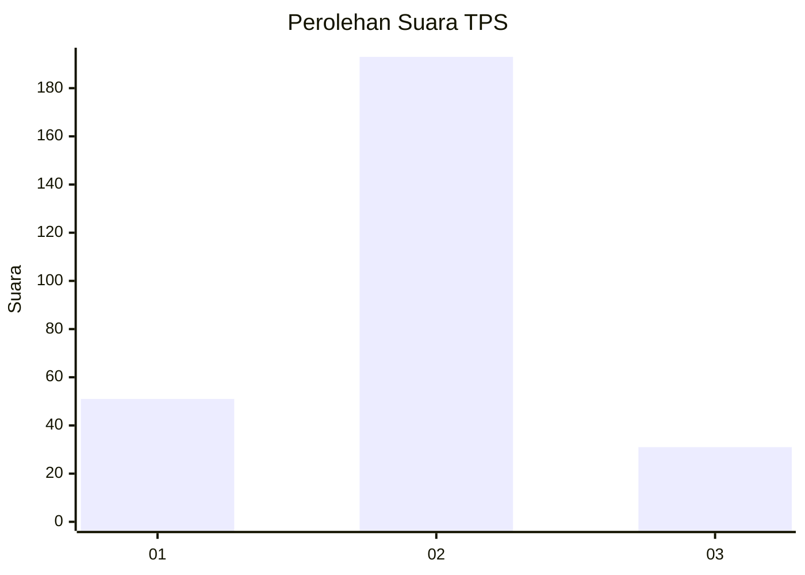
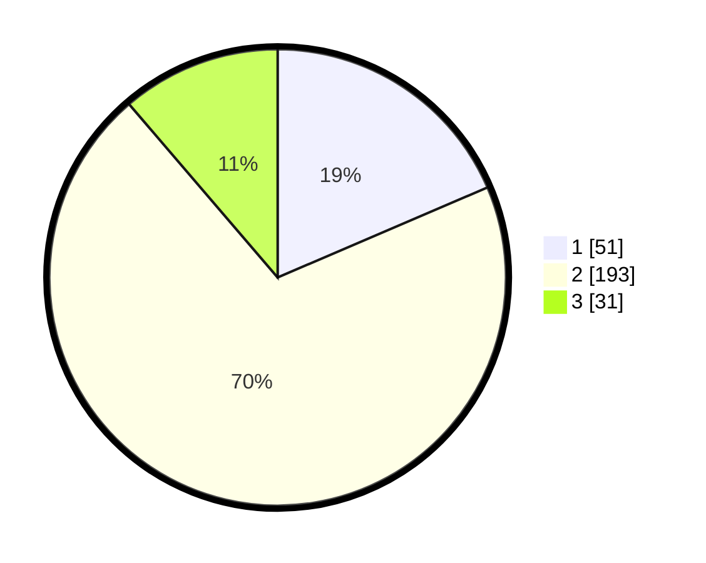

# Hasil

## Grafik

## Tabel

| No. | Nama Paslon    | Suara | Suara (raw) | Persentase |
|:--- |:-------------- | -----:| -----------:| ----------:|
| 1   | ANIES MUHAIMIN | 51    | [51][p-1]   | 18,55      |
| 2   | PRABOWO GIBRAN | 193   | [193][p-2]  | 70,18      |
| 3   | GANJAR MAHFUD  | 31    | [31][p-3]   | 11,27      |

[p-1]: https://github.com/gigit-pemilu/pemilu-2024/blob/main/pilpres/hitung-suara/sub/35-jawa-timur/sub/26-bangkalan/sub/17-konang/sub/2002-konang/sub/013-tps/sub/paslon-1.txt
[p-2]: https://github.com/gigit-pemilu/pemilu-2024/blob/main/pilpres/hitung-suara/sub/35-jawa-timur/sub/26-bangkalan/sub/17-konang/sub/2002-konang/sub/013-tps/sub/paslon-2.txt
[p-3]: https://github.com/gigit-pemilu/pemilu-2024/blob/main/pilpres/hitung-suara/sub/35-jawa-timur/sub/26-bangkalan/sub/17-konang/sub/2002-konang/sub/013-tps/sub/paslon-3.txt

## Foto C Plano

https://sirekap-obj-formc.kpu.go.id/3615/pemilu/ppwp/35/26/17/20/02/3526172002013-20240214-190217--2888810c-ac7d-4a57-a6b3-8312862be5d2.jpg

https://sirekap-obj-formc.kpu.go.id/3615/pemilu/ppwp/35/26/17/20/02/3526172002013-20240214-190552--0ad4bd12-8fb7-4857-bfd5-68f5dc3ecb57.jpg

## Metadata

| Key        | Value               |
| ---------- | ------------------- |
| Time Stamp | 2024-02-24 22:31:28 |

