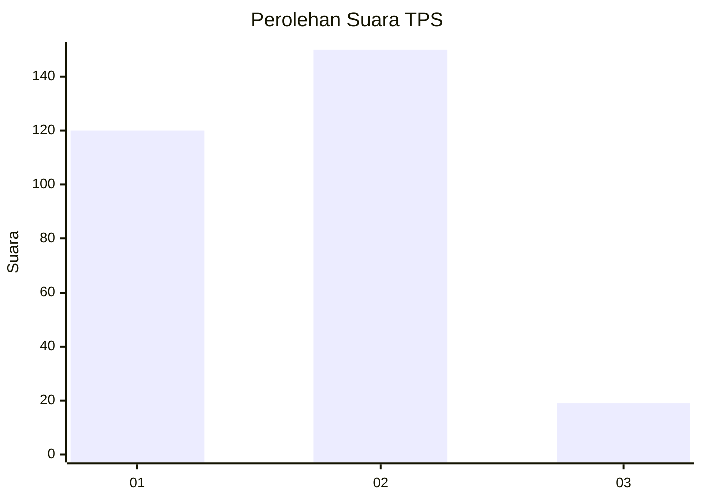

# Hasil

## Grafik

## Tabel

| No. | Nama Paslon    | Suara | Suara (raw) | Persentase |
|:--- |:-------------- | -----:| -----------:| ----------:|
| 1   | ANIES MUHAIMIN | 120   | [120][p-1]  | 41,52      |
| 2   | PRABOWO GIBRAN | 150   | [150][p-2]  | 51,90      |
| 3   | GANJAR MAHFUD  | 19    | [19][p-3]   | 6,57       |

[p-1]: https://github.com/gigit-pemilu/pemilu-2024-35-jawa-timur/blob/main/pilpres/hitung-suara/sub/35-jawa-timur/sub/26-bangkalan/sub/17-konang/sub/2003-genteng/sub/003-tps/sub/paslon-1.txt
[p-2]: https://github.com/gigit-pemilu/pemilu-2024-35-jawa-timur/blob/main/pilpres/hitung-suara/sub/35-jawa-timur/sub/26-bangkalan/sub/17-konang/sub/2003-genteng/sub/003-tps/sub/paslon-2.txt
[p-3]: https://github.com/gigit-pemilu/pemilu-2024-35-jawa-timur/blob/main/pilpres/hitung-suara/sub/35-jawa-timur/sub/26-bangkalan/sub/17-konang/sub/2003-genteng/sub/003-tps/sub/paslon-3.txt

## Foto C Plano

https://sirekap-obj-formc.kpu.go.id/7438/pemilu/ppwp/35/26/17/20/03/3526172003003-20240214-212826--2f71aaca-df71-413c-9fd0-83334114309b.jpg

https://sirekap-obj-formc.kpu.go.id/7438/pemilu/ppwp/35/26/17/20/03/3526172003003-20240214-213838--609d0f59-58e3-454d-9960-fdad81984dc7.jpg

https://sirekap-obj-formc.kpu.go.id/7438/pemilu/ppwp/35/26/17/20/03/3526172003003-20240214-214353--c5cb3f1b-3d06-4d21-8762-6a6e7e6feb4a.jpg

## Metadata

| Key        | Value               |
| ---------- | ------------------- |
| Time Stamp | 2024-02-19 06:16:00 |

