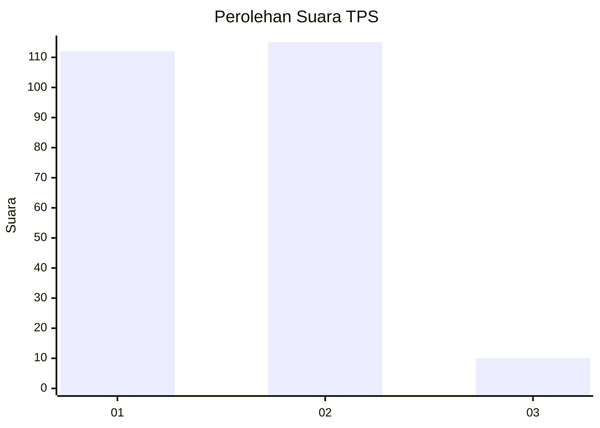
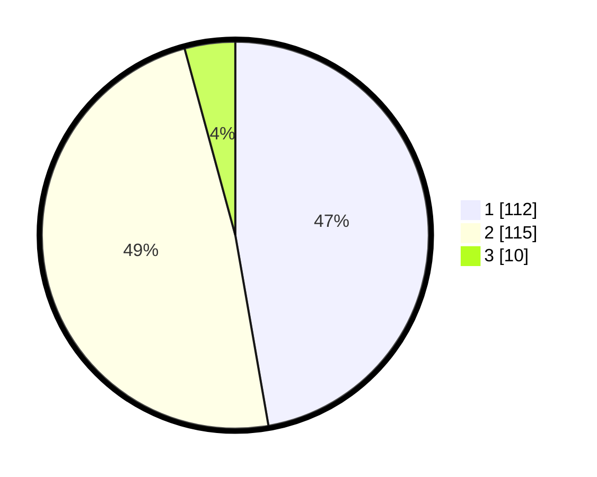

# Hasil

## Grafik

## Tabel

| No. | Nama Paslon    | Suara | Suara (raw) | Persentase |
|:--- |:-------------- | -----:| -----------:| ----------:|
| 1   | ANIES MUHAIMIN | 112   | [112][p-1]  | 47,26      |
| 2   | PRABOWO GIBRAN | 115   | [115][p-2]  | 48,52      |
| 3   | GANJAR MAHFUD  | 10    | [10][p-3]   | 4,22       |

[p-1]: https://github.com/gigit-pemilu/pemilu-2024-35-jawa-timur/blob/main/pilpres/hitung-suara/sub/35-jawa-timur/sub/26-bangkalan/sub/17-konang/sub/2003-genteng/sub/021-tps/sub/paslon-1.txt
[p-2]: https://github.com/gigit-pemilu/pemilu-2024-35-jawa-timur/blob/main/pilpres/hitung-suara/sub/35-jawa-timur/sub/26-bangkalan/sub/17-konang/sub/2003-genteng/sub/021-tps/sub/paslon-2.txt
[p-3]: https://github.com/gigit-pemilu/pemilu-2024-35-jawa-timur/blob/main/pilpres/hitung-suara/sub/35-jawa-timur/sub/26-bangkalan/sub/17-konang/sub/2003-genteng/sub/021-tps/sub/paslon-3.txt

## Foto C Plano

https://sirekap-obj-formc.kpu.go.id/a258/pemilu/ppwp/35/26/17/20/03/3526172003021-20240214-220421--19dfbed6-2404-4f2c-99b2-2cf5b71e53bd.jpg

https://sirekap-obj-formc.kpu.go.id/a258/pemilu/ppwp/35/26/17/20/03/3526172003021-20240214-220807--5711b9d6-b0db-4f01-9507-303538d99ca8.jpg

https://sirekap-obj-formc.kpu.go.id/a258/pemilu/ppwp/35/26/17/20/03/3526172003021-20240214-221005--ad6135be-ce50-4e6f-be5b-9c91a813e7bd.jpg

## Metadata

| Key        | Value               |
| ---------- | ------------------- |
| Time Stamp | 2024-02-24 22:31:28 |

