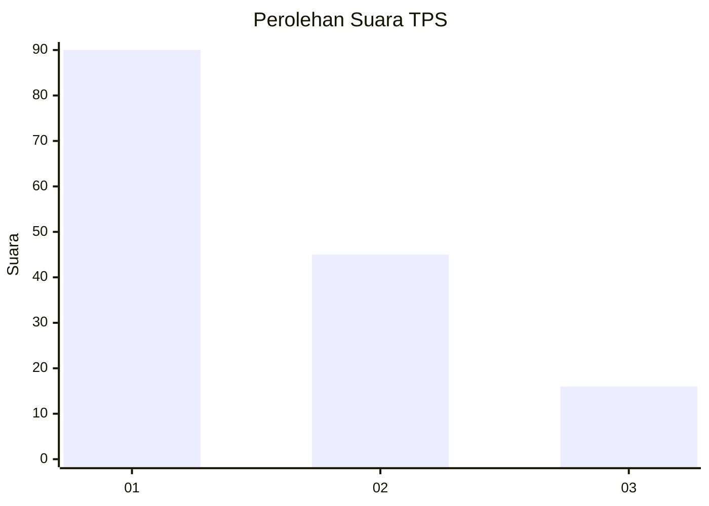
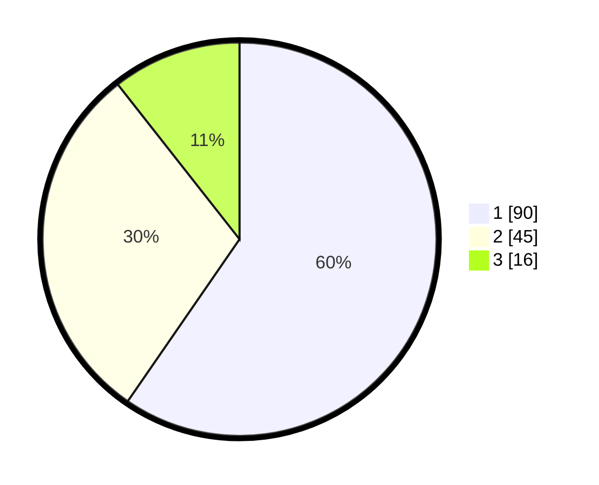

# Hasil

## Grafik

## Tabel

| No. | Nama Paslon    | Suara | Suara (raw) | Persentase |
|:--- |:-------------- | -----:| -----------:| ----------:|
| 1   | ANIES MUHAIMIN | 90    | [90][p-1]   | 59,60      |
| 2   | PRABOWO GIBRAN | 45    | [45][p-2]   | 29,80      |
| 3   | GANJAR MAHFUD  | 16    | [16][p-3]   | 10,60      |

[p-1]: https://github.com/gigit-pemilu/pemilu-2024-35-jawa-timur/blob/main/pilpres/hitung-suara/sub/35-jawa-timur/sub/26-bangkalan/sub/17-konang/sub/2003-genteng/sub/023-tps/sub/paslon-1.txt
[p-2]: https://github.com/gigit-pemilu/pemilu-2024-35-jawa-timur/blob/main/pilpres/hitung-suara/sub/35-jawa-timur/sub/26-bangkalan/sub/17-konang/sub/2003-genteng/sub/023-tps/sub/paslon-2.txt
[p-3]: https://github.com/gigit-pemilu/pemilu-2024-35-jawa-timur/blob/main/pilpres/hitung-suara/sub/35-jawa-timur/sub/26-bangkalan/sub/17-konang/sub/2003-genteng/sub/023-tps/sub/paslon-3.txt

## Foto C Plano

https://sirekap-obj-formc.kpu.go.id/4860/pemilu/ppwp/35/26/17/20/03/3526172003023-20240214-202632--cce40b43-d38c-4a36-95af-bcf12ab878e6.jpg

https://sirekap-obj-formc.kpu.go.id/4860/pemilu/ppwp/35/26/17/20/03/3526172003023-20240214-202825--6e40abeb-999d-4cb2-ad99-0c9b677e6d41.jpg

https://sirekap-obj-formc.kpu.go.id/4860/pemilu/ppwp/35/26/17/20/03/3526172003023-20240214-203335--c6ae272c-74f7-4d65-aa28-1463f5926148.jpg

## Metadata

| Key        | Value               |
| ---------- | ------------------- |
| Time Stamp | 2024-02-19 06:16:00 |

