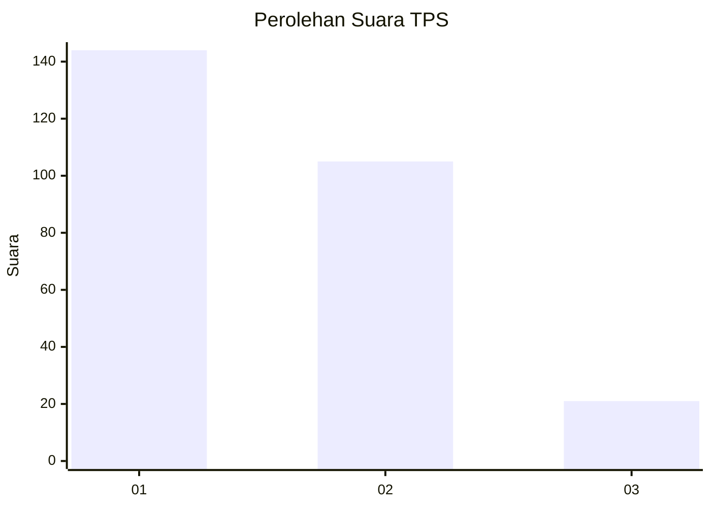
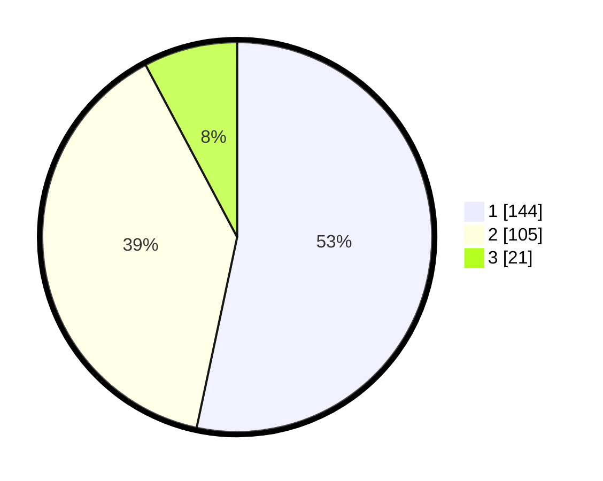

# Hasil

## Grafik

## Tabel

| No. | Nama Paslon    | Suara | Suara (raw) | Persentase |
|:--- |:-------------- | -----:| -----------:| ----------:|
| 1   | ANIES MUHAIMIN | 144   | [144][p-1]  | 53,33      |
| 2   | PRABOWO GIBRAN | 105   | [105][p-2]  | 38,89      |
| 3   | GANJAR MAHFUD  | 21    | [21][p-3]   | 7,78       |

[p-1]: https://github.com/gigit-pemilu/pemilu-2024-35-jawa-timur/blob/main/pilpres/hitung-suara/sub/35-jawa-timur/sub/26-bangkalan/sub/17-konang/sub/2004-pakes/sub/005-tps/sub/paslon-1.txt
[p-2]: https://github.com/gigit-pemilu/pemilu-2024-35-jawa-timur/blob/main/pilpres/hitung-suara/sub/35-jawa-timur/sub/26-bangkalan/sub/17-konang/sub/2004-pakes/sub/005-tps/sub/paslon-2.txt
[p-3]: https://github.com/gigit-pemilu/pemilu-2024-35-jawa-timur/blob/main/pilpres/hitung-suara/sub/35-jawa-timur/sub/26-bangkalan/sub/17-konang/sub/2004-pakes/sub/005-tps/sub/paslon-3.txt

## Foto C Plano

https://sirekap-obj-formc.kpu.go.id/adb6/pemilu/ppwp/35/26/17/20/04/3526172004005-20240223-173929--42a62a7a-541f-47a8-8912-773ffa0cd7e4.jpg

https://sirekap-obj-formc.kpu.go.id/adb6/pemilu/ppwp/35/26/17/20/04/3526172004005-20240223-173708--32166aae-e46f-4961-bef5-21de78d4b2ad.jpg

https://sirekap-obj-formc.kpu.go.id/adb6/pemilu/ppwp/35/26/17/20/04/3526172004005-20240223-173828--985a3926-917e-4c8a-9337-9164c740802d.jpg

## Metadata

| Key        | Value               |
| ---------- | ------------------- |
| Time Stamp | 2024-02-24 22:31:28 |

