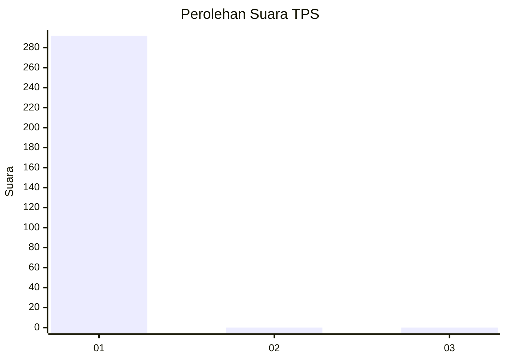
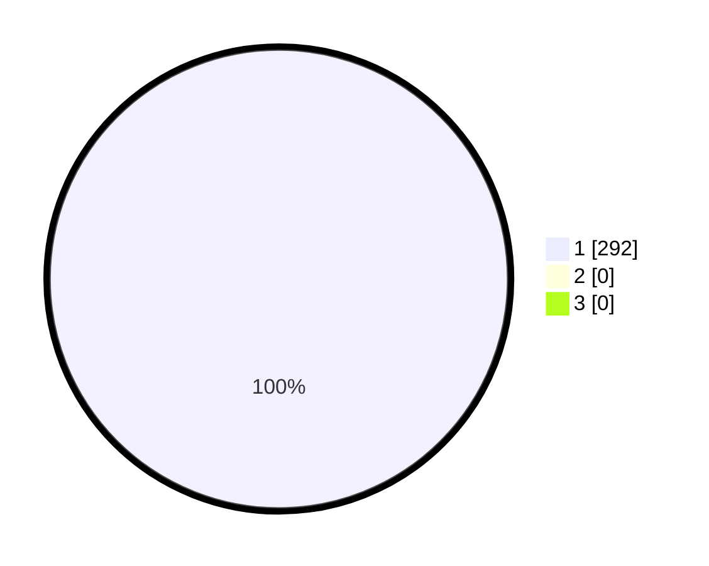

# Hasil

## Grafik

## Tabel

| No. | Nama Paslon    | Suara | Suara (raw) | Persentase |
|:--- |:-------------- | -----:| -----------:| ----------:|
| 1   | ANIES MUHAIMIN | 292   | [292][p-1]  | 100,00     |
| 2   | PRABOWO GIBRAN | 0     | [0][p-2]    | 0,00       |
| 3   | GANJAR MAHFUD  | 0     | [0][p-3]    | 0,00       |

[p-1]: https://github.com/gigit-pemilu/pemilu-2024/blob/main/pilpres/hitung-suara/sub/35-jawa-timur/sub/26-bangkalan/sub/17-konang/sub/2005-cangkareman/sub/003-tps/sub/paslon-1.txt
[p-2]: https://github.com/gigit-pemilu/pemilu-2024/blob/main/pilpres/hitung-suara/sub/35-jawa-timur/sub/26-bangkalan/sub/17-konang/sub/2005-cangkareman/sub/003-tps/sub/paslon-2.txt
[p-3]: https://github.com/gigit-pemilu/pemilu-2024/blob/main/pilpres/hitung-suara/sub/35-jawa-timur/sub/26-bangkalan/sub/17-konang/sub/2005-cangkareman/sub/003-tps/sub/paslon-3.txt

## Foto C Plano

https://sirekap-obj-formc.kpu.go.id/062b/pemilu/ppwp/35/26/17/20/05/3526172005003-20240221-222747--8d9532f6-d2cd-4864-911f-dfac9191e6d5.jpg

https://sirekap-obj-formc.kpu.go.id/062b/pemilu/ppwp/35/26/17/20/05/3526172005003-20240221-222839--eaf29d5e-ed0a-45ac-908b-05ba7e8097a6.jpg

https://sirekap-obj-formc.kpu.go.id/062b/pemilu/ppwp/35/26/17/20/05/3526172005003-20240221-222941--23674b7c-2240-4df9-ba77-d2ad78f6f5e7.jpg

## Metadata

| Key        | Value               |
| ---------- | ------------------- |
| Time Stamp | 2024-02-24 22:31:28 |

