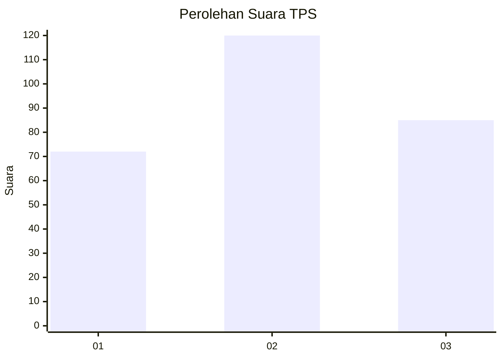
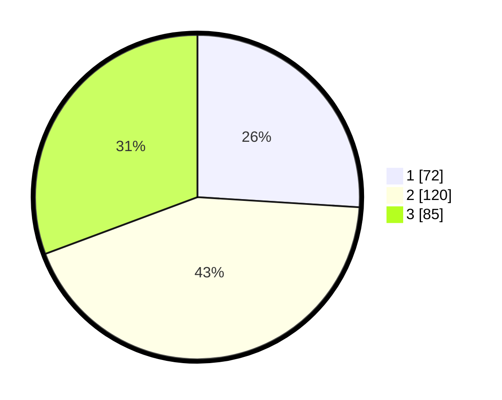

# Hasil

## Grafik

## Tabel

| No. | Nama Paslon    | Suara | Suara (raw) | Persentase |
|:--- |:-------------- | -----:| -----------:| ----------:|
| 1   | ANIES MUHAIMIN | 72    | [72][p-1]   | 25,99      |
| 2   | PRABOWO GIBRAN | 120   | [120][p-2]  | 43,32      |
| 3   | GANJAR MAHFUD  | 85    | [85][p-3]   | 30,69      |

[p-1]: https://github.com/gigit-pemilu/pemilu-2024/blob/main/pilpres/hitung-suara/sub/35-jawa-timur/sub/26-bangkalan/sub/18-galis/sub/2002-daleman/sub/010-tps/sub/paslon-1.txt
[p-2]: https://github.com/gigit-pemilu/pemilu-2024/blob/main/pilpres/hitung-suara/sub/35-jawa-timur/sub/26-bangkalan/sub/18-galis/sub/2002-daleman/sub/010-tps/sub/paslon-2.txt
[p-3]: https://github.com/gigit-pemilu/pemilu-2024/blob/main/pilpres/hitung-suara/sub/35-jawa-timur/sub/26-bangkalan/sub/18-galis/sub/2002-daleman/sub/010-tps/sub/paslon-3.txt

## Foto C Plano

https://sirekap-obj-formc.kpu.go.id/1a77/pemilu/ppwp/35/26/18/20/02/3526182002010-20240226-100842--d168784f-d892-4a3b-9029-55aee84a23ad.jpg

https://sirekap-obj-formc.kpu.go.id/1a77/pemilu/ppwp/35/26/18/20/02/3526182002010-20240226-101003--fc2147cf-0ee0-4aff-8d5d-89a53324321e.jpg

https://sirekap-obj-formc.kpu.go.id/1a77/pemilu/ppwp/35/26/18/20/02/3526182002010-20240226-101818--60bf6c75-dd3a-4a6e-851c-80217cca2ae8.jpg

## Metadata

| Key        | Value               |
| ---------- | ------------------- |
| Time Stamp | 2024-02-29 16:00:00 |

## DATA PEMILIH TETAP

Jumlah pemilih dalam DPT: **280**.
 * L: **142**.
 * P: **138**.

## DATA PENGGUNA HAK PILIH

Jumlah pengguna hak pilih dalam DPT: **280**.
 * L: **142**.
 * P: **138**.

Jumlah pengguna hak pilih dalam DPTb: **103**.
 * L: **27**.
 * P: **773**.

Jumlah pengguna hak pilih dalam DPK: **0**.
 * L: **0**.
 * P: **0**.

Jumlah pengguna hak pilih: **280**.
 * L: **142**.
 * P: **138**.

## JUMLAH SUARA SAH DAN TIDAK SAH

JUMLAH SELURUH SUARA SAH: **277**.

JUMLAH SUARA TIDAK SAH: **3**.

JUMLAH SELURUH SUARA SAH DAN SUARA TIDAK SAH: **280**.

