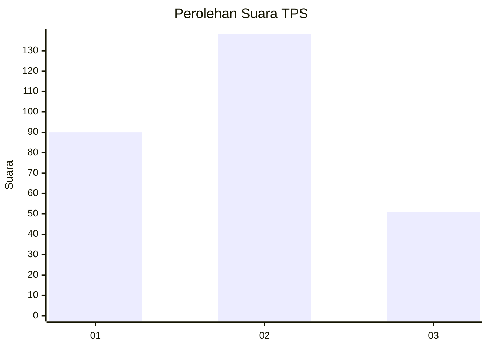
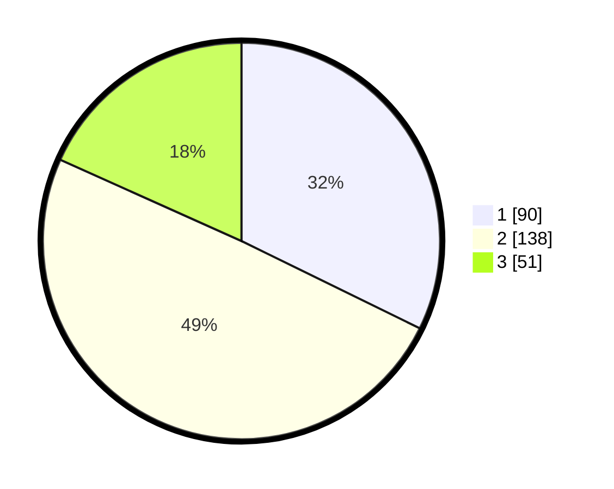

# Hasil

## Grafik

## Tabel

| No. | Nama Paslon    | Suara | Suara (raw) | Persentase |
|:--- |:-------------- | -----:| -----------:| ----------:|
| 1   | ANIES MUHAIMIN | 90    | [90][p-1]   | 32,26      |
| 2   | PRABOWO GIBRAN | 138   | [138][p-2]  | 49,46      |
| 3   | GANJAR MAHFUD  | 51    | [51][p-3]   | 18,28      |

[p-1]: https://github.com/gigit-pemilu/pemilu-2024-35-jawa-timur/blob/main/pilpres/hitung-suara/sub/35-jawa-timur/sub/26-bangkalan/sub/18-galis/sub/2002-daleman/sub/013-tps/sub/paslon-1.txt
[p-2]: https://github.com/gigit-pemilu/pemilu-2024-35-jawa-timur/blob/main/pilpres/hitung-suara/sub/35-jawa-timur/sub/26-bangkalan/sub/18-galis/sub/2002-daleman/sub/013-tps/sub/paslon-2.txt
[p-3]: https://github.com/gigit-pemilu/pemilu-2024-35-jawa-timur/blob/main/pilpres/hitung-suara/sub/35-jawa-timur/sub/26-bangkalan/sub/18-galis/sub/2002-daleman/sub/013-tps/sub/paslon-3.txt

## Foto C Plano

https://sirekap-obj-formc.kpu.go.id/39a1/pemilu/ppwp/35/26/18/20/02/3526182002013-20240226-111650--fbe80bc9-1401-4010-9188-48f58e01661e.jpg

https://sirekap-obj-formc.kpu.go.id/39a1/pemilu/ppwp/35/26/18/20/02/3526182002013-20240226-112328--1ef2f45e-ac7c-4f99-9601-642907c74194.jpg

https://sirekap-obj-formc.kpu.go.id/39a1/pemilu/ppwp/35/26/18/20/02/3526182002013-20240226-112602--6778a439-8349-4a85-acfb-5056e39814c8.jpg

## Metadata

| Key        | Value               |
| ---------- | ------------------- |
| Time Stamp | 2024-02-28 20:00:00 |

