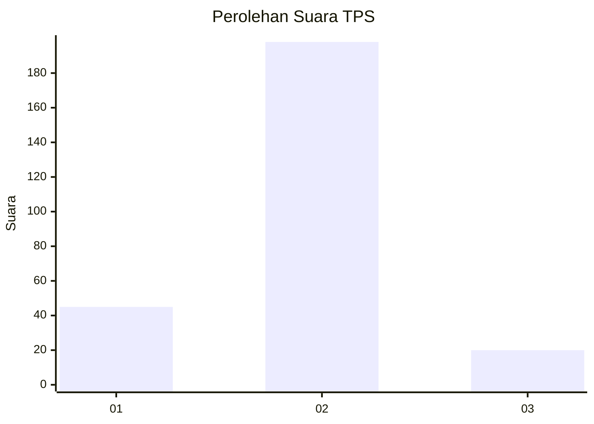
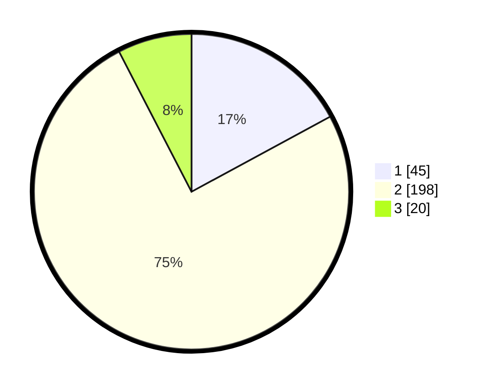

# Hasil

## Grafik

## Tabel

| No. | Nama Paslon    | Suara | Suara (raw) | Persentase |
|:--- |:-------------- | -----:| -----------:| ----------:|
| 1   | ANIES MUHAIMIN | 45    | [45][p-1]   | 17,11      |
| 2   | PRABOWO GIBRAN | 198   | [198][p-2]  | 75,29      |
| 3   | GANJAR MAHFUD  | 20    | [20][p-3]   | 7,60       |

[p-1]: https://github.com/gigit-pemilu/pemilu-2024-35-jawa-timur/blob/main/pilpres/hitung-suara/sub/35-jawa-timur/sub/26-bangkalan/sub/18-galis/sub/2003-blateran/sub/001-tps/sub/paslon-1.txt
[p-2]: https://github.com/gigit-pemilu/pemilu-2024-35-jawa-timur/blob/main/pilpres/hitung-suara/sub/35-jawa-timur/sub/26-bangkalan/sub/18-galis/sub/2003-blateran/sub/001-tps/sub/paslon-2.txt
[p-3]: https://github.com/gigit-pemilu/pemilu-2024-35-jawa-timur/blob/main/pilpres/hitung-suara/sub/35-jawa-timur/sub/26-bangkalan/sub/18-galis/sub/2003-blateran/sub/001-tps/sub/paslon-3.txt

## Foto C Plano

https://sirekap-obj-formc.kpu.go.id/5edb/pemilu/ppwp/35/26/18/20/03/3526182003001-20240214-230925--b17c464f-3a08-4bd6-b65b-378e5657a988.jpg

https://sirekap-obj-formc.kpu.go.id/5edb/pemilu/ppwp/35/26/18/20/03/3526182003001-20240214-231002--24c30e1b-6686-4e81-9806-697d5fc19ba0.jpg

https://sirekap-obj-formc.kpu.go.id/5edb/pemilu/ppwp/35/26/18/20/03/3526182003001-20240214-230825--960be903-75e7-41af-87fc-fdcdda5d796f.jpg

## Metadata

| Key        | Value               |
| ---------- | ------------------- |
| Time Stamp | 2024-02-21 16:00:00 |

