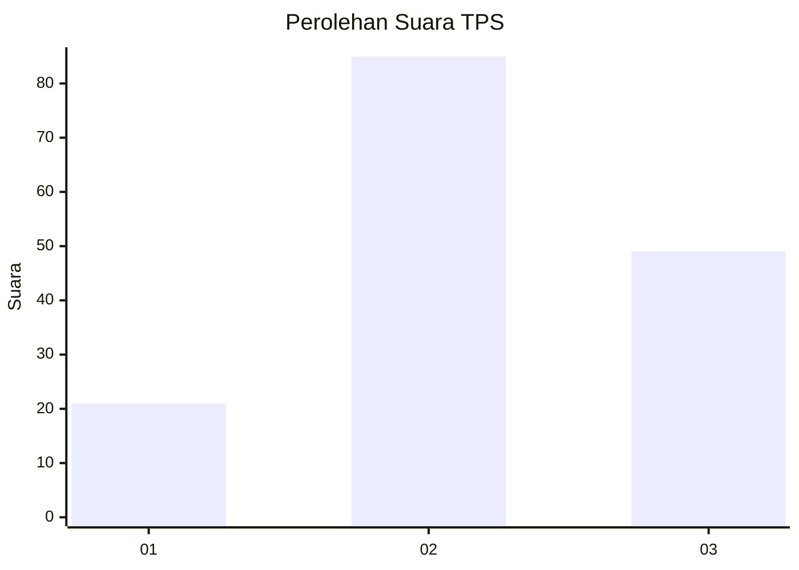
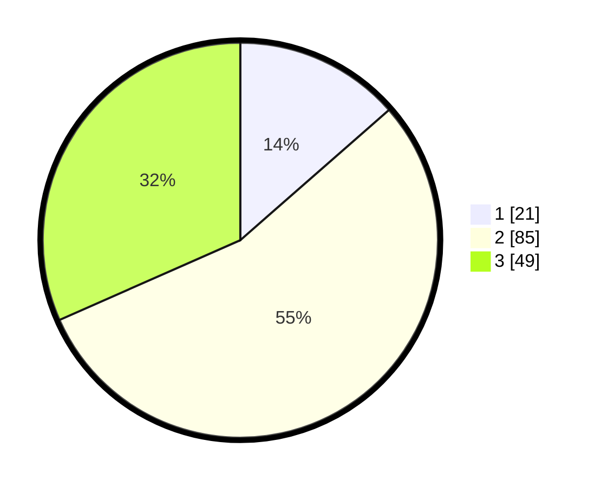

# Hasil

## Grafik

## Tabel

| No. | Nama Paslon    | Suara | Suara (raw) | Persentase |
|:--- |:-------------- | -----:| -----------:| ----------:|
| 1   | ANIES MUHAIMIN | 21    | [21][p-1]   | 13,55      |
| 2   | PRABOWO GIBRAN | 85    | [85][p-2]   | 54,84      |
| 3   | GANJAR MAHFUD  | 49    | [49][p-3]   | 31,61      |

[p-1]: https://github.com/gigit-pemilu/pemilu-2024/blob/main/pilpres/hitung-suara/sub/35-jawa-timur/sub/26-bangkalan/sub/18-galis/sub/2003-blateran/sub/002-tps/sub/paslon-1.txt
[p-2]: https://github.com/gigit-pemilu/pemilu-2024/blob/main/pilpres/hitung-suara/sub/35-jawa-timur/sub/26-bangkalan/sub/18-galis/sub/2003-blateran/sub/002-tps/sub/paslon-2.txt
[p-3]: https://github.com/gigit-pemilu/pemilu-2024/blob/main/pilpres/hitung-suara/sub/35-jawa-timur/sub/26-bangkalan/sub/18-galis/sub/2003-blateran/sub/002-tps/sub/paslon-3.txt

## Foto C Plano

https://sirekap-obj-formc.kpu.go.id/d979/pemilu/ppwp/35/26/18/20/03/3526182003002-20240214-214353--a0b26432-f4c1-4f5c-89a9-1d719287e3f0.jpg

https://sirekap-obj-formc.kpu.go.id/d979/pemilu/ppwp/35/26/18/20/03/3526182003002-20240214-214524--9bfdb29e-babc-44d4-8470-81ce9bdd9fb6.jpg

https://sirekap-obj-formc.kpu.go.id/d979/pemilu/ppwp/35/26/18/20/03/3526182003002-20240214-214555--a0f29470-9879-4af1-9f7a-e4bff887a799.jpg

## Metadata

| Key        | Value               |
| ---------- | ------------------- |
| Time Stamp | 2024-02-19 06:16:00 |

