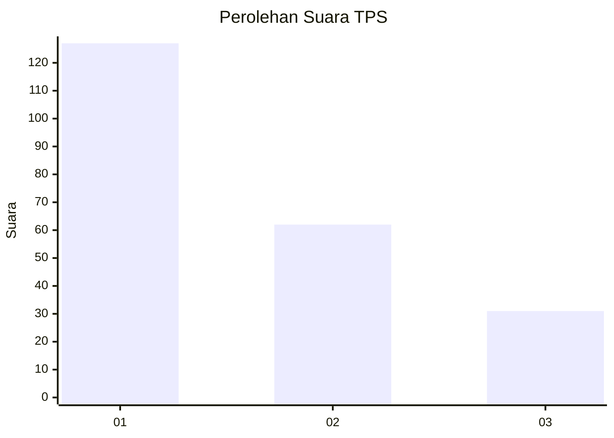
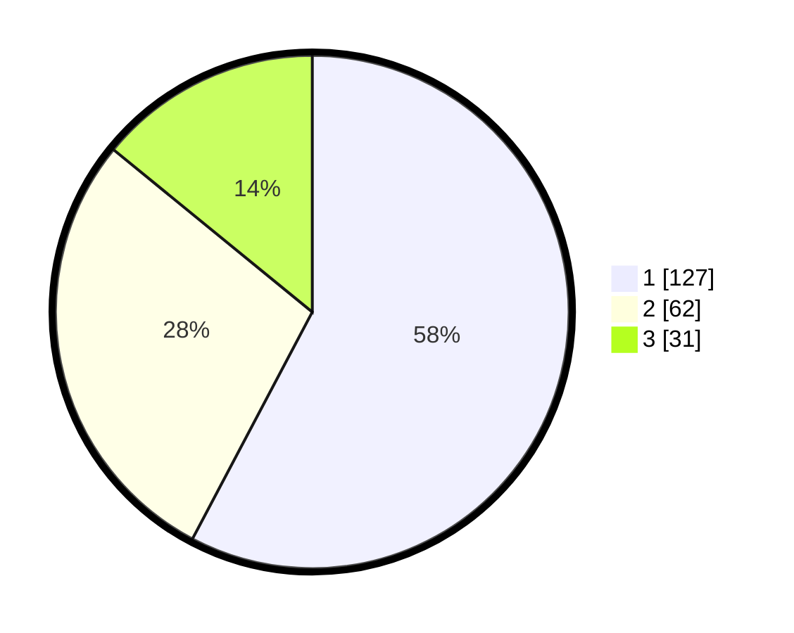

# Hasil

## Grafik

## Tabel

| No. | Nama Paslon    | Suara | Suara (raw) | Persentase |
|:--- |:-------------- | -----:| -----------:| ----------:|
| 1   | ANIES MUHAIMIN | 127   | [127][p-1]  | 57,73      |
| 2   | PRABOWO GIBRAN | 62    | [62][p-2]   | 28,18      |
| 3   | GANJAR MAHFUD  | 31    | [31][p-3]   | 14,09      |

[p-1]: https://github.com/gigit-pemilu/pemilu-2024-35-jawa-timur/blob/main/pilpres/hitung-suara/sub/35-jawa-timur/sub/26-bangkalan/sub/18-galis/sub/2003-blateran/sub/003-tps/sub/paslon-1.txt
[p-2]: https://github.com/gigit-pemilu/pemilu-2024-35-jawa-timur/blob/main/pilpres/hitung-suara/sub/35-jawa-timur/sub/26-bangkalan/sub/18-galis/sub/2003-blateran/sub/003-tps/sub/paslon-2.txt
[p-3]: https://github.com/gigit-pemilu/pemilu-2024-35-jawa-timur/blob/main/pilpres/hitung-suara/sub/35-jawa-timur/sub/26-bangkalan/sub/18-galis/sub/2003-blateran/sub/003-tps/sub/paslon-3.txt

## Foto C Plano

https://sirekap-obj-formc.kpu.go.id/3012/pemilu/ppwp/35/26/18/20/03/3526182003003-20240214-220033--cbf4e498-922f-4cd5-b002-3e842a265ad8.jpg

https://sirekap-obj-formc.kpu.go.id/3012/pemilu/ppwp/35/26/18/20/03/3526182003003-20240214-220128--34d583f0-ad10-47ca-bb7f-60668713ee95.jpg

https://sirekap-obj-formc.kpu.go.id/3012/pemilu/ppwp/35/26/18/20/03/3526182003003-20240214-220204--38df1e87-9c64-48a9-821f-0f19cf852c61.jpg

## Metadata

| Key        | Value               |
| ---------- | ------------------- |
| Time Stamp | 2024-02-21 16:00:00 |

